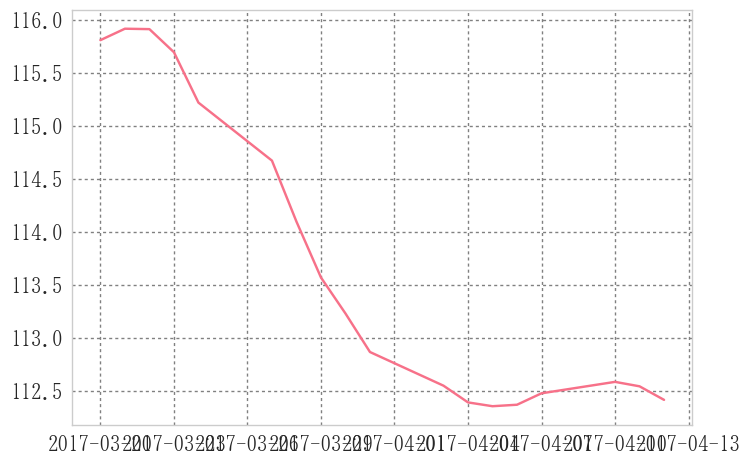

```python
import matplotlib.pyplot as plt
import matplotlib.finance as mpf
```


```python
def candlechart(ohlc, width=0.8):
    """入力されたデータフレームに対してローソク足チャートを返す
        引数:
            * ohlc:
                *データフレーム
                * 列名に'open'", 'close', 'low', 'high'を入れること
                * 順不同"
            * widrh: ローソクの線幅
        戻り値: ax: subplot"""
    fig, ax = plt.subplots()
    # ローソク足
    fin.candlestick2_ohlc(ax, opens=ohlc.open.values, closes=ohlc.close.values,
                          lows=ohlc.low.values, highs=ohlc.high.values,
                          width=width, colorup='r', colordown='b')

    # x軸を時間にする
    xdate = ohlc.index
    ax.xaxis.set_major_locator(ticker.MaxNLocator(6))

    def mydate(x, pos):
        try:
            return xdate[int(x)]
        except IndexError:
            return ''

    # ax.xaxis.set_major_formatter(ticker.FuncFormatter(mydate))
    ax.format_xdata = mdates.DateFormatter('%Y-%m-%d')

    fig.autofmt_xdate()
    fig.tight_layout()

    return fig, ax

```


```python
from randomwalk import *
```


```python
df = randomwalk(60*24*30, freq='T', tick=0.01).resample('B').ohlc() + 115
df.head()
```


<div>
<table border="1" class="dataframe">
  <thead>
    <tr style="text-align: right;">
      <th></th>
      <th>open</th>
      <th>high</th>
      <th>low</th>
      <th>close</th>
    </tr>
  </thead>
  <tbody>
    <tr>
      <th>2017-03-14</th>
      <td>114.99</td>
      <td>115.32</td>
      <td>114.97</td>
      <td>115.31</td>
    </tr>
    <tr>
      <th>2017-03-15</th>
      <td>115.30</td>
      <td>115.49</td>
      <td>115.03</td>
      <td>115.46</td>
    </tr>
    <tr>
      <th>2017-03-16</th>
      <td>115.45</td>
      <td>116.12</td>
      <td>115.44</td>
      <td>115.95</td>
    </tr>
    <tr>
      <th>2017-03-17</th>
      <td>115.95</td>
      <td>116.24</td>
      <td>115.67</td>
      <td>116.18</td>
    </tr>
    <tr>
      <th>2017-03-20</th>
      <td>116.18</td>
      <td>116.45</td>
      <td>115.98</td>
      <td>116.16</td>
    </tr>
  </tbody>
</table>
</div>


```python
# 参考: http://qiita.com/toyolab/items/1b5d11b5d376bd542022

fig = plt.figure()
ax = plt.subplot()

ohlc = np.vstack((range(len(df)), df.values.T)).T #x軸データを整数に
mpf.candlestick_ohlc(ax, ohlc, width=0.8, colorup='r', colordown='b')

xtick0 = (5-df.index[0].weekday())%5 #最初の月曜日のインデックス
plt.xticks(range(xtick0,len(df),5), [x.strftime('%Y-%m-%d') for x in df.index][xtick0::5])
ax.grid(True) #グリッド表示
ax.set_xlim(-1, len(df)) #x軸の範囲
fig.autofmt_xdate() #x軸のオートフォーマット

sma5 = df.close.rolling(5).mean()
ax.plot(sma5)
```


    [<matplotlib.lines.Line2D at 0x241b423a668>]





```python
ts = pd.date_range('20160901', '20161011')
date2num(ts)
```


    ---------------------------------------------------------------------------

    AttributeError                            Traceback (most recent call last)

    <ipython-input-54-7b4532c772d4> in <module>()
          1 ts = pd.date_range('20160901', '20161011')
    ----> 2 date2num(ts)
    

    C:\Anaconda3\lib\site-packages\matplotlib\dates.py in date2num(d)
        360         if not d.size:
        361             return d
    --> 362         return _to_ordinalf_np_vectorized(d)
        363 
        364 
    

    C:\Anaconda3\lib\site-packages\numpy\lib\function_base.py in __call__(self, *args, **kwargs)
       2216             vargs.extend([kwargs[_n] for _n in names])
       2217 
    -> 2218         return self._vectorize_call(func=func, args=vargs)
       2219 
       2220     def _get_ufunc_and_otypes(self, func, args):
    

    C:\Anaconda3\lib\site-packages\numpy\lib\function_base.py in _vectorize_call(self, func, args)
       2279             _res = func()
       2280         else:
    -> 2281             ufunc, otypes = self._get_ufunc_and_otypes(func=func, args=args)
       2282 
       2283             # Convert args to object arrays first
    

    C:\Anaconda3\lib\site-packages\numpy\lib\function_base.py in _get_ufunc_and_otypes(self, func, args)
       2241             # arrays (the input values are not checked to ensure this)
       2242             inputs = [asarray(_a).flat[0] for _a in args]
    -> 2243             outputs = func(*inputs)
       2244 
       2245             # Performance note: profiling indicates that -- for simple
    

    C:\Anaconda3\lib\site-packages\matplotlib\dates.py in _to_ordinalf(dt)
        218         tzi = UTC
        219 
    --> 220     base = float(dt.toordinal())
        221 
        222     # If it's sufficiently datetime-like, it will have a `date()` method
    

    AttributeError: 'numpy.datetime64' object has no attribute 'toordinal'


```python

```
