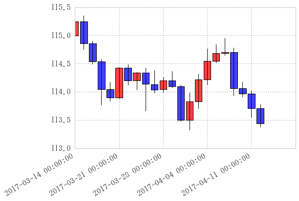
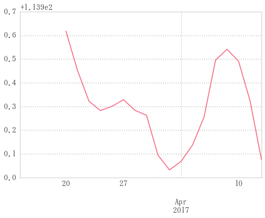
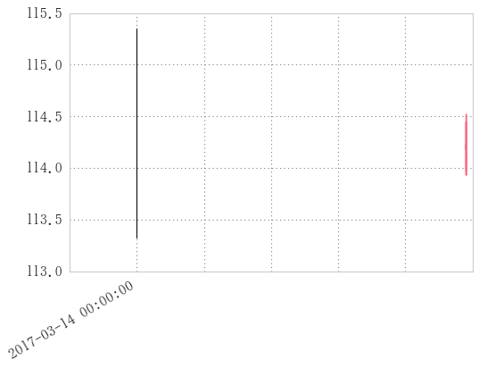

```python
import candlechart as c
```


```python
# 10秒間のtickチャート
c.randomwalk(10, tick=0.01, freq='S')
```


    2017-03-14 00:00:00   -0.01
    2017-03-14 00:00:01   -0.01
    2017-03-14 00:00:02   -0.01
    2017-03-14 00:00:03   -0.01
    2017-03-14 00:00:04    0.00
    2017-03-14 00:00:05   -0.01
    2017-03-14 00:00:06    0.00
    2017-03-14 00:00:07    0.00
    2017-03-14 00:00:08    0.01
    2017-03-14 00:00:09    0.01
    Freq: S, dtype: float64


```python
# 5日間のtickチャート
time = 60 * 60 * 24 * 30  # 秒数
init_value = 115
tick = c.randomwalk(time, tick=0.001, freq='S') + init_value
```


```python
chart = tick.resample('B').ohlc()
chart.head()
```


<div>
<table border="1" class="dataframe">
  <thead>
    <tr style="text-align: right;">
      <th></th>
      <th>open</th>
      <th>high</th>
      <th>low</th>
      <th>close</th>
    </tr>
  </thead>
  <tbody>
    <tr>
      <th>2017-03-14</th>
      <td>114.999</td>
      <td>115.342</td>
      <td>114.976</td>
      <td>115.250</td>
    </tr>
    <tr>
      <th>2017-03-15</th>
      <td>115.250</td>
      <td>115.352</td>
      <td>114.757</td>
      <td>114.854</td>
    </tr>
    <tr>
      <th>2017-03-16</th>
      <td>114.855</td>
      <td>114.897</td>
      <td>114.493</td>
      <td>114.537</td>
    </tr>
    <tr>
      <th>2017-03-17</th>
      <td>114.536</td>
      <td>114.579</td>
      <td>113.765</td>
      <td>114.047</td>
    </tr>
    <tr>
      <th>2017-03-20</th>
      <td>114.046</td>
      <td>114.175</td>
      <td>113.840</td>
      <td>113.899</td>
    </tr>
  </tbody>
</table>
</div>


```python
c.candlechart(chart)
# plt.xlim([pd.Timestamp('20170314'), pd.Timestamp('20170414')])
```


    ---------------------------------------------------------------------------

    NameError                                 Traceback (most recent call last)

    <ipython-input-173-7b48034d283e> in <module>()
    ----> 1 c.candlechart(chart)
          2 # plt.xlim([pd.Timestamp('20170314'), pd.Timestamp('20170414')])
    

    C:\Users\U1and0\Dropbox\Program\python\fxpy\common\candlechart.py in candlechart(ohlc, width)
         33 
         34     # ax.xaxis.set_major_formatter(ticker.FuncFormatter(mydate))
    ---> 35     ax.format_xdata = mdates.DateFormatter('%Y-%m-%d')
         36 
         37     fig.autofmt_xdate()
    

    NameError: name 'mdates' is not defined





```python
sma5 = chart.close.rolling(5).mean()
sma5
```


    2017-03-14         NaN
    2017-03-15         NaN
    2017-03-16         NaN
    2017-03-17         NaN
    2017-03-20    114.5174
    2017-03-21    114.3524
    2017-03-22    114.2216
    2017-03-23    114.1824
    2017-03-24    114.2002
    2017-03-27    114.2282
    2017-03-28    114.1834
    2017-03-29    114.1626
    2017-03-30    113.9940
    2017-03-31    113.9322
    2017-04-03    113.9678
    2017-04-04    114.0368
    2017-04-05    114.1548
    2017-04-06    114.3948
    2017-04-07    114.4410
    2017-04-10    114.3910
    2017-04-11    114.2238
    2017-04-12    113.9740
    Freq: B, Name: close, dtype: float64


```python
fig, ax = c.candlechart(chart)

# fig.plot(sma5)
# ax = plt.gca()
# ax.plot(sma5)
# sma5.plot(ax=ax.append())
```


```python

```


    <bound method _AxesBase.get_xticklabels of <matplotlib.axes._subplots.AxesSubplot object at 0x000002348501CC50>>


```python
sma5.plot(xticks=ax.get_xticklabels())
```


    ---------------------------------------------------------------------------

    ValueError                                Traceback (most recent call last)

    <ipython-input-168-abc62964f48e> in <module>()
    ----> 1 sma5.plot(xticks=ax.get_xticklabels())
    

    C:\Anaconda3\lib\site-packages\pandas\tools\plotting.py in __call__(self, kind, ax, figsize, use_index, title, grid, legend, style, logx, logy, loglog, xticks, yticks, xlim, ylim, rot, fontsize, colormap, table, yerr, xerr, label, secondary_y, **kwds)
       3598                            colormap=colormap, table=table, yerr=yerr,
       3599                            xerr=xerr, label=label, secondary_y=secondary_y,
    -> 3600                            **kwds)
       3601     __call__.__doc__ = plot_series.__doc__
       3602 
    

    C:\Anaconda3\lib\site-packages\pandas\tools\plotting.py in plot_series(data, kind, ax, figsize, use_index, title, grid, legend, style, logx, logy, loglog, xticks, yticks, xlim, ylim, rot, fontsize, colormap, table, yerr, xerr, label, secondary_y, **kwds)
       2672                  yerr=yerr, xerr=xerr,
       2673                  label=label, secondary_y=secondary_y,
    -> 2674                  **kwds)
       2675 
       2676 
    

    C:\Anaconda3\lib\site-packages\pandas\tools\plotting.py in _plot(data, x, y, subplots, ax, kind, **kwds)
       2468         plot_obj = klass(data, subplots=subplots, ax=ax, kind=kind, **kwds)
       2469 
    -> 2470     plot_obj.generate()
       2471     plot_obj.draw()
       2472     return plot_obj.result
    

    C:\Anaconda3\lib\site-packages\pandas\tools\plotting.py in generate(self)
       1044         self._add_table()
       1045         self._make_legend()
    -> 1046         self._adorn_subplots()
       1047 
       1048         for ax in self.axes:
    

    C:\Anaconda3\lib\site-packages\pandas\tools\plotting.py in _adorn_subplots(self)
       1206 
       1207             if self.xticks is not None:
    -> 1208                 ax.set_xticks(self.xticks)
       1209 
       1210             if self.ylim is not None:
    

    C:\Anaconda3\lib\site-packages\matplotlib\axes\_base.py in set_xticks(self, ticks, minor)
       2848         ACCEPTS: sequence of floats
       2849         """
    -> 2850         ret = self.xaxis.set_ticks(ticks, minor=minor)
       2851         self.stale = True
       2852         return ret
    

    C:\Anaconda3\lib\site-packages\matplotlib\axis.py in set_ticks(self, ticks, minor)
       1592         """
       1593         # XXX if the user changes units, the information will be lost here
    -> 1594         ticks = self.convert_units(ticks)
       1595         if len(ticks) > 1:
       1596             xleft, xright = self.get_view_interval()
    

    C:\Anaconda3\lib\site-packages\matplotlib\axis.py in convert_units(self, x)
       1440             return x
       1441 
    -> 1442         ret = self.converter.convert(x, self.units, self)
       1443         return ret
       1444 
    

    C:\Anaconda3\lib\site-packages\pandas\tseries\converter.py in convert(values, units, axis)
        148             return PeriodIndex(values, freq=axis.freq)._values
        149         if isinstance(values, (list, tuple, np.ndarray, Index)):
    --> 150             return [get_datevalue(x, axis.freq) for x in values]
        151         return values
        152 
    

    C:\Anaconda3\lib\site-packages\pandas\tseries\converter.py in <listcomp>(.0)
        148             return PeriodIndex(values, freq=axis.freq)._values
        149         if isinstance(values, (list, tuple, np.ndarray, Index)):
    --> 150             return [get_datevalue(x, axis.freq) for x in values]
        151         return values
        152 
    

    C:\Anaconda3\lib\site-packages\pandas\tseries\converter.py in get_datevalue(date, freq)
        163     elif date is None:
        164         return None
    --> 165     raise ValueError("Unrecognizable date '%s'" % date)
        166 
        167 
    

    ValueError: Unrecognizable date 'Text(0,0,'2017-03-14 00:00:00')'





```python
# c.candlechart(chart)
ax.get_axes?
```


```python
fig
```





```python
fig
# sma5.plot()
```


```python

```
