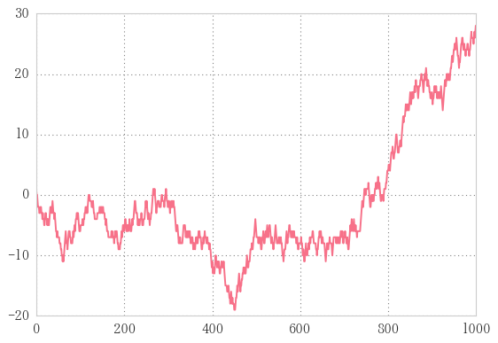
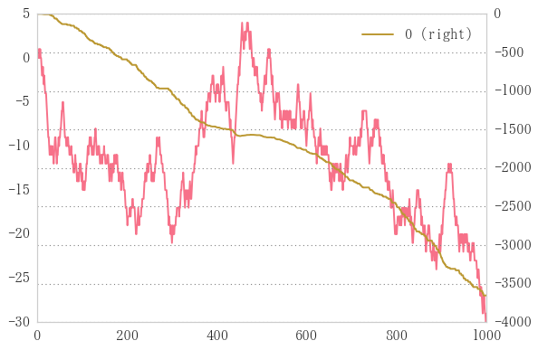

# ランダムウォークのシリーズを作成


```python
n = 1000
se = pd.Series(np.random.randint(-1, 2, n)).cumsum()
se.plot()
```


    <matplotlib.axes._subplots.AxesSubplot at 0x22526fcbba8>





## 前日より値が低かったら買い、高かったら見過ごし


```python
position = np.zeros(len(se))  # seと同じ長さの配列を作成
for i in se.index[:-1]:
    if se[i+1] - se[i] > 0:
        position[i]=se[i]
position
```


    array([  0.,   0.,   0.,   0.,   0.,   0.,   0.,   0.,  -3.,   0.,   0.,
             0.,   0.,   0.,  -4.,   0.,   0.,   0.,   0.,  -5.,  -4.,   0.,
             0.,   0.,   0.,  -5.,   0.,   0.,   0.,  -5.,  -4.,  -3.,   0.,
             0.,   0.,  -3.,  -2.,   0.,   0.,   0.,   0.,  -4.,   0.,   0.,
             0.,   0.,   0.,  -7.,   0.,   0.,   0.,   0.,   0.,   0.,   0.,
             0.,   0.,   0.,   0.,   0., -11.,   0., -11., -10.,  -9.,  -8.,
            -7.,   0.,   0.,   0.,   0.,  -9.,  -8.,  -7.,   0.,   0.,   0.,
             0.,   0.,   0.,   0.,   0.,  -8.,  -7.,   0.,  -7.,  -6.,   0.,
            -6.,  -5.,   0.,  -4.,   0.,   0.,  -4.,   0.,   0.,   0.,   0.,
             0.,  -6.,   0.,   0.,   0.,  -5.,   0.,   0.,  -5.,   0.,  -4.,
             0.,  -3.,   0.,   0.,  -3.,   0.,  -3.,  -2.,  -1.,   0.,   0.,
             0.,   0.,   0.,   0.,   0.,   0.,   0.,  -2.,   0.,   0.,   0.,
             0.,   0.,   0.,   0.,   0.,   0.,  -4.,   0.,   0.,   0.,   0.,
            -3.,   0.,   0.,  -3.,   0.,   0.,   0.,  -3.,   0.,   0.,   0.,
             0.,   0.,   0.,   0.,  -5.,   0.,   0.,   0.,   0.,   0.,   0.,
             0.,   0.,   0.,   0.,   0.,  -7.,   0.,  -7.,   0.,   0.,   0.,
             0.,  -8.,  -7.,   0.,  -7.,   0.,   0.,   0.,   0.,   0.,   0.,
             0.,   0.,   0.,  -9.,   0.,  -8.,  -7.,   0.,  -7.,  -6.,   0.,
             0.,   0.,  -6.,  -5.,   0.,   0.,   0.,   0.,  -6.,   0.,   0.,
            -6.,   0.,  -5.,   0.,   0.,   0.,   0.,  -6.,  -5.,   0.,  -5.,
             0.,  -4.,  -3.,  -2.,   0.,   0.,   0.,   0.,   0.,   0.,   0.,
            -5.,   0.,   0.,   0.,  -5.,   0.,   0.,  -4.,   0.,   0.,   0.,
             0.,  -5.,   0.,   0.,  -4.,  -3.,  -2.,   0.,  -2.,   0.,   0.,
             0.,  -4.,   0.,   0.,   0.,  -5.,   0.,  -4.,   0.,  -3.,  -2.,
            -1.,   0.,   0.,   0.,   0.,   0.,   0.,   0.,   0.,  -3.,   0.,
            -2.,   0.,   0.,   0.,   0.,   0.,   0.,   0.,  -2.,  -1.,   0.,
             0.,   0.,   0.,   0.,   0.,  -2.,  -1.,   0.,   0.,   0.,   0.,
             0.,   0.,   0.,  -2.,   0.,   0.,   0.,  -3.,   0.,  -2.,   0.,
            -2.,   0.,   0.,  -2.,   0.,   0.,   0.,   0.,   0.,   0.,   0.,
            -6.,   0.,   0.,   0.,   0.,  -8.,   0.,  -8.,   0.,   0.,   0.,
             0.,   0.,  -8.,  -7.,  -6.,   0.,   0.,   0.,   0.,   0.,  -7.,
             0.,   0.,  -7.,   0.,  -7.,   0.,   0.,  -7.,   0.,   0.,   0.,
            -8.,   0.,   0.,   0.,   0.,  -9.,   0.,   0.,   0.,  -9.,  -8.,
             0.,   0.,  -8.,   0.,  -8.,  -7.,   0.,  -7.,   0.,   0.,   0.,
             0.,   0.,   0.,  -9.,   0.,  -8.,   0.,  -8.,  -7.,   0.,   0.,
             0.,   0.,   0.,  -8.,   0.,   0.,   0.,   0.,  -9.,   0.,   0.,
             0.,   0.,   0., -12.,   0.,   0., -13.,   0.,   0., -13., -12.,
           -11.,   0.,   0.,   0., -12.,   0.,   0., -12.,   0.,   0.,   0.,
           -13.,   0., -12.,   0.,   0.,   0.,   0., -12.,   0.,   0.,   0.,
             0.,   0.,   0.,   0.,   0.,   0.,   0., -16.,   0.,   0.,   0.,
             0., -18., -17.,   0.,   0., -18.,   0.,   0.,   0.,   0.,   0.,
             0., -19., -18.,   0., -17., -16.,   0., -16., -15., -14.,   0.,
             0.,   0., -16.,   0., -15.,   0., -14.,   0., -13.,   0.,   0.,
           -13.,   0.,   0., -13., -12., -11.,   0.,   0.,   0., -12.,   0.,
             0., -11., -10.,   0.,   0.,  -9.,   0.,   0.,  -9.,  -8.,   0.,
            -7.,  -6.,  -5.,   0.,   0.,   0.,   0.,   0.,   0.,   0.,  -8.,
             0.,   0.,  -8.,   0.,   0.,   0.,  -9.,  -8.,   0.,  -7.,   0.,
             0.,   0.,  -8.,  -7.,   0.,   0.,  -7.,  -6.,   0.,   0.,  -7.,
             0.,  -6.,   0.,   0.,   0.,   0.,  -8.,   0.,   0.,   0.,   0.,
            -9.,   0.,  -8.,  -7.,  -6.,   0.,   0.,   0.,   0.,   0.,   0.,
            -8.,   0.,   0.,  -8.,   0.,  -8.,   0.,   0.,   0.,   0.,   0.,
             0., -11., -10.,   0.,   0.,  -9.,  -8.,  -7.,   0.,   0.,  -8.,
             0.,  -7.,  -6.,   0.,   0.,   0.,   0.,   0.,  -7.,   0.,   0.,
            -7.,   0.,  -7.,   0.,   0.,   0.,   0.,   0.,   0.,  -8.,   0.,
             0.,   0.,  -9.,   0.,   0.,   0.,   0.,  -8.,   0.,   0.,   0.,
             0., -10.,   0.,   0.,   0., -11., -10.,  -9.,   0.,   0.,   0.,
           -10.,   0.,  -9.,   0.,  -9.,  -8.,   0.,  -8.,   0.,   0.,   0.,
            -7.,   0.,   0.,   0.,   0.,   0.,   0.,   0.,   0.,   0.,   0.,
           -10.,   0.,  -9.,  -8.,   0.,  -7.,   0.,  -7.,   0.,   0.,   0.,
            -8.,   0.,   0.,   0.,   0.,   0.,   0.,   0.,   0., -11., -10.,
            -9.,   0.,   0.,   0.,  -9.,   0.,  -8.,   0.,   0.,   0.,   0.,
             0.,   0., -10.,  -9.,  -8.,   0.,   0.,   0.,   0.,   0.,   0.,
            -8.,   0.,   0.,   0.,  -8.,   0.,   0.,   0.,  -8.,  -7.,   0.,
             0.,   0.,  -7.,   0.,   0.,  -8.,   0.,   0.,  -7.,   0.,   0.,
             0.,   0.,  -8.,   0.,   0.,   0.,  -9.,  -8.,  -7.,  -6.,   0.,
            -6.,  -5.,   0.,   0.,   0.,  -6.,  -5.,   0.,   0.,   0.,  -6.,
             0.,   0.,   0.,  -7.,   0.,   0.,   0.,   0.,   0.,   0.,  -6.,
            -5.,  -4.,  -3.,  -2.,   0.,   0.,  -2.,  -1.,   0.,   0.,   0.,
             0.,   0.,   0.,   0.,   0.,   0.,   1.,   0.,   0.,   0.,   0.,
             0.,  -2.,  -1.,   0.,   0.,  -1.,   0.,   0.,  -1.,   0.,   0.,
             0.,   1.,   0.,   0.,   1.,   0.,   2.,   0.,   0.,   1.,   0.,
             0.,   0.,   0.,  -1.,   0.,   0.,   0.,   0.,  -1.,   0.,   0.,
             0.,   0.,   1.,   0.,   2.,   3.,   0.,   0.,   4.,   0.,   0.,
             0.,   4.,   5.,   6.,   0.,   0.,   7.,   0.,   0.,   0.,   6.,
             0.,   7.,   8.,   9.,   0.,   0.,   0.,   0.,   0.,   0.,   7.,
             0.,   8.,   0.,   0.,   8.,   9.,  10.,  11.,  12.,   0.,  12.,
             0.,   0.,  13.,  14.,   0.,   0.,   0.,  14.,   0.,   0.,   0.,
            14.,  15.,  16.,   0.,   0.,  15.,  16.,   0.,  16.,   0.,  16.,
             0.,  17.,   0.,  17.,  18.,   0.,   0.,   0.,   0.,   0.,  16.,
            17.,   0.,   0.,  18.,   0.,  19.,   0.,   0.,   0.,   0.,   0.,
            17.,  18.,  19.,   0.,  19.,  20.,   0.,   0.,   0.,  18.,   0.,
             0.,   0.,   0.,   0.,   0.,   0.,   0.,  16.,   0.,   0.,  15.,
             0.,  16.,  17.,   0.,   0.,   0.,  17.,   0.,   0.,   0.,  16.,
             0.,   0.,  16.,   0.,   0.,  16.,  17.,   0.,   0.,   0.,   0.,
            14.,  15.,  16.,  17.,  18.,   0.,   0.,  18.,  19.,   0.,  19.,
             0.,   0.,  19.,   0.,   0.,  19.,  20.,   0.,  21.,  22.,   0.,
             0.,  22.,  23.,   0.,  24.,   0.,  24.,   0.,  25.,   0.,   0.,
             0.,   0.,   0.,   0.,  21.,   0.,  22.,  23.,  24.,   0.,  25.,
             0.,   0.,   0.,   0.,  24.,   0.,   0.,   0.,  23.,   0.,   0.,
            24.,   0.,   0.,   0.,   0.,  23.,   0.,  24.,  25.,  26.,   0.,
             0.,   0.,   0.,   0.,  25.,  26.,   0.,  26.,  27.,   0.])


```python
fig, ax = plt.subplots()
se.plot(ax=ax)
pd.DataFrame(position).cumsum().plot(ax=ax, secondary_y=True)  # ポジションのcum sumをプロット
plt.grid(True)
```





## 特定期間で買い


```python
freq = 5 
```
