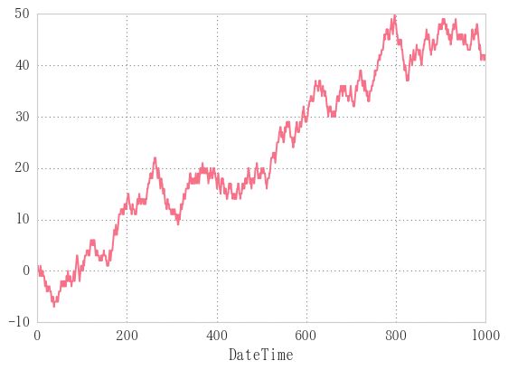
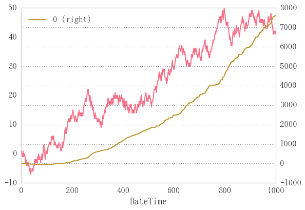
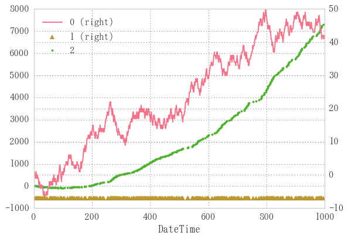

# ドルコスト平均法
1. 下がったら買い
2. 一定額を買う

## ランダムウォークのシリーズを作成


```python
n = 1000
bullbear = pd.Series(np.random.randint(-1, 2, n))
price = bullbear.cumsum()
price.index.name='DateTime'
price.plot()
```


    <matplotlib.axes._subplots.AxesSubplot at 0x1d5bc2425f8>





## 前日より値が低かったら買い、高かったら見過ごし
ドルコスト平均法の(1)


```python
position = np.zeros(len(se))  # seと同じ長さの配列を作成
for i in price.index[:-1]:
    if price[i+1] - price[i] < 0:  # 前日の値のほうが小さければ高ければ安くなっているということ
        position[i]=price[i]  # そのときのpriceで買い
position
```


    array([  0.,   0.,   0.,   2.,   1.,   0.,   0.,   0.,   0.,   0.,   0.,
             2.,   0.,   2.,   0.,   1.,   0.,   0.,   0.,   0.,   0.,   3.,
             2.,   0.,   0.,   2.,   0.,   0.,   0.,   0.,   3.,   0.,   0.,
             0.,   3.,   0.,   2.,   1.,   0.,   0.,   0.,   2.,   0.,   1.,
             0.,   1.,   0.,   0.,   0.,  -1.,   0.,   0.,   0.,   0.,   0.,
            -1.,  -2.,   0.,  -2.,   0.,   0.,   0.,   0.,  -1.,  -2.,   0.,
            -2.,   0.,  -2.,   0.,   0.,   0.,   0.,   0.,   0.,   0.,   0.,
             2.,   1.,   0.,  -1.,   0.,   0.,   0.,   0.,   0.,   0.,   0.,
             0.,   0.,   1.,   0.,   0.,   0.,   0.,   0.,   0.,   0.,   0.,
             4.,   0.,   0.,   0.,   5.,   4.,   0.,   3.,   0.,   0.,   2.,
             1.,   0.,   0.,   0.,   0.,   0.,   2.,   1.,   0.,   0.,   0.,
             0.,   0.,   1.,   0.,  -1.,  -2.,   0.,  -2.,   0.,   0.,   0.,
            -2.,   0.,   0.,  -2.,  -3.,  -4.,   0.,  -4.,   0.,   0.,  -4.,
            -5.,   0.,  -6.,   0.,   0.,   0.,  -6.,   0.,  -7.,   0.,   0.,
            -6.,  -7.,   0.,  -8.,   0.,   0.,   0.,   0.,  -6.,   0.,   0.,
             0.,   0.,   0.,   0.,  -3.,   0.,   0.,   0.,   0.,   0.,   0.,
             0.,   0.,   0.,   0.,   0.,   0.,   0.,   0.,   3.,   0.,   0.,
             0.,   0.,   0.,   0.,   0.,   0.,   0.,   0.,   0.,  10.,   9.,
             0.,   0.,   8.,   0.,   0.,   9.,   0.,   0.,   0.,   0.,  10.,
             0.,   0.,  10.,   0.,  10.,   9.,   8.,   0.,   7.,   0.,   0.,
             0.,   0.,   9.,   8.,   0.,   0.,   0.,   0.,   0.,   8.,   0.,
             0.,   0.,   0.,   0.,  10.,   0.,  10.,   0.,  10.,   0.,   0.,
             0.,   0.,   0.,   0.,  13.,   0.,   0.,   0.,   0.,   0.,   0.,
            15.,   0.,   0.,   0.,   0.,   0.,   0.,   0.,  16.,   0.,   0.,
            17.,  16.,   0.,   0.,   0.,   0.,  18.,   0.,   0.,  17.,   0.,
             0.,   0.,  18.,   0.,  18.,   0.,   0.,  19.,   0.,  19.,   0.,
             0.,  18.,   0.,   0.,   0.,  19.,  18.,   0.,  18.,   0.,   0.,
             0.,   0.,   0.,  20.,   0.,  19.,  18.,   0.,   0.,   0.,   0.,
             0.,   0.,   0.,   0.,   0.,  22.,  21.,   0.,  21.,  20.,  19.,
            18.,   0.,   0.,  18.,   0.,   0.,  18.,   0.,   0.,   0.,   0.,
            19.,  18.,   0.,  18.,  17.,  16.,   0.,  15.,  14.,  13.,   0.,
             0.,   0.,   0.,   0.,   0.,  13.,   0.,   0.,   0.,   0.,   0.,
             0.,   0.,   0.,   0.,  17.,   0.,   0.,   0.,   0.,   0.,   0.,
            19.,   0.,  18.,  17.,   0.,   0.,   0.,  18.,   0.,  17.,   0.,
             0.,   0.,  17.,   0.,   0.,   0.,   0.,   0.,  21.,   0.,   0.,
            22.,  21.,   0.,  20.,   0.,   0.,  20.,   0.,   0.,   0.,  21.,
             0.,   0.,  20.,   0.,   0.,  20.,   0.,   0.,   0.,   0.,  21.,
            20.,  19.,   0.,   0.,   0.,   0.,  18.,  17.,   0.,  16.,   0.,
             0.,  16.,   0.,   0.,   0.,   0.,   0.,   0.,   0.,   0.,  18.,
             0.,   0.,   0.,   0.,   0.,  21.,   0.,  20.,   0.,   0.,   0.,
             0.,   0.,   0.,   0.,  24.,  23.,   0.,   0.,   0.,  22.,   0.,
             0.,  23.,   0.,   0.,   0.,   0.,   0.,   0.,   0.,   0.,   0.,
            27.,   0.,   0.,   0.,   0.,   0.,  29.,   0.,  28.,   0.,  28.,
            27.,   0.,   0.,  26.,   0.,   0.,   0.,  25.,   0.,   0.,  25.,
             0.,   0.,   0.,  26.,   0.,   0.,  26.,  25.,   0.,  25.,   0.,
             0.,   0.,   0.,  25.,   0.,   0.,   0.,   0.,  25.,   0.,   0.,
            26.,  25.,  24.,   0.,   0.,   0.,   0.,   0.,  28.,   0.,   0.,
            27.,   0.,   0.,   0.,  28.,  27.,   0.,  27.,   0.,  26.,   0.,
            25.,   0.,   0.,  25.,   0.,   0.,   0.,  26.,   0.,   0.,  25.,
            24.,   0.,   0.,   0.,   0.,   0.,   0.,  26.,  25.,   0.,  25.,
             0.,  25.,  24.,   0.,  24.,  23.,   0.,   0.,  23.,  22.,   0.,
             0.,  21.,  20.,  19.,   0.,   0.,   0.,   0.,  20.,   0.,   0.,
             0.,  20.,  19.,  18.,   0.,   0.,   0.,   0.,   0.,  19.,   0.,
             0.,   0.,   0.,  20.,   0.,  20.,  19.,   0.,   0.,  19.,   0.,
            18.,   0.,   0.,  17.,   0.,   0.,   0.,  19.,  18.,   0.,  18.,
             0.,  17.,   0.,  17.,   0.,   0.,  16.,  15.,   0.,  15.,  14.,
             0.,   0.,  13.,   0.,   0.,  13.,   0.,  12.,   0.,  12.,   0.,
            12.,   0.,   0.,   0.,   0.,   0.,   0.,   0.,   0.,  15.,  14.,
             0.,  14.,   0.,  14.,   0.,   0.,   0.,   0.,   0.,  14.,   0.,
             0.,   0.,   0.,   0.,   0.,   0.,  18.,  17.,  16.,   0.,  15.,
            14.,  13.,  12.,  11.,  10.,   9.,   0.,   0.,   0.,   0.,   0.,
             0.,   0.,   0.,  11.,   0.,   0.,   0.,   0.,   0.,  14.,   0.,
             0.,  14.,   0.,   0.,   0.,   0.,   0.,  14.,  13.,  12.,  11.,
             0.,   0.,   0.,  13.,   0.,   0.,  14.,  13.,   0.,   0.,   0.,
            14.,   0.,   0.,   0.,  16.,  15.,   0.,   0.,   0.,   0.,   0.,
             0.,   0.,   0.,   0.,   0.,   0.,  22.,   0.,  22.,  21.,   0.,
            21.,   0.,  21.,   0.,   0.,  20.,   0.,   0.,   0.,   0.,  21.,
             0.,   0.,  22.,  21.,  20.,  19.,  18.,  17.,   0.,   0.,   0.,
            18.,  17.,  16.,  15.,  14.,  13.,   0.,   0.,   0.,   0.,   0.,
             0.,  14.,  13.,  12.,  11.,  10.,   0.,   0.,   9.,   8.,   0.,
             0.,   0.,   9.,   0.,   0.,   0.,  10.,   0.,   9.,   0.,   8.,
             7.,   0.,   0.,   0.,   7.,   6.,   0.,   5.,   4.,   0.,   0.,
             0.,   4.,   0.,   0.,   4.,   3.,   0.,   0.,   3.,   2.,   0.,
             1.,   0.,   0.,   0.,   0.,   0.,   0.,   0.,   3.,   2.,   1.,
             0.,   1.,   0.,   0.,   0.,   0.,   0.,   2.,   0.,   2.,   0.,
             0.,   0.,   0.,   0.,   0.,   5.,   0.,   0.,   0.,   6.,   0.,
             0.,   6.,   0.,   0.,   0.,   0.,   8.,   0.,   7.,   6.,   5.,
             4.,   0.,   4.,   0.,   4.,   0.,   0.,   0.,   5.,   4.,   0.,
             0.,   0.,   0.,   0.,   0.,   0.,   0.,   0.,   0.,   7.,   0.,
             0.,   0.,   0.,   0.,   0.,   0.,   0.,   0.,  11.,   0.,   0.,
             0.,  11.,   0.,  11.,   0.,   0.,  10.,   0.,   0.,  11.,   0.,
            10.,   0.,   0.,   0.,  10.,   0.,   9.,   8.,   0.,   7.,   0.,
             0.,   0.,   7.,   6.,   0.,   0.,   0.,   0.,   0.,   0.,   6.,
             0.,   0.,   5.,   0.,   0.,   6.,   0.,   5.,   0.,   0.,   6.,
             5.,   0.,   5.,   0.,   0.,   4.,   0.,   0.,   0.,   0.,   0.,
             0.,   0.,   0.,   0.,   6.,   0.,   5.,   0.,   4.,   3.,   0.,
             3.,   2.,   0.,   0.,   0.,   0.,   2.,   0.,   0.,   0.,   0.,
             0.,   0.,   4.,   0.,   4.,   0.,   4.,   3.,   0.,   0.,   0.,
             4.,   0.,   0.,   4.,   0.,   0.,   0.,   0.,   5.,   0.,   0.,
             0.,   5.,   0.,   0.,   0.,   0.,   0.,   8.,   0.,   0.,   9.,
             0.,   8.,   7.,   0.,   0.,   0.,   0.,   0.,   8.,   0.])


```python
fig, ax = plt.subplots()
price.plot(ax=ax)
pd.DataFrame(position).cumsum().plot(ax=ax, secondary_y=True)  # ポジションのcumulative sumをプロット
```


    <matplotlib.axes._subplots.AxesSubplot at 0x1d5b978fd68>





### priceからbullbearの計算


```python
def p2b(price):
    return price.sub(price.shift(1), fill_value=0)
```


```python
np.array_equal(p2b(price), np.array(bullbear))
```


    True


`p2b`関数によってbullbearの計算が可能となった。

## 効率化
前日の値より低かった日の終値だけを収集する関数


```python
def dob(price):
    pos = np.zeros(len(price))  # priceと同じ長さの配列を作成
    for i in price.index[:-1]:
        if price[i+1]<price[i]:  # 前日の値より安ければ
            pos[i]=price[i]  # 買い
    return pos
```


```python
%timeit dob(price)
```

    10 loops, best of 3: 36.8 ms per loop
    

最もシンプル


```python
%timeit [price[i] if price[i+1]<price[i] else 0 for i in price.index[:-1]]
```

    10 loops, best of 3: 40.9 ms per loop
    

内包表記を用いても時間はあまり変わらない


```python
def dob2(price):
    pos = np.zeros(len(price))  # priceと同じ長さの配列を作成
    pos = [price[i] if price.sub(price.shift(1), fill_value=0)<0 else 0]  # 下がったら買い
    return pos
```


```python
price[np.array(bullbear)<0]  # bullbearが負の値になったところだけのpriceを収集
```


    DateTime
    3       0
    6      -1
    9       0
    10     -1
    12     -1
    14     -1
    17     -2
    18     -3
    21     -3
    22     -4
    24     -4
    29     -4
    32     -5
    33     -6
    37     -6
    38     -7
    45     -6
    55     -3
    57     -3
    60     -3
    62     -3
    64     -3
    67     -2
    70     -1
    71     -2
    75     -2
    77     -3
    83     -1
    84     -2
    91      2
           ..
    913    47
    914    46
    917    46
    918    45
    921    45
    922    44
    929    47
    934    48
    935    47
    936    46
    937    45
    943    45
    945    45
    949    45
    950    44
    955    45
    956    44
    960    43
    971    46
    973    45
    978    46
    982    47
    983    46
    984    45
    985    44
    986    43
    988    43
    989    42
    990    41
    996    41
    dtype: int32


```python
def lowprice(price):
    """bullbearが負になったところだけのpriceを収集したpd.Seriesを返す"""
    return price[np.array(p2b(price))<0]
```


```python
%timeit lowprice(price)
```

    100 loops, best of 3: 3.24 ms per loop
    

pd.Serieesから直接引き出すので高速。10倍速を実現した

## 可視化


```python
price.head()
```


    DateTime
    0    0
    1    1
    2    1
    3    0
    4    0
    dtype: int32


```python
low = lowprice(price)
ax = pd.DataFrame([price, low, low.cumsum()]).T.plot(grid=True, style=['-', '^', '.'], secondary_y=[False, False, True])
```


```python
low = lowprice(price)
df = pd.DataFrame([price, pd.Series(np.zeros_like(low)+min(price), index=low.index), low.cumsum()]).T
df.plot(grid=True, style=['-', '^', '.'], secondary_y=[False, False, True])
```


    <matplotlib.axes._subplots.AxesSubplot at 0x1d5b9a00048>





## 特定期間で買い
毎週毎週購入かけているとお金が大量に必要になってしまう。

そんなに大量のお給料をもらっていないのである程度制限する。

ある週に1回でも購入したら、その週は条件が来ても購入を控えようと思う。

つまり来週になるまで「購入」の行動を無視するわけだね。


```python

```


```python
def randomwalk(periods, start=pd.datetime.today().date()):
    ts = pd.date_range(start=start, periods=periods)
    bullbear = pd.Series(np.random.randint(-1, 2, n), index=ts, name='DateTime')
    price = bullbear.cumsum()
    return price
price=randomwalk(1000)
price.plot()
```


    <matplotlib.axes._subplots.AxesSubplot at 0x1d5b85e4668>


```python
p2b(price)
```


    2017-03-12    1.0
    2017-03-13    1.0
    2017-03-14    1.0
    2017-03-15   -1.0
    2017-03-16   -1.0
    2017-03-17   -1.0
    2017-03-18    1.0
    2017-03-19   -1.0
    2017-03-20    1.0
    2017-03-21    0.0
    2017-03-22    0.0
    2017-03-23    1.0
    2017-03-24   -1.0
    2017-03-25   -1.0
    2017-03-26   -1.0
    2017-03-27    0.0
    2017-03-28   -1.0
    2017-03-29    0.0
    2017-03-30    0.0
    2017-03-31    1.0
    2017-04-01   -1.0
    2017-04-02    0.0
    2017-04-03    0.0
    2017-04-04    1.0
    2017-04-05    0.0
    2017-04-06    1.0
    2017-04-07    1.0
    2017-04-08   -1.0
    2017-04-09   -1.0
    2017-04-10   -1.0
                 ... 
    2019-11-07    1.0
    2019-11-08   -1.0
    2019-11-09    1.0
    2019-11-10   -1.0
    2019-11-11    1.0
    2019-11-12    0.0
    2019-11-13    0.0
    2019-11-14    1.0
    2019-11-15    0.0
    2019-11-16    1.0
    2019-11-17    1.0
    2019-11-18    1.0
    2019-11-19    1.0
    2019-11-20    1.0
    2019-11-21   -1.0
    2019-11-22    1.0
    2019-11-23   -1.0
    2019-11-24    1.0
    2019-11-25    0.0
    2019-11-26   -1.0
    2019-11-27   -1.0
    2019-11-28   -1.0
    2019-11-29    1.0
    2019-11-30    0.0
    2019-12-01   -1.0
    2019-12-02   -1.0
    2019-12-03    0.0
    2019-12-04    1.0
    2019-12-05    0.0
    2019-12-06   -1.0
    Freq: D, Name: DateTime, dtype: float64


```python

```


```python

```


```python
freq = 5 
```
