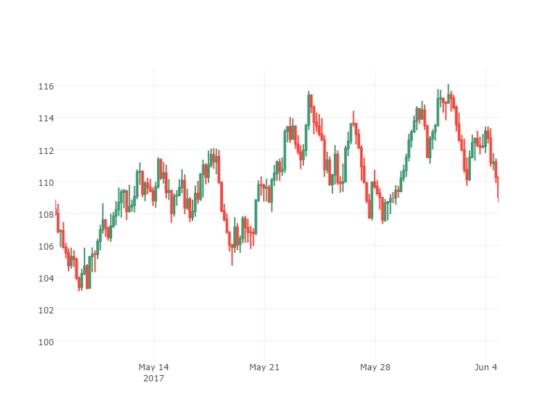

```python
import sys
sys.path.append('../../common/')
```

# 使い方

## 下準備

### モジュールインポート

必要なモジュールをインポートします。


```python
# ----------General Module----------
import numpy as np
import pandas as pd
import stockstats as ss
# ----------User Module----------
from randomwalk import randomwalk
import stockplot as sp
```

* General Moduleは一般に配布されているパッケージなのでcondaやpipといったパッケージ管理ソフトでインストールしてください。
* User Moduleのstockplotについては[Qiita - u1and0 / plotlyでキャンドルチャートプロット](http://qiita.com/u1and0/items/0ebcf097a1d61c636eb9)
* random_walkについては[Qiita - u1and0 / pythonでローソク足(candle chart)の描画](http://qiita.com/u1and0/items/1d9afdb7216c3d2320ef)

### サンプルデータの作成


```python
# Make sample data
np.random.seed(1)
df = randomwalk(60 * 60 * 24 * 90, freq='S', tick=0.01, start=pd.datetime(2017, 3, 20)).resample('T').ohlc() + 115  # 90日分の1分足
```

ランダムな為替チャートを作成します。
randomwalk関数で"2017/3/20からの1分足を90日分作成します。

### インスタンス化


```python
# Convert DataFrame as StockDataFrame
sdf = ss.StockDataFrame(df)

# Convert StockDataFrame as StockPlot
fx = sp.StockPlot(sdf)
```

StockDataFrameクラスでインスタンス化を行います。
今回の記事では指標の追加は行いませんので、必ずしも必要ではありません。

`fig = sp.StockPlot(sdf)`でStockPlotクラスでインスタンス化します。
インスタンス化すると同時に日足に変換され、StockPlotのインスタンス変数`stock_dataframe`に格納されます。
2017/3/20-2017/6/17の日足が格納されました。


```python
fx.stock_dataframe.head(), fx.stock_dataframe.tail()
```


    (               low    open    high   close
     2017-03-20  112.71  115.00  116.80  114.22
     2017-03-21  113.67  114.23  116.23  115.52
     2017-03-22  112.23  115.51  117.44  112.29
     2017-03-23  111.88  112.28  116.08  116.02
     2017-03-24  114.76  116.03  119.10  118.60,
                    low    open    high   close
     2017-06-13  103.18  106.19  106.28  106.12
     2017-06-14  104.59  106.13  108.51  108.07
     2017-06-15  103.97  108.06  108.86  105.66
     2017-06-16  104.94  105.66  108.59  108.25
     2017-06-17  107.31  108.24  110.73  109.22)


## ローソク足の描画


```python
fx.candle_plot()
```


    {'data': [{'boxpoints': False,
       'fillcolor': '#3D9970',
       'line': {'color': '#3D9970'},
       'name': 'Increasing',
       'showlegend': False,
       'type': 'box',
       'whiskerwidth': 0,
       'x': [Timestamp('2017-03-21 00:00:00', freq='D'),
        Timestamp('2017-03-21 00:00:00', freq='D'),
        Timestamp('2017-03-21 00:00:00', freq='D'),
        Timestamp('2017-03-21 00:00:00', freq='D'),
        Timestamp('2017-03-21 00:00:00', freq='D'),
        Timestamp('2017-03-21 00:00:00', freq='D'),
        Timestamp('2017-03-23 00:00:00', freq='D'),
        Timestamp('2017-03-23 00:00:00', freq='D'),
        Timestamp('2017-03-23 00:00:00', freq='D'),
        Timestamp('2017-03-23 00:00:00', freq='D'),
        Timestamp('2017-03-23 00:00:00', freq='D'),
        Timestamp('2017-03-23 00:00:00', freq='D'),
        Timestamp('2017-03-24 00:00:00', freq='D'),
        Timestamp('2017-03-24 00:00:00', freq='D'),
        Timestamp('2017-03-24 00:00:00', freq='D'),
        Timestamp('2017-03-24 00:00:00', freq='D'),
        Timestamp('2017-03-24 00:00:00', freq='D'),
        Timestamp('2017-03-24 00:00:00', freq='D'),
        Timestamp('2017-03-25 00:00:00', freq='D'),
        Timestamp('2017-03-25 00:00:00', freq='D'),
        Timestamp('2017-03-25 00:00:00', freq='D'),
        Timestamp('2017-03-25 00:00:00', freq='D'),
        Timestamp('2017-03-25 00:00:00', freq='D'),
        Timestamp('2017-03-25 00:00:00', freq='D'),
        Timestamp('2017-03-28 00:00:00', freq='D'),
        Timestamp('2017-03-28 00:00:00', freq='D'),
        Timestamp('2017-03-28 00:00:00', freq='D'),
        Timestamp('2017-03-28 00:00:00', freq='D'),
        Timestamp('2017-03-28 00:00:00', freq='D'),
        Timestamp('2017-03-28 00:00:00', freq='D'),
        Timestamp('2017-03-31 00:00:00', freq='D'),
        Timestamp('2017-03-31 00:00:00', freq='D'),
        Timestamp('2017-03-31 00:00:00', freq='D'),
        Timestamp('2017-03-31 00:00:00', freq='D'),
        Timestamp('2017-03-31 00:00:00', freq='D'),
        Timestamp('2017-03-31 00:00:00', freq='D'),
        Timestamp('2017-04-02 00:00:00', freq='D'),
        Timestamp('2017-04-02 00:00:00', freq='D'),
        Timestamp('2017-04-02 00:00:00', freq='D'),
        Timestamp('2017-04-02 00:00:00', freq='D'),
        Timestamp('2017-04-02 00:00:00', freq='D'),
        Timestamp('2017-04-02 00:00:00', freq='D'),
        Timestamp('2017-04-03 00:00:00', freq='D'),
        Timestamp('2017-04-03 00:00:00', freq='D'),
        Timestamp('2017-04-03 00:00:00', freq='D'),
        Timestamp('2017-04-03 00:00:00', freq='D'),
        Timestamp('2017-04-03 00:00:00', freq='D'),
        Timestamp('2017-04-03 00:00:00', freq='D'),
        Timestamp('2017-04-04 00:00:00', freq='D'),
        Timestamp('2017-04-04 00:00:00', freq='D'),
        Timestamp('2017-04-04 00:00:00', freq='D'),
        Timestamp('2017-04-04 00:00:00', freq='D'),
        Timestamp('2017-04-04 00:00:00', freq='D'),
        Timestamp('2017-04-04 00:00:00', freq='D'),
        Timestamp('2017-04-06 00:00:00', freq='D'),
        Timestamp('2017-04-06 00:00:00', freq='D'),
        Timestamp('2017-04-06 00:00:00', freq='D'),
        Timestamp('2017-04-06 00:00:00', freq='D'),
        Timestamp('2017-04-06 00:00:00', freq='D'),
        Timestamp('2017-04-06 00:00:00', freq='D'),
        Timestamp('2017-04-09 00:00:00', freq='D'),
        Timestamp('2017-04-09 00:00:00', freq='D'),
        Timestamp('2017-04-09 00:00:00', freq='D'),
        Timestamp('2017-04-09 00:00:00', freq='D'),
        Timestamp('2017-04-09 00:00:00', freq='D'),
        Timestamp('2017-04-09 00:00:00', freq='D'),
        Timestamp('2017-04-13 00:00:00', freq='D'),
        Timestamp('2017-04-13 00:00:00', freq='D'),
        Timestamp('2017-04-13 00:00:00', freq='D'),
        Timestamp('2017-04-13 00:00:00', freq='D'),
        Timestamp('2017-04-13 00:00:00', freq='D'),
        Timestamp('2017-04-13 00:00:00', freq='D'),
        Timestamp('2017-04-16 00:00:00', freq='D'),
        Timestamp('2017-04-16 00:00:00', freq='D'),
        Timestamp('2017-04-16 00:00:00', freq='D'),
        Timestamp('2017-04-16 00:00:00', freq='D'),
        Timestamp('2017-04-16 00:00:00', freq='D'),
        Timestamp('2017-04-16 00:00:00', freq='D'),
        Timestamp('2017-04-22 00:00:00', freq='D'),
        Timestamp('2017-04-22 00:00:00', freq='D'),
        Timestamp('2017-04-22 00:00:00', freq='D'),
        Timestamp('2017-04-22 00:00:00', freq='D'),
        Timestamp('2017-04-22 00:00:00', freq='D'),
        Timestamp('2017-04-22 00:00:00', freq='D'),
        Timestamp('2017-04-23 00:00:00', freq='D'),
        Timestamp('2017-04-23 00:00:00', freq='D'),
        Timestamp('2017-04-23 00:00:00', freq='D'),
        Timestamp('2017-04-23 00:00:00', freq='D'),
        Timestamp('2017-04-23 00:00:00', freq='D'),
        Timestamp('2017-04-23 00:00:00', freq='D'),
        Timestamp('2017-04-24 00:00:00', freq='D'),
        Timestamp('2017-04-24 00:00:00', freq='D'),
        Timestamp('2017-04-24 00:00:00', freq='D'),
        Timestamp('2017-04-24 00:00:00', freq='D'),
        Timestamp('2017-04-24 00:00:00', freq='D'),
        Timestamp('2017-04-24 00:00:00', freq='D'),
        Timestamp('2017-04-25 00:00:00', freq='D'),
        Timestamp('2017-04-25 00:00:00', freq='D'),
        Timestamp('2017-04-25 00:00:00', freq='D'),
        Timestamp('2017-04-25 00:00:00', freq='D'),
        Timestamp('2017-04-25 00:00:00', freq='D'),
        Timestamp('2017-04-25 00:00:00', freq='D'),
        Timestamp('2017-04-27 00:00:00', freq='D'),
        Timestamp('2017-04-27 00:00:00', freq='D'),
        Timestamp('2017-04-27 00:00:00', freq='D'),
        Timestamp('2017-04-27 00:00:00', freq='D'),
        Timestamp('2017-04-27 00:00:00', freq='D'),
        Timestamp('2017-04-27 00:00:00', freq='D'),
        Timestamp('2017-04-29 00:00:00', freq='D'),
        Timestamp('2017-04-29 00:00:00', freq='D'),
        Timestamp('2017-04-29 00:00:00', freq='D'),
        Timestamp('2017-04-29 00:00:00', freq='D'),
        Timestamp('2017-04-29 00:00:00', freq='D'),
        Timestamp('2017-04-29 00:00:00', freq='D'),
        Timestamp('2017-05-02 00:00:00', freq='D'),
        Timestamp('2017-05-02 00:00:00', freq='D'),
        Timestamp('2017-05-02 00:00:00', freq='D'),
        Timestamp('2017-05-02 00:00:00', freq='D'),
        Timestamp('2017-05-02 00:00:00', freq='D'),
        Timestamp('2017-05-02 00:00:00', freq='D'),
        Timestamp('2017-05-03 00:00:00', freq='D'),
        Timestamp('2017-05-03 00:00:00', freq='D'),
        Timestamp('2017-05-03 00:00:00', freq='D'),
        Timestamp('2017-05-03 00:00:00', freq='D'),
        Timestamp('2017-05-03 00:00:00', freq='D'),
        Timestamp('2017-05-03 00:00:00', freq='D'),
        Timestamp('2017-05-06 00:00:00', freq='D'),
        Timestamp('2017-05-06 00:00:00', freq='D'),
        Timestamp('2017-05-06 00:00:00', freq='D'),
        Timestamp('2017-05-06 00:00:00', freq='D'),
        Timestamp('2017-05-06 00:00:00', freq='D'),
        Timestamp('2017-05-06 00:00:00', freq='D'),
        Timestamp('2017-05-10 00:00:00', freq='D'),
        Timestamp('2017-05-10 00:00:00', freq='D'),
        Timestamp('2017-05-10 00:00:00', freq='D'),
        Timestamp('2017-05-10 00:00:00', freq='D'),
        Timestamp('2017-05-10 00:00:00', freq='D'),
        Timestamp('2017-05-10 00:00:00', freq='D'),
        Timestamp('2017-05-11 00:00:00', freq='D'),
        Timestamp('2017-05-11 00:00:00', freq='D'),
        Timestamp('2017-05-11 00:00:00', freq='D'),
        Timestamp('2017-05-11 00:00:00', freq='D'),
        Timestamp('2017-05-11 00:00:00', freq='D'),
        Timestamp('2017-05-11 00:00:00', freq='D'),
        Timestamp('2017-05-12 00:00:00', freq='D'),
        Timestamp('2017-05-12 00:00:00', freq='D'),
        Timestamp('2017-05-12 00:00:00', freq='D'),
        Timestamp('2017-05-12 00:00:00', freq='D'),
        Timestamp('2017-05-12 00:00:00', freq='D'),
        Timestamp('2017-05-12 00:00:00', freq='D'),
        Timestamp('2017-05-13 00:00:00', freq='D'),
        Timestamp('2017-05-13 00:00:00', freq='D'),
        Timestamp('2017-05-13 00:00:00', freq='D'),
        Timestamp('2017-05-13 00:00:00', freq='D'),
        Timestamp('2017-05-13 00:00:00', freq='D'),
        Timestamp('2017-05-13 00:00:00', freq='D'),
        Timestamp('2017-05-15 00:00:00', freq='D'),
        Timestamp('2017-05-15 00:00:00', freq='D'),
        Timestamp('2017-05-15 00:00:00', freq='D'),
        Timestamp('2017-05-15 00:00:00', freq='D'),
        Timestamp('2017-05-15 00:00:00', freq='D'),
        Timestamp('2017-05-15 00:00:00', freq='D'),
        Timestamp('2017-05-17 00:00:00', freq='D'),
        Timestamp('2017-05-17 00:00:00', freq='D'),
        Timestamp('2017-05-17 00:00:00', freq='D'),
        Timestamp('2017-05-17 00:00:00', freq='D'),
        Timestamp('2017-05-17 00:00:00', freq='D'),
        Timestamp('2017-05-17 00:00:00', freq='D'),
        Timestamp('2017-05-19 00:00:00', freq='D'),
        Timestamp('2017-05-19 00:00:00', freq='D'),
        Timestamp('2017-05-19 00:00:00', freq='D'),
        Timestamp('2017-05-19 00:00:00', freq='D'),
        Timestamp('2017-05-19 00:00:00', freq='D'),
        Timestamp('2017-05-19 00:00:00', freq='D'),
        Timestamp('2017-05-20 00:00:00', freq='D'),
        Timestamp('2017-05-20 00:00:00', freq='D'),
        Timestamp('2017-05-20 00:00:00', freq='D'),
        Timestamp('2017-05-20 00:00:00', freq='D'),
        Timestamp('2017-05-20 00:00:00', freq='D'),
        Timestamp('2017-05-20 00:00:00', freq='D'),
        Timestamp('2017-05-21 00:00:00', freq='D'),
        Timestamp('2017-05-21 00:00:00', freq='D'),
        Timestamp('2017-05-21 00:00:00', freq='D'),
        Timestamp('2017-05-21 00:00:00', freq='D'),
        Timestamp('2017-05-21 00:00:00', freq='D'),
        Timestamp('2017-05-21 00:00:00', freq='D'),
        Timestamp('2017-05-22 00:00:00', freq='D'),
        Timestamp('2017-05-22 00:00:00', freq='D'),
        Timestamp('2017-05-22 00:00:00', freq='D'),
        Timestamp('2017-05-22 00:00:00', freq='D'),
        Timestamp('2017-05-22 00:00:00', freq='D'),
        Timestamp('2017-05-22 00:00:00', freq='D'),
        Timestamp('2017-05-23 00:00:00', freq='D'),
        Timestamp('2017-05-23 00:00:00', freq='D'),
        Timestamp('2017-05-23 00:00:00', freq='D'),
        Timestamp('2017-05-23 00:00:00', freq='D'),
        Timestamp('2017-05-23 00:00:00', freq='D'),
        Timestamp('2017-05-23 00:00:00', freq='D'),
        Timestamp('2017-05-26 00:00:00', freq='D'),
        Timestamp('2017-05-26 00:00:00', freq='D'),
        Timestamp('2017-05-26 00:00:00', freq='D'),
        Timestamp('2017-05-26 00:00:00', freq='D'),
        Timestamp('2017-05-26 00:00:00', freq='D'),
        Timestamp('2017-05-26 00:00:00', freq='D'),
        Timestamp('2017-05-29 00:00:00', freq='D'),
        Timestamp('2017-05-29 00:00:00', freq='D'),
        Timestamp('2017-05-29 00:00:00', freq='D'),
        Timestamp('2017-05-29 00:00:00', freq='D'),
        Timestamp('2017-05-29 00:00:00', freq='D'),
        Timestamp('2017-05-29 00:00:00', freq='D'),
        Timestamp('2017-05-30 00:00:00', freq='D'),
        Timestamp('2017-05-30 00:00:00', freq='D'),
        Timestamp('2017-05-30 00:00:00', freq='D'),
        Timestamp('2017-05-30 00:00:00', freq='D'),
        Timestamp('2017-05-30 00:00:00', freq='D'),
        Timestamp('2017-05-30 00:00:00', freq='D'),
        Timestamp('2017-06-01 00:00:00', freq='D'),
        Timestamp('2017-06-01 00:00:00', freq='D'),
        Timestamp('2017-06-01 00:00:00', freq='D'),
        Timestamp('2017-06-01 00:00:00', freq='D'),
        Timestamp('2017-06-01 00:00:00', freq='D'),
        Timestamp('2017-06-01 00:00:00', freq='D'),
        Timestamp('2017-06-03 00:00:00', freq='D'),
        Timestamp('2017-06-03 00:00:00', freq='D'),
        Timestamp('2017-06-03 00:00:00', freq='D'),
        Timestamp('2017-06-03 00:00:00', freq='D'),
        Timestamp('2017-06-03 00:00:00', freq='D'),
        Timestamp('2017-06-03 00:00:00', freq='D'),
        Timestamp('2017-06-07 00:00:00', freq='D'),
        Timestamp('2017-06-07 00:00:00', freq='D'),
        Timestamp('2017-06-07 00:00:00', freq='D'),
        Timestamp('2017-06-07 00:00:00', freq='D'),
        Timestamp('2017-06-07 00:00:00', freq='D'),
        Timestamp('2017-06-07 00:00:00', freq='D'),
        Timestamp('2017-06-08 00:00:00', freq='D'),
        Timestamp('2017-06-08 00:00:00', freq='D'),
        Timestamp('2017-06-08 00:00:00', freq='D'),
        Timestamp('2017-06-08 00:00:00', freq='D'),
        Timestamp('2017-06-08 00:00:00', freq='D'),
        Timestamp('2017-06-08 00:00:00', freq='D'),
        Timestamp('2017-06-10 00:00:00', freq='D'),
        Timestamp('2017-06-10 00:00:00', freq='D'),
        Timestamp('2017-06-10 00:00:00', freq='D'),
        Timestamp('2017-06-10 00:00:00', freq='D'),
        Timestamp('2017-06-10 00:00:00', freq='D'),
        Timestamp('2017-06-10 00:00:00', freq='D'),
        Timestamp('2017-06-14 00:00:00', freq='D'),
        Timestamp('2017-06-14 00:00:00', freq='D'),
        Timestamp('2017-06-14 00:00:00', freq='D'),
        Timestamp('2017-06-14 00:00:00', freq='D'),
        Timestamp('2017-06-14 00:00:00', freq='D'),
        Timestamp('2017-06-14 00:00:00', freq='D'),
        Timestamp('2017-06-16 00:00:00', freq='D'),
        Timestamp('2017-06-16 00:00:00', freq='D'),
        Timestamp('2017-06-16 00:00:00', freq='D'),
        Timestamp('2017-06-16 00:00:00', freq='D'),
        Timestamp('2017-06-16 00:00:00', freq='D'),
        Timestamp('2017-06-16 00:00:00', freq='D'),
        Timestamp('2017-06-17 00:00:00', freq='D'),
        Timestamp('2017-06-17 00:00:00', freq='D'),
        Timestamp('2017-06-17 00:00:00', freq='D'),
        Timestamp('2017-06-17 00:00:00', freq='D'),
        Timestamp('2017-06-17 00:00:00', freq='D'),
        Timestamp('2017-06-17 00:00:00', freq='D')],
       'y': [113.67,
        114.23,
        115.52,
        115.52,
        115.52,
        116.23,
        111.88000000000002,
        112.28000000000002,
        116.02,
        116.02,
        116.02,
        116.08,
        114.76000000000001,
        116.03,
        118.59999999999997,
        118.59999999999997,
        118.59999999999997,
        119.09999999999995,
        117.49999999999999,
        118.58999999999997,
        121.3399999999999,
        121.3399999999999,
        121.3399999999999,
        121.6599999999999,
        113.19,
        115.34999999999999,
        116.71000000000001,
        116.71000000000001,
        116.71000000000001,
        117.31999999999999,
        111.43000000000004,
        112.50000000000001,
        112.95,
        112.95,
        112.95,
        114.42999999999999,
        111.17000000000004,
        111.73000000000002,
        113.03999999999999,
        113.03999999999999,
        113.03999999999999,
        114.31,
        112.03000000000002,
        113.05,
        113.72,
        113.72,
        113.72,
        114.44,
        112.62,
        113.73,
        114.13,
        114.13,
        114.13,
        115.89,
        112.60000000000001,
        113.2,
        114.68000000000001,
        114.68000000000001,
        114.68000000000001,
        115.81,
        110.87000000000005,
        110.89000000000004,
        115.78,
        115.78,
        115.78,
        116.16,
        114.17,
        114.44,
        116.89,
        116.89,
        116.89,
        117.45999999999999,
        111.62000000000003,
        112.06000000000002,
        114.42,
        114.42,
        114.42,
        115.53,
        96.139999999999844,
        97.760000000000105,
        98.530000000000229,
        98.530000000000229,
        98.530000000000229,
        98.810000000000272,
        97.890000000000128,
        98.520000000000223,
        103.05000000000021,
        103.05000000000021,
        103.05000000000021,
        103.4500000000002,
        102.62000000000022,
        103.04000000000021,
        105.10000000000016,
        105.10000000000016,
        105.10000000000016,
        107.11000000000013,
        104.92000000000017,
        105.09000000000017,
        106.77000000000012,
        106.77000000000012,
        106.77000000000012,
        107.40000000000012,
        104.55000000000018,
        105.52000000000015,
        105.57000000000016,
        105.57000000000016,
        105.57000000000016,
        107.31000000000012,
        103.6600000000002,
        105.25000000000017,
        106.21000000000015,
        106.21000000000015,
        106.21000000000015,
        107.71000000000011,
        100.05000000000027,
        100.99000000000025,
        105.85000000000015,
        105.85000000000015,
        105.85000000000015,
        105.99000000000015,
        105.46000000000016,
        105.85000000000015,
        108.65000000000009,
        108.65000000000009,
        108.65000000000009,
        109.83000000000007,
        105.68000000000015,
        106.08000000000014,
        108.5800000000001,
        108.5800000000001,
        108.5800000000001,
        108.98000000000009,
        103.27000000000021,
        103.33000000000021,
        107.59000000000012,
        107.59000000000012,
        107.59000000000012,
        108.63000000000009,
        106.22000000000014,
        107.60000000000011,
        108.68000000000009,
        108.68000000000009,
        108.68000000000009,
        109.61000000000007,
        107.57000000000011,
        108.69000000000008,
        109.05000000000008,
        109.05000000000008,
        109.05000000000008,
        109.79000000000006,
        108.76000000000009,
        109.05000000000008,
        109.39000000000007,
        109.39000000000007,
        109.39000000000007,
        111.19000000000004,
        107.40000000000012,
        109.32000000000008,
        110.06000000000006,
        110.06000000000006,
        110.06000000000006,
        110.76000000000005,
        108.7700000000001,
        108.89000000000009,
        111.23000000000003,
        111.23000000000003,
        111.23000000000003,
        112.09000000000002,
        104.72000000000017,
        106.04000000000015,
        107.11000000000013,
        107.11000000000013,
        107.11000000000013,
        107.86000000000011,
        105.77000000000015,
        107.10000000000012,
        109.76000000000006,
        109.76000000000006,
        109.76000000000006,
        110.31000000000006,
        108.0900000000001,
        109.76000000000006,
        111.21000000000004,
        111.21000000000004,
        111.21000000000004,
        111.31000000000003,
        110.03000000000006,
        111.20000000000003,
        113.45,
        113.45,
        113.45,
        114.02,
        110.77000000000004,
        113.45,
        115.38,
        115.38,
        115.38,
        115.67,
        109.34000000000007,
        109.88000000000007,
        112.94,
        112.94,
        112.94,
        114.42,
        107.94000000000011,
        108.72000000000008,
        110.68000000000005,
        110.68000000000005,
        110.68000000000005,
        111.05000000000004,
        110.28000000000006,
        110.68000000000005,
        113.90000000000001,
        113.90000000000001,
        113.90000000000001,
        114.7,
        113.42999999999999,
        113.48999999999999,
        115.20999999999999,
        115.20999999999999,
        115.20999999999999,
        116.09999999999999,
        110.01000000000006,
        110.12000000000006,
        112.19000000000001,
        112.19000000000001,
        112.19000000000001,
        113.17,
        105.95000000000014,
        106.68000000000013,
        107.38000000000012,
        107.38000000000012,
        107.38000000000012,
        108.46000000000009,
        106.22000000000014,
        107.38000000000012,
        107.65000000000012,
        107.65000000000012,
        107.65000000000012,
        109.55000000000007,
        104.00000000000018,
        105.16000000000017,
        106.59000000000013,
        106.59000000000013,
        106.59000000000013,
        108.5200000000001,
        104.59000000000017,
        106.13000000000014,
        108.07000000000011,
        108.07000000000011,
        108.07000000000011,
        108.51000000000009,
        104.94000000000017,
        105.66000000000015,
        108.2500000000001,
        108.2500000000001,
        108.2500000000001,
        108.59000000000009,
        107.31000000000012,
        108.24000000000009,
        109.22000000000008,
        109.22000000000008,
        109.22000000000008,
        110.73000000000005]},
      {'boxpoints': False,
       'fillcolor': '#FF4136',
       'line': {'color': '#FF4136'},
       'name': 'Decreasing',
       'showlegend': False,
       'type': 'box',
       'whiskerwidth': 0,
       'x': [Timestamp('2017-03-20 00:00:00', freq='D'),
        Timestamp('2017-03-20 00:00:00', freq='D'),
        Timestamp('2017-03-20 00:00:00', freq='D'),
        Timestamp('2017-03-20 00:00:00', freq='D'),
        Timestamp('2017-03-20 00:00:00', freq='D'),
        Timestamp('2017-03-20 00:00:00', freq='D'),
        Timestamp('2017-03-22 00:00:00', freq='D'),
        Timestamp('2017-03-22 00:00:00', freq='D'),
        Timestamp('2017-03-22 00:00:00', freq='D'),
        Timestamp('2017-03-22 00:00:00', freq='D'),
        Timestamp('2017-03-22 00:00:00', freq='D'),
        Timestamp('2017-03-22 00:00:00', freq='D'),
        Timestamp('2017-03-26 00:00:00', freq='D'),
        Timestamp('2017-03-26 00:00:00', freq='D'),
        Timestamp('2017-03-26 00:00:00', freq='D'),
        Timestamp('2017-03-26 00:00:00', freq='D'),
        Timestamp('2017-03-26 00:00:00', freq='D'),
        Timestamp('2017-03-26 00:00:00', freq='D'),
        Timestamp('2017-03-27 00:00:00', freq='D'),
        Timestamp('2017-03-27 00:00:00', freq='D'),
        Timestamp('2017-03-27 00:00:00', freq='D'),
        Timestamp('2017-03-27 00:00:00', freq='D'),
        Timestamp('2017-03-27 00:00:00', freq='D'),
        Timestamp('2017-03-27 00:00:00', freq='D'),
        Timestamp('2017-03-29 00:00:00', freq='D'),
        Timestamp('2017-03-29 00:00:00', freq='D'),
        Timestamp('2017-03-29 00:00:00', freq='D'),
        Timestamp('2017-03-29 00:00:00', freq='D'),
        Timestamp('2017-03-29 00:00:00', freq='D'),
        Timestamp('2017-03-29 00:00:00', freq='D'),
        Timestamp('2017-03-30 00:00:00', freq='D'),
        Timestamp('2017-03-30 00:00:00', freq='D'),
        Timestamp('2017-03-30 00:00:00', freq='D'),
        Timestamp('2017-03-30 00:00:00', freq='D'),
        Timestamp('2017-03-30 00:00:00', freq='D'),
        Timestamp('2017-03-30 00:00:00', freq='D'),
        Timestamp('2017-04-01 00:00:00', freq='D'),
        Timestamp('2017-04-01 00:00:00', freq='D'),
        Timestamp('2017-04-01 00:00:00', freq='D'),
        Timestamp('2017-04-01 00:00:00', freq='D'),
        Timestamp('2017-04-01 00:00:00', freq='D'),
        Timestamp('2017-04-01 00:00:00', freq='D'),
        Timestamp('2017-04-05 00:00:00', freq='D'),
        Timestamp('2017-04-05 00:00:00', freq='D'),
        Timestamp('2017-04-05 00:00:00', freq='D'),
        Timestamp('2017-04-05 00:00:00', freq='D'),
        Timestamp('2017-04-05 00:00:00', freq='D'),
        Timestamp('2017-04-05 00:00:00', freq='D'),
        Timestamp('2017-04-07 00:00:00', freq='D'),
        Timestamp('2017-04-07 00:00:00', freq='D'),
        Timestamp('2017-04-07 00:00:00', freq='D'),
        Timestamp('2017-04-07 00:00:00', freq='D'),
        Timestamp('2017-04-07 00:00:00', freq='D'),
        Timestamp('2017-04-07 00:00:00', freq='D'),
        Timestamp('2017-04-08 00:00:00', freq='D'),
        Timestamp('2017-04-08 00:00:00', freq='D'),
        Timestamp('2017-04-08 00:00:00', freq='D'),
        Timestamp('2017-04-08 00:00:00', freq='D'),
        Timestamp('2017-04-08 00:00:00', freq='D'),
        Timestamp('2017-04-08 00:00:00', freq='D'),
        Timestamp('2017-04-10 00:00:00', freq='D'),
        Timestamp('2017-04-10 00:00:00', freq='D'),
        Timestamp('2017-04-10 00:00:00', freq='D'),
        Timestamp('2017-04-10 00:00:00', freq='D'),
        Timestamp('2017-04-10 00:00:00', freq='D'),
        Timestamp('2017-04-10 00:00:00', freq='D'),
        Timestamp('2017-04-11 00:00:00', freq='D'),
        Timestamp('2017-04-11 00:00:00', freq='D'),
        Timestamp('2017-04-11 00:00:00', freq='D'),
        Timestamp('2017-04-11 00:00:00', freq='D'),
        Timestamp('2017-04-11 00:00:00', freq='D'),
        Timestamp('2017-04-11 00:00:00', freq='D'),
        Timestamp('2017-04-12 00:00:00', freq='D'),
        Timestamp('2017-04-12 00:00:00', freq='D'),
        Timestamp('2017-04-12 00:00:00', freq='D'),
        Timestamp('2017-04-12 00:00:00', freq='D'),
        Timestamp('2017-04-12 00:00:00', freq='D'),
        Timestamp('2017-04-12 00:00:00', freq='D'),
        Timestamp('2017-04-14 00:00:00', freq='D'),
        Timestamp('2017-04-14 00:00:00', freq='D'),
        Timestamp('2017-04-14 00:00:00', freq='D'),
        Timestamp('2017-04-14 00:00:00', freq='D'),
        Timestamp('2017-04-14 00:00:00', freq='D'),
        Timestamp('2017-04-14 00:00:00', freq='D'),
        Timestamp('2017-04-15 00:00:00', freq='D'),
        Timestamp('2017-04-15 00:00:00', freq='D'),
        Timestamp('2017-04-15 00:00:00', freq='D'),
        Timestamp('2017-04-15 00:00:00', freq='D'),
        Timestamp('2017-04-15 00:00:00', freq='D'),
        Timestamp('2017-04-15 00:00:00', freq='D'),
        Timestamp('2017-04-17 00:00:00', freq='D'),
        Timestamp('2017-04-17 00:00:00', freq='D'),
        Timestamp('2017-04-17 00:00:00', freq='D'),
        Timestamp('2017-04-17 00:00:00', freq='D'),
        Timestamp('2017-04-17 00:00:00', freq='D'),
        Timestamp('2017-04-17 00:00:00', freq='D'),
        Timestamp('2017-04-18 00:00:00', freq='D'),
        Timestamp('2017-04-18 00:00:00', freq='D'),
        Timestamp('2017-04-18 00:00:00', freq='D'),
        Timestamp('2017-04-18 00:00:00', freq='D'),
        Timestamp('2017-04-18 00:00:00', freq='D'),
        Timestamp('2017-04-18 00:00:00', freq='D'),
        Timestamp('2017-04-19 00:00:00', freq='D'),
        Timestamp('2017-04-19 00:00:00', freq='D'),
        Timestamp('2017-04-19 00:00:00', freq='D'),
        Timestamp('2017-04-19 00:00:00', freq='D'),
        Timestamp('2017-04-19 00:00:00', freq='D'),
        Timestamp('2017-04-19 00:00:00', freq='D'),
        Timestamp('2017-04-20 00:00:00', freq='D'),
        Timestamp('2017-04-20 00:00:00', freq='D'),
        Timestamp('2017-04-20 00:00:00', freq='D'),
        Timestamp('2017-04-20 00:00:00', freq='D'),
        Timestamp('2017-04-20 00:00:00', freq='D'),
        Timestamp('2017-04-20 00:00:00', freq='D'),
        Timestamp('2017-04-21 00:00:00', freq='D'),
        Timestamp('2017-04-21 00:00:00', freq='D'),
        Timestamp('2017-04-21 00:00:00', freq='D'),
        Timestamp('2017-04-21 00:00:00', freq='D'),
        Timestamp('2017-04-21 00:00:00', freq='D'),
        Timestamp('2017-04-21 00:00:00', freq='D'),
        Timestamp('2017-04-26 00:00:00', freq='D'),
        Timestamp('2017-04-26 00:00:00', freq='D'),
        Timestamp('2017-04-26 00:00:00', freq='D'),
        Timestamp('2017-04-26 00:00:00', freq='D'),
        Timestamp('2017-04-26 00:00:00', freq='D'),
        Timestamp('2017-04-26 00:00:00', freq='D'),
        Timestamp('2017-04-28 00:00:00', freq='D'),
        Timestamp('2017-04-28 00:00:00', freq='D'),
        Timestamp('2017-04-28 00:00:00', freq='D'),
        Timestamp('2017-04-28 00:00:00', freq='D'),
        Timestamp('2017-04-28 00:00:00', freq='D'),
        Timestamp('2017-04-28 00:00:00', freq='D'),
        Timestamp('2017-04-30 00:00:00', freq='D'),
        Timestamp('2017-04-30 00:00:00', freq='D'),
        Timestamp('2017-04-30 00:00:00', freq='D'),
        Timestamp('2017-04-30 00:00:00', freq='D'),
        Timestamp('2017-04-30 00:00:00', freq='D'),
        Timestamp('2017-04-30 00:00:00', freq='D'),
        Timestamp('2017-05-01 00:00:00', freq='D'),
        Timestamp('2017-05-01 00:00:00', freq='D'),
        Timestamp('2017-05-01 00:00:00', freq='D'),
        Timestamp('2017-05-01 00:00:00', freq='D'),
        Timestamp('2017-05-01 00:00:00', freq='D'),
        Timestamp('2017-05-01 00:00:00', freq='D'),
        Timestamp('2017-05-04 00:00:00', freq='D'),
        Timestamp('2017-05-04 00:00:00', freq='D'),
        Timestamp('2017-05-04 00:00:00', freq='D'),
        Timestamp('2017-05-04 00:00:00', freq='D'),
        Timestamp('2017-05-04 00:00:00', freq='D'),
        Timestamp('2017-05-04 00:00:00', freq='D'),
        Timestamp('2017-05-05 00:00:00', freq='D'),
        Timestamp('2017-05-05 00:00:00', freq='D'),
        Timestamp('2017-05-05 00:00:00', freq='D'),
        Timestamp('2017-05-05 00:00:00', freq='D'),
        Timestamp('2017-05-05 00:00:00', freq='D'),
        Timestamp('2017-05-05 00:00:00', freq='D'),
        Timestamp('2017-05-07 00:00:00', freq='D'),
        Timestamp('2017-05-07 00:00:00', freq='D'),
        Timestamp('2017-05-07 00:00:00', freq='D'),
        Timestamp('2017-05-07 00:00:00', freq='D'),
        Timestamp('2017-05-07 00:00:00', freq='D'),
        Timestamp('2017-05-07 00:00:00', freq='D'),
        Timestamp('2017-05-08 00:00:00', freq='D'),
        Timestamp('2017-05-08 00:00:00', freq='D'),
        Timestamp('2017-05-08 00:00:00', freq='D'),
        Timestamp('2017-05-08 00:00:00', freq='D'),
        Timestamp('2017-05-08 00:00:00', freq='D'),
        Timestamp('2017-05-08 00:00:00', freq='D'),
        Timestamp('2017-05-09 00:00:00', freq='D'),
        Timestamp('2017-05-09 00:00:00', freq='D'),
        Timestamp('2017-05-09 00:00:00', freq='D'),
        Timestamp('2017-05-09 00:00:00', freq='D'),
        Timestamp('2017-05-09 00:00:00', freq='D'),
        Timestamp('2017-05-09 00:00:00', freq='D'),
        Timestamp('2017-05-14 00:00:00', freq='D'),
        Timestamp('2017-05-14 00:00:00', freq='D'),
        Timestamp('2017-05-14 00:00:00', freq='D'),
        Timestamp('2017-05-14 00:00:00', freq='D'),
        Timestamp('2017-05-14 00:00:00', freq='D'),
        Timestamp('2017-05-14 00:00:00', freq='D'),
        Timestamp('2017-05-16 00:00:00', freq='D'),
        Timestamp('2017-05-16 00:00:00', freq='D'),
        Timestamp('2017-05-16 00:00:00', freq='D'),
        Timestamp('2017-05-16 00:00:00', freq='D'),
        Timestamp('2017-05-16 00:00:00', freq='D'),
        Timestamp('2017-05-16 00:00:00', freq='D'),
        Timestamp('2017-05-18 00:00:00', freq='D'),
        Timestamp('2017-05-18 00:00:00', freq='D'),
        Timestamp('2017-05-18 00:00:00', freq='D'),
        Timestamp('2017-05-18 00:00:00', freq='D'),
        Timestamp('2017-05-18 00:00:00', freq='D'),
        Timestamp('2017-05-18 00:00:00', freq='D'),
        Timestamp('2017-05-24 00:00:00', freq='D'),
        Timestamp('2017-05-24 00:00:00', freq='D'),
        Timestamp('2017-05-24 00:00:00', freq='D'),
        Timestamp('2017-05-24 00:00:00', freq='D'),
        Timestamp('2017-05-24 00:00:00', freq='D'),
        Timestamp('2017-05-24 00:00:00', freq='D'),
        Timestamp('2017-05-25 00:00:00', freq='D'),
        Timestamp('2017-05-25 00:00:00', freq='D'),
        Timestamp('2017-05-25 00:00:00', freq='D'),
        Timestamp('2017-05-25 00:00:00', freq='D'),
        Timestamp('2017-05-25 00:00:00', freq='D'),
        Timestamp('2017-05-25 00:00:00', freq='D'),
        Timestamp('2017-05-27 00:00:00', freq='D'),
        Timestamp('2017-05-27 00:00:00', freq='D'),
        Timestamp('2017-05-27 00:00:00', freq='D'),
        Timestamp('2017-05-27 00:00:00', freq='D'),
        Timestamp('2017-05-27 00:00:00', freq='D'),
        Timestamp('2017-05-27 00:00:00', freq='D'),
        Timestamp('2017-05-28 00:00:00', freq='D'),
        Timestamp('2017-05-28 00:00:00', freq='D'),
        Timestamp('2017-05-28 00:00:00', freq='D'),
        Timestamp('2017-05-28 00:00:00', freq='D'),
        Timestamp('2017-05-28 00:00:00', freq='D'),
        Timestamp('2017-05-28 00:00:00', freq='D'),
        Timestamp('2017-05-31 00:00:00', freq='D'),
        Timestamp('2017-05-31 00:00:00', freq='D'),
        Timestamp('2017-05-31 00:00:00', freq='D'),
        Timestamp('2017-05-31 00:00:00', freq='D'),
        Timestamp('2017-05-31 00:00:00', freq='D'),
        Timestamp('2017-05-31 00:00:00', freq='D'),
        Timestamp('2017-06-02 00:00:00', freq='D'),
        Timestamp('2017-06-02 00:00:00', freq='D'),
        Timestamp('2017-06-02 00:00:00', freq='D'),
        Timestamp('2017-06-02 00:00:00', freq='D'),
        Timestamp('2017-06-02 00:00:00', freq='D'),
        Timestamp('2017-06-02 00:00:00', freq='D'),
        Timestamp('2017-06-04 00:00:00', freq='D'),
        Timestamp('2017-06-04 00:00:00', freq='D'),
        Timestamp('2017-06-04 00:00:00', freq='D'),
        Timestamp('2017-06-04 00:00:00', freq='D'),
        Timestamp('2017-06-04 00:00:00', freq='D'),
        Timestamp('2017-06-04 00:00:00', freq='D'),
        Timestamp('2017-06-05 00:00:00', freq='D'),
        Timestamp('2017-06-05 00:00:00', freq='D'),
        Timestamp('2017-06-05 00:00:00', freq='D'),
        Timestamp('2017-06-05 00:00:00', freq='D'),
        Timestamp('2017-06-05 00:00:00', freq='D'),
        Timestamp('2017-06-05 00:00:00', freq='D'),
        Timestamp('2017-06-06 00:00:00', freq='D'),
        Timestamp('2017-06-06 00:00:00', freq='D'),
        Timestamp('2017-06-06 00:00:00', freq='D'),
        Timestamp('2017-06-06 00:00:00', freq='D'),
        Timestamp('2017-06-06 00:00:00', freq='D'),
        Timestamp('2017-06-06 00:00:00', freq='D'),
        Timestamp('2017-06-09 00:00:00', freq='D'),
        Timestamp('2017-06-09 00:00:00', freq='D'),
        Timestamp('2017-06-09 00:00:00', freq='D'),
        Timestamp('2017-06-09 00:00:00', freq='D'),
        Timestamp('2017-06-09 00:00:00', freq='D'),
        Timestamp('2017-06-09 00:00:00', freq='D'),
        Timestamp('2017-06-11 00:00:00', freq='D'),
        Timestamp('2017-06-11 00:00:00', freq='D'),
        Timestamp('2017-06-11 00:00:00', freq='D'),
        Timestamp('2017-06-11 00:00:00', freq='D'),
        Timestamp('2017-06-11 00:00:00', freq='D'),
        Timestamp('2017-06-11 00:00:00', freq='D'),
        Timestamp('2017-06-12 00:00:00', freq='D'),
        Timestamp('2017-06-12 00:00:00', freq='D'),
        Timestamp('2017-06-12 00:00:00', freq='D'),
        Timestamp('2017-06-12 00:00:00', freq='D'),
        Timestamp('2017-06-12 00:00:00', freq='D'),
        Timestamp('2017-06-12 00:00:00', freq='D'),
        Timestamp('2017-06-13 00:00:00', freq='D'),
        Timestamp('2017-06-13 00:00:00', freq='D'),
        Timestamp('2017-06-13 00:00:00', freq='D'),
        Timestamp('2017-06-13 00:00:00', freq='D'),
        Timestamp('2017-06-13 00:00:00', freq='D'),
        Timestamp('2017-06-13 00:00:00', freq='D'),
        Timestamp('2017-06-15 00:00:00', freq='D'),
        Timestamp('2017-06-15 00:00:00', freq='D'),
        Timestamp('2017-06-15 00:00:00', freq='D'),
        Timestamp('2017-06-15 00:00:00', freq='D'),
        Timestamp('2017-06-15 00:00:00', freq='D'),
        Timestamp('2017-06-15 00:00:00', freq='D')],
       'y': [112.71000000000001,
        115.0,
        114.22,
        114.22,
        114.22,
        116.8,
        112.23000000000002,
        115.51000000000001,
        112.29000000000002,
        112.29000000000002,
        112.29000000000002,
        117.44,
        116.22,
        121.3399999999999,
        117.09,
        117.09,
        117.09,
        121.8899999999999,
        114.40000000000001,
        117.09,
        115.36,
        115.36,
        115.36,
        118.91999999999996,
        113.63,
        116.7,
        114.03,
        114.03,
        114.03,
        117.19,
        110.27000000000005,
        114.04000000000001,
        112.51000000000001,
        112.51000000000001,
        112.51000000000001,
        115.34999999999999,
        110.71000000000005,
        112.95999999999999,
        111.72000000000003,
        111.72000000000003,
        111.72000000000003,
        113.66,
        112.02000000000002,
        114.14,
        113.20999999999999,
        113.20999999999999,
        113.20999999999999,
        115.63,
        112.43000000000001,
        114.69,
        112.58000000000001,
        112.58000000000001,
        112.58000000000001,
        115.64,
        110.39000000000006,
        112.58000000000001,
        110.90000000000005,
        110.90000000000005,
        110.90000000000005,
        113.42,
        115.18000000000001,
        115.78,
        115.59999999999999,
        115.59999999999999,
        115.59999999999999,
        117.77999999999999,
        113.31999999999999,
        115.61,
        115.33,
        115.33,
        115.33,
        116.66,
        113.39,
        115.33,
        114.42999999999999,
        114.42999999999999,
        114.42999999999999,
        117.54999999999998,
        112.33000000000001,
        116.88,
        112.46000000000001,
        112.46000000000001,
        112.46000000000001,
        117.0,
        111.40000000000003,
        112.46000000000001,
        112.06000000000002,
        112.06000000000002,
        112.06000000000002,
        114.06,
        111.09000000000003,
        114.41,
        111.09000000000003,
        111.09000000000003,
        111.09000000000003,
        115.54000000000001,
        108.07000000000011,
        111.08000000000004,
        108.87000000000009,
        108.87000000000009,
        108.87000000000009,
        111.45000000000003,
        106.70000000000013,
        108.86000000000008,
        108.1600000000001,
        108.1600000000001,
        108.1600000000001,
        110.79000000000005,
        104.65000000000018,
        108.1700000000001,
        104.84000000000017,
        104.84000000000017,
        104.84000000000017,
        110.28000000000006,
        97.30000000000004,
        104.83000000000017,
        97.760000000000105,
        97.760000000000105,
        97.760000000000105,
        105.33000000000015,
        105.38000000000017,
        106.78000000000013,
        105.51000000000016,
        105.51000000000016,
        105.51000000000016,
        107.67000000000012,
        103.30000000000021,
        105.58000000000015,
        105.24000000000017,
        105.24000000000017,
        105.24000000000017,
        106.00000000000014,
        102.55000000000022,
        106.20000000000014,
        104.41000000000018,
        104.41000000000018,
        104.41000000000018,
        106.28000000000014,
        99.700000000000287,
        104.42000000000019,
        100.98000000000026,
        100.98000000000026,
        100.98000000000026,
        104.77000000000018,
        104.56000000000017,
        108.65000000000009,
        106.57000000000014,
        106.57000000000014,
        106.57000000000014,
        108.91000000000008,
        104.25000000000018,
        106.56000000000013,
        106.07000000000015,
        106.07000000000015,
        106.07000000000015,
        107.8400000000001,
        107.75000000000011,
        108.57000000000009,
        107.9800000000001,
        107.9800000000001,
        107.9800000000001,
        110.17000000000006,
        104.38000000000018,
        107.99000000000011,
        105.29000000000016,
        105.29000000000016,
        105.29000000000016,
        108.60000000000009,
        103.1200000000002,
        105.30000000000017,
        103.32000000000021,
        103.32000000000021,
        103.32000000000021,
        105.85000000000015,
        108.3400000000001,
        109.40000000000008,
        109.31000000000007,
        109.31000000000007,
        109.31000000000007,
        111.52000000000002,
        107.44000000000011,
        110.05000000000007,
        108.89000000000009,
        108.89000000000009,
        108.89000000000009,
        110.44000000000005,
        105.61000000000016,
        111.22000000000004,
        106.05000000000015,
        106.05000000000015,
        106.05000000000015,
        112.05000000000001,
        110.28000000000006,
        115.39,
        110.73000000000005,
        110.73000000000005,
        110.73000000000005,
        115.45,
        109.23000000000008,
        110.73000000000005,
        109.87000000000006,
        109.87000000000006,
        109.87000000000006,
        112.28000000000002,
        107.55000000000011,
        112.95,
        109.95000000000006,
        109.95000000000006,
        109.95000000000006,
        113.28,
        107.34000000000012,
        109.95000000000006,
        108.72000000000008,
        108.72000000000008,
        108.72000000000008,
        110.73000000000005,
        111.11000000000004,
        113.91,
        113.48999999999999,
        113.48999999999999,
        113.48999999999999,
        115.04000000000001,
        109.72000000000007,
        115.20999999999999,
        110.11000000000006,
        110.11000000000006,
        110.11000000000006,
        115.42,
        108.70000000000009,
        112.19000000000001,
        109.02000000000008,
        109.02000000000008,
        109.02000000000008,
        113.44,
        106.96000000000012,
        109.01000000000008,
        109.01000000000008,
        109.01000000000008,
        109.01000000000008,
        110.99000000000004,
        106.61000000000013,
        109.02000000000008,
        106.67000000000013,
        106.67000000000013,
        106.67000000000013,
        109.67000000000007,
        103.73000000000019,
        107.66000000000011,
        105.16000000000017,
        105.16000000000017,
        105.16000000000017,
        107.8900000000001,
        105.44000000000015,
        106.60000000000014,
        106.42000000000014,
        106.42000000000014,
        106.42000000000014,
        109.60000000000007,
        102.76000000000022,
        106.42000000000014,
        106.20000000000014,
        106.20000000000014,
        106.20000000000014,
        106.65000000000013,
        103.18000000000021,
        106.19000000000014,
        106.12000000000015,
        106.12000000000015,
        106.12000000000015,
        106.28000000000014,
        103.9700000000002,
        108.0600000000001,
        105.66000000000015,
        105.66000000000015,
        105.66000000000015,
        108.86000000000008]}],
     'layout': {'xaxis': {'range': [1493424000000.0, 1497657600000.0],
       'showgrid': True},
      'yaxis': {'autorange': True}}}


`fig = sp.StockPlot(sdf)`でインスタンス化されたら即、日足としてプロットが可能です。
`fig.candle_plot()`で`plotly`で出力する形式`plotly.graph_objs.graph_objs.Figure`(`data`と`layout`がキーとなった辞書)が返されます。

画像を見るには`matplotlib.pyplot`のように`show`メソッドを使います。
`show`メソッドの第一引数`how`のデフォルト引数は`html`です。
故に引数なしで`show`するとブラウザの新しいタブが立ち上がってそこに表示されます。
今はJupyter Notebook上で描きたいので、`how=jupyter`、または単に`jupyter`を引数にします。


```python
fx.show(how='jupyter')
```


<div id="899f79f3-38db-46bc-a1a5-0a1e631a9a45" style="height: 525px; width: 100%;" class="plotly-graph-div"></div><script type="text/javascript">require(["plotly"], function(Plotly) { window.PLOTLYENV=window.PLOTLYENV || {};window.PLOTLYENV.BASE_URL="https://plot.ly";Plotly.newPlot("899f79f3-38db-46bc-a1a5-0a1e631a9a45", [{"whiskerwidth": 0, "boxpoints": false, "name": "Increasing", "x": ["2017-03-21", "2017-03-21", "2017-03-21", "2017-03-21", "2017-03-21", "2017-03-21", "2017-03-23", "2017-03-23", "2017-03-23", "2017-03-23", "2017-03-23", "2017-03-23", "2017-03-24", "2017-03-24", "2017-03-24", "2017-03-24", "2017-03-24", "2017-03-24", "2017-03-25", "2017-03-25", "2017-03-25", "2017-03-25", "2017-03-25", "2017-03-25", "2017-03-28", "2017-03-28", "2017-03-28", "2017-03-28", "2017-03-28", "2017-03-28", "2017-03-31", "2017-03-31", "2017-03-31", "2017-03-31", "2017-03-31", "2017-03-31", "2017-04-02", "2017-04-02", "2017-04-02", "2017-04-02", "2017-04-02", "2017-04-02", "2017-04-03", "2017-04-03", "2017-04-03", "2017-04-03", "2017-04-03", "2017-04-03", "2017-04-04", "2017-04-04", "2017-04-04", "2017-04-04", "2017-04-04", "2017-04-04", "2017-04-06", "2017-04-06", "2017-04-06", "2017-04-06", "2017-04-06", "2017-04-06", "2017-04-09", "2017-04-09", "2017-04-09", "2017-04-09", "2017-04-09", "2017-04-09", "2017-04-13", "2017-04-13", "2017-04-13", "2017-04-13", "2017-04-13", "2017-04-13", "2017-04-16", "2017-04-16", "2017-04-16", "2017-04-16", "2017-04-16", "2017-04-16", "2017-04-22", "2017-04-22", "2017-04-22", "2017-04-22", "2017-04-22", "2017-04-22", "2017-04-23", "2017-04-23", "2017-04-23", "2017-04-23", "2017-04-23", "2017-04-23", "2017-04-24", "2017-04-24", "2017-04-24", "2017-04-24", "2017-04-24", "2017-04-24", "2017-04-25", "2017-04-25", "2017-04-25", "2017-04-25", "2017-04-25", "2017-04-25", "2017-04-27", "2017-04-27", "2017-04-27", "2017-04-27", "2017-04-27", "2017-04-27", "2017-04-29", "2017-04-29", "2017-04-29", "2017-04-29", "2017-04-29", "2017-04-29", "2017-05-02", "2017-05-02", "2017-05-02", "2017-05-02", "2017-05-02", "2017-05-02", "2017-05-03", "2017-05-03", "2017-05-03", "2017-05-03", "2017-05-03", "2017-05-03", "2017-05-06", "2017-05-06", "2017-05-06", "2017-05-06", "2017-05-06", "2017-05-06", "2017-05-10", "2017-05-10", "2017-05-10", "2017-05-10", "2017-05-10", "2017-05-10", "2017-05-11", "2017-05-11", "2017-05-11", "2017-05-11", "2017-05-11", "2017-05-11", "2017-05-12", "2017-05-12", "2017-05-12", "2017-05-12", "2017-05-12", "2017-05-12", "2017-05-13", "2017-05-13", "2017-05-13", "2017-05-13", "2017-05-13", "2017-05-13", "2017-05-15", "2017-05-15", "2017-05-15", "2017-05-15", "2017-05-15", "2017-05-15", "2017-05-17", "2017-05-17", "2017-05-17", "2017-05-17", "2017-05-17", "2017-05-17", "2017-05-19", "2017-05-19", "2017-05-19", "2017-05-19", "2017-05-19", "2017-05-19", "2017-05-20", "2017-05-20", "2017-05-20", "2017-05-20", "2017-05-20", "2017-05-20", "2017-05-21", "2017-05-21", "2017-05-21", "2017-05-21", "2017-05-21", "2017-05-21", "2017-05-22", "2017-05-22", "2017-05-22", "2017-05-22", "2017-05-22", "2017-05-22", "2017-05-23", "2017-05-23", "2017-05-23", "2017-05-23", "2017-05-23", "2017-05-23", "2017-05-26", "2017-05-26", "2017-05-26", "2017-05-26", "2017-05-26", "2017-05-26", "2017-05-29", "2017-05-29", "2017-05-29", "2017-05-29", "2017-05-29", "2017-05-29", "2017-05-30", "2017-05-30", "2017-05-30", "2017-05-30", "2017-05-30", "2017-05-30", "2017-06-01", "2017-06-01", "2017-06-01", "2017-06-01", "2017-06-01", "2017-06-01", "2017-06-03", "2017-06-03", "2017-06-03", "2017-06-03", "2017-06-03", "2017-06-03", "2017-06-07", "2017-06-07", "2017-06-07", "2017-06-07", "2017-06-07", "2017-06-07", "2017-06-08", "2017-06-08", "2017-06-08", "2017-06-08", "2017-06-08", "2017-06-08", "2017-06-10", "2017-06-10", "2017-06-10", "2017-06-10", "2017-06-10", "2017-06-10", "2017-06-14", "2017-06-14", "2017-06-14", "2017-06-14", "2017-06-14", "2017-06-14", "2017-06-16", "2017-06-16", "2017-06-16", "2017-06-16", "2017-06-16", "2017-06-16", "2017-06-17", "2017-06-17", "2017-06-17", "2017-06-17", "2017-06-17", "2017-06-17"], "showlegend": false, "y": [113.67, 114.23, 115.52, 115.52, 115.52, 116.23, 111.88000000000002, 112.28000000000002, 116.02, 116.02, 116.02, 116.08, 114.76, 116.03, 118.59999999999997, 118.59999999999997, 118.59999999999997, 119.09999999999995, 117.49999999999999, 118.58999999999997, 121.3399999999999, 121.3399999999999, 121.3399999999999, 121.6599999999999, 113.19, 115.35, 116.71000000000001, 116.71000000000001, 116.71000000000001, 117.32, 111.43000000000004, 112.50000000000001, 112.95, 112.95, 112.95, 114.42999999999999, 111.17000000000004, 111.73000000000002, 113.03999999999999, 113.03999999999999, 113.03999999999999, 114.31, 112.03000000000002, 113.05, 113.72, 113.72, 113.72, 114.44, 112.62, 113.73, 114.13, 114.13, 114.13, 115.89, 112.60000000000001, 113.2, 114.68, 114.68, 114.68, 115.81, 110.87000000000005, 110.89000000000004, 115.78, 115.78, 115.78, 116.16, 114.17, 114.44, 116.89, 116.89, 116.89, 117.46, 111.62000000000003, 112.06000000000002, 114.42, 114.42, 114.42, 115.53, 96.13999999999984, 97.7600000000001, 98.53000000000023, 98.53000000000023, 98.53000000000023, 98.81000000000027, 97.89000000000013, 98.52000000000022, 103.05000000000021, 103.05000000000021, 103.05000000000021, 103.4500000000002, 102.62000000000022, 103.0400000000002, 105.10000000000016, 105.10000000000016, 105.10000000000016, 107.11000000000013, 104.92000000000017, 105.09000000000017, 106.77000000000012, 106.77000000000012, 106.77000000000012, 107.40000000000012, 104.55000000000018, 105.52000000000015, 105.57000000000016, 105.57000000000016, 105.57000000000016, 107.31000000000012, 103.6600000000002, 105.25000000000017, 106.21000000000015, 106.21000000000015, 106.21000000000015, 107.71000000000011, 100.05000000000027, 100.99000000000025, 105.85000000000015, 105.85000000000015, 105.85000000000015, 105.99000000000015, 105.46000000000016, 105.85000000000015, 108.65000000000009, 108.65000000000009, 108.65000000000009, 109.83000000000007, 105.68000000000015, 106.08000000000014, 108.5800000000001, 108.5800000000001, 108.5800000000001, 108.98000000000009, 103.27000000000021, 103.33000000000021, 107.59000000000012, 107.59000000000012, 107.59000000000012, 108.6300000000001, 106.22000000000014, 107.60000000000011, 108.68000000000009, 108.68000000000009, 108.68000000000009, 109.61000000000007, 107.5700000000001, 108.69000000000008, 109.05000000000008, 109.05000000000008, 109.05000000000008, 109.79000000000006, 108.76000000000009, 109.05000000000008, 109.39000000000007, 109.39000000000007, 109.39000000000007, 111.19000000000004, 107.40000000000012, 109.32000000000008, 110.06000000000006, 110.06000000000006, 110.06000000000006, 110.76000000000005, 108.7700000000001, 108.89000000000009, 111.23000000000003, 111.23000000000003, 111.23000000000003, 112.09000000000002, 104.72000000000017, 106.04000000000015, 107.11000000000013, 107.11000000000013, 107.11000000000013, 107.86000000000011, 105.77000000000015, 107.10000000000012, 109.76000000000006, 109.76000000000006, 109.76000000000006, 110.31000000000006, 108.0900000000001, 109.76000000000006, 111.21000000000004, 111.21000000000004, 111.21000000000004, 111.31000000000003, 110.03000000000006, 111.20000000000003, 113.45, 113.45, 113.45, 114.02, 110.77000000000004, 113.45, 115.38, 115.38, 115.38, 115.67, 109.34000000000007, 109.88000000000007, 112.94, 112.94, 112.94, 114.42, 107.94000000000011, 108.72000000000008, 110.68000000000005, 110.68000000000005, 110.68000000000005, 111.05000000000004, 110.28000000000006, 110.68000000000005, 113.9, 113.9, 113.9, 114.7, 113.42999999999999, 113.49, 115.21, 115.21, 115.21, 116.1, 110.01000000000006, 110.12000000000006, 112.19000000000001, 112.19000000000001, 112.19000000000001, 113.17, 105.95000000000014, 106.68000000000013, 107.38000000000012, 107.38000000000012, 107.38000000000012, 108.4600000000001, 106.22000000000014, 107.38000000000012, 107.65000000000012, 107.65000000000012, 107.65000000000012, 109.55000000000007, 104.00000000000018, 105.16000000000017, 106.59000000000013, 106.59000000000013, 106.59000000000013, 108.5200000000001, 104.59000000000017, 106.13000000000014, 108.0700000000001, 108.0700000000001, 108.0700000000001, 108.51000000000009, 104.94000000000017, 105.66000000000015, 108.2500000000001, 108.2500000000001, 108.2500000000001, 108.59000000000009, 107.31000000000012, 108.2400000000001, 109.22000000000008, 109.22000000000008, 109.22000000000008, 110.73000000000005], "line": {"color": "#3D9970"}, "fillcolor": "#3D9970", "type": "box"}, {"whiskerwidth": 0, "boxpoints": false, "name": "Decreasing", "x": ["2017-03-20", "2017-03-20", "2017-03-20", "2017-03-20", "2017-03-20", "2017-03-20", "2017-03-22", "2017-03-22", "2017-03-22", "2017-03-22", "2017-03-22", "2017-03-22", "2017-03-26", "2017-03-26", "2017-03-26", "2017-03-26", "2017-03-26", "2017-03-26", "2017-03-27", "2017-03-27", "2017-03-27", "2017-03-27", "2017-03-27", "2017-03-27", "2017-03-29", "2017-03-29", "2017-03-29", "2017-03-29", "2017-03-29", "2017-03-29", "2017-03-30", "2017-03-30", "2017-03-30", "2017-03-30", "2017-03-30", "2017-03-30", "2017-04-01", "2017-04-01", "2017-04-01", "2017-04-01", "2017-04-01", "2017-04-01", "2017-04-05", "2017-04-05", "2017-04-05", "2017-04-05", "2017-04-05", "2017-04-05", "2017-04-07", "2017-04-07", "2017-04-07", "2017-04-07", "2017-04-07", "2017-04-07", "2017-04-08", "2017-04-08", "2017-04-08", "2017-04-08", "2017-04-08", "2017-04-08", "2017-04-10", "2017-04-10", "2017-04-10", "2017-04-10", "2017-04-10", "2017-04-10", "2017-04-11", "2017-04-11", "2017-04-11", "2017-04-11", "2017-04-11", "2017-04-11", "2017-04-12", "2017-04-12", "2017-04-12", "2017-04-12", "2017-04-12", "2017-04-12", "2017-04-14", "2017-04-14", "2017-04-14", "2017-04-14", "2017-04-14", "2017-04-14", "2017-04-15", "2017-04-15", "2017-04-15", "2017-04-15", "2017-04-15", "2017-04-15", "2017-04-17", "2017-04-17", "2017-04-17", "2017-04-17", "2017-04-17", "2017-04-17", "2017-04-18", "2017-04-18", "2017-04-18", "2017-04-18", "2017-04-18", "2017-04-18", "2017-04-19", "2017-04-19", "2017-04-19", "2017-04-19", "2017-04-19", "2017-04-19", "2017-04-20", "2017-04-20", "2017-04-20", "2017-04-20", "2017-04-20", "2017-04-20", "2017-04-21", "2017-04-21", "2017-04-21", "2017-04-21", "2017-04-21", "2017-04-21", "2017-04-26", "2017-04-26", "2017-04-26", "2017-04-26", "2017-04-26", "2017-04-26", "2017-04-28", "2017-04-28", "2017-04-28", "2017-04-28", "2017-04-28", "2017-04-28", "2017-04-30", "2017-04-30", "2017-04-30", "2017-04-30", "2017-04-30", "2017-04-30", "2017-05-01", "2017-05-01", "2017-05-01", "2017-05-01", "2017-05-01", "2017-05-01", "2017-05-04", "2017-05-04", "2017-05-04", "2017-05-04", "2017-05-04", "2017-05-04", "2017-05-05", "2017-05-05", "2017-05-05", "2017-05-05", "2017-05-05", "2017-05-05", "2017-05-07", "2017-05-07", "2017-05-07", "2017-05-07", "2017-05-07", "2017-05-07", "2017-05-08", "2017-05-08", "2017-05-08", "2017-05-08", "2017-05-08", "2017-05-08", "2017-05-09", "2017-05-09", "2017-05-09", "2017-05-09", "2017-05-09", "2017-05-09", "2017-05-14", "2017-05-14", "2017-05-14", "2017-05-14", "2017-05-14", "2017-05-14", "2017-05-16", "2017-05-16", "2017-05-16", "2017-05-16", "2017-05-16", "2017-05-16", "2017-05-18", "2017-05-18", "2017-05-18", "2017-05-18", "2017-05-18", "2017-05-18", "2017-05-24", "2017-05-24", "2017-05-24", "2017-05-24", "2017-05-24", "2017-05-24", "2017-05-25", "2017-05-25", "2017-05-25", "2017-05-25", "2017-05-25", "2017-05-25", "2017-05-27", "2017-05-27", "2017-05-27", "2017-05-27", "2017-05-27", "2017-05-27", "2017-05-28", "2017-05-28", "2017-05-28", "2017-05-28", "2017-05-28", "2017-05-28", "2017-05-31", "2017-05-31", "2017-05-31", "2017-05-31", "2017-05-31", "2017-05-31", "2017-06-02", "2017-06-02", "2017-06-02", "2017-06-02", "2017-06-02", "2017-06-02", "2017-06-04", "2017-06-04", "2017-06-04", "2017-06-04", "2017-06-04", "2017-06-04", "2017-06-05", "2017-06-05", "2017-06-05", "2017-06-05", "2017-06-05", "2017-06-05", "2017-06-06", "2017-06-06", "2017-06-06", "2017-06-06", "2017-06-06", "2017-06-06", "2017-06-09", "2017-06-09", "2017-06-09", "2017-06-09", "2017-06-09", "2017-06-09", "2017-06-11", "2017-06-11", "2017-06-11", "2017-06-11", "2017-06-11", "2017-06-11", "2017-06-12", "2017-06-12", "2017-06-12", "2017-06-12", "2017-06-12", "2017-06-12", "2017-06-13", "2017-06-13", "2017-06-13", "2017-06-13", "2017-06-13", "2017-06-13", "2017-06-15", "2017-06-15", "2017-06-15", "2017-06-15", "2017-06-15", "2017-06-15"], "showlegend": false, "y": [112.71000000000001, 115.0, 114.22, 114.22, 114.22, 116.8, 112.23000000000002, 115.51, 112.29000000000002, 112.29000000000002, 112.29000000000002, 117.44, 116.22, 121.3399999999999, 117.09, 117.09, 117.09, 121.8899999999999, 114.4, 117.09, 115.36, 115.36, 115.36, 118.91999999999996, 113.63, 116.7, 114.03, 114.03, 114.03, 117.19, 110.27000000000005, 114.04, 112.51, 112.51, 112.51, 115.35, 110.71000000000005, 112.96, 111.72000000000003, 111.72000000000003, 111.72000000000003, 113.66, 112.02000000000002, 114.14, 113.21, 113.21, 113.21, 115.63, 112.43, 114.69, 112.58000000000001, 112.58000000000001, 112.58000000000001, 115.64, 110.39000000000006, 112.58000000000001, 110.90000000000005, 110.90000000000005, 110.90000000000005, 113.42, 115.18, 115.78, 115.6, 115.6, 115.6, 117.77999999999999, 113.32, 115.61, 115.33, 115.33, 115.33, 116.66, 113.39, 115.33, 114.42999999999999, 114.42999999999999, 114.42999999999999, 117.54999999999998, 112.33000000000001, 116.88, 112.46000000000001, 112.46000000000001, 112.46000000000001, 117.0, 111.40000000000003, 112.46000000000001, 112.06000000000002, 112.06000000000002, 112.06000000000002, 114.06, 111.09000000000003, 114.41, 111.09000000000003, 111.09000000000003, 111.09000000000003, 115.54, 108.0700000000001, 111.08000000000004, 108.87000000000009, 108.87000000000009, 108.87000000000009, 111.45000000000003, 106.70000000000013, 108.86000000000008, 108.1600000000001, 108.1600000000001, 108.1600000000001, 110.79000000000005, 104.65000000000018, 108.1700000000001, 104.84000000000017, 104.84000000000017, 104.84000000000017, 110.28000000000006, 97.30000000000004, 104.83000000000017, 97.7600000000001, 97.7600000000001, 97.7600000000001, 105.33000000000015, 105.38000000000017, 106.78000000000013, 105.51000000000016, 105.51000000000016, 105.51000000000016, 107.67000000000012, 103.30000000000021, 105.58000000000015, 105.24000000000017, 105.24000000000017, 105.24000000000017, 106.00000000000014, 102.55000000000022, 106.20000000000014, 104.41000000000018, 104.41000000000018, 104.41000000000018, 106.28000000000014, 99.70000000000029, 104.42000000000019, 100.98000000000026, 100.98000000000026, 100.98000000000026, 104.77000000000018, 104.56000000000017, 108.65000000000009, 106.57000000000014, 106.57000000000014, 106.57000000000014, 108.91000000000008, 104.25000000000018, 106.56000000000013, 106.07000000000015, 106.07000000000015, 106.07000000000015, 107.8400000000001, 107.75000000000011, 108.57000000000009, 107.9800000000001, 107.9800000000001, 107.9800000000001, 110.17000000000006, 104.38000000000018, 107.99000000000011, 105.29000000000016, 105.29000000000016, 105.29000000000016, 108.6000000000001, 103.1200000000002, 105.30000000000017, 103.3200000000002, 103.3200000000002, 103.3200000000002, 105.85000000000015, 108.3400000000001, 109.40000000000008, 109.31000000000007, 109.31000000000007, 109.31000000000007, 111.52000000000002, 107.44000000000011, 110.05000000000007, 108.89000000000009, 108.89000000000009, 108.89000000000009, 110.44000000000005, 105.61000000000016, 111.22000000000004, 106.05000000000015, 106.05000000000015, 106.05000000000015, 112.05000000000001, 110.28000000000006, 115.39, 110.73000000000005, 110.73000000000005, 110.73000000000005, 115.45, 109.23000000000008, 110.73000000000005, 109.87000000000006, 109.87000000000006, 109.87000000000006, 112.28000000000002, 107.55000000000011, 112.95, 109.95000000000006, 109.95000000000006, 109.95000000000006, 113.28, 107.34000000000012, 109.95000000000006, 108.72000000000008, 108.72000000000008, 108.72000000000008, 110.73000000000005, 111.11000000000004, 113.91, 113.49, 113.49, 113.49, 115.04, 109.72000000000007, 115.21, 110.11000000000006, 110.11000000000006, 110.11000000000006, 115.42, 108.70000000000009, 112.19000000000001, 109.02000000000008, 109.02000000000008, 109.02000000000008, 113.44, 106.96000000000012, 109.01000000000008, 109.01000000000008, 109.01000000000008, 109.01000000000008, 110.99000000000004, 106.61000000000013, 109.02000000000008, 106.67000000000013, 106.67000000000013, 106.67000000000013, 109.67000000000007, 103.73000000000019, 107.66000000000011, 105.16000000000017, 105.16000000000017, 105.16000000000017, 107.8900000000001, 105.44000000000015, 106.60000000000014, 106.42000000000014, 106.42000000000014, 106.42000000000014, 109.60000000000007, 102.76000000000022, 106.42000000000014, 106.20000000000014, 106.20000000000014, 106.20000000000014, 106.65000000000013, 103.1800000000002, 106.19000000000014, 106.12000000000015, 106.12000000000015, 106.12000000000015, 106.28000000000014, 103.9700000000002, 108.0600000000001, 105.66000000000015, 105.66000000000015, 105.66000000000015, 108.86000000000008], "line": {"color": "#FF4136"}, "fillcolor": "#FF4136", "type": "box"}], {"yaxis": {"autorange": true}, "xaxis": {"range": [1493424000000.0, 1497657600000.0], "showgrid": true}}, {"linkText": "Export to plot.ly", "showLink": true})});</script>


2017/3/20-2017/6/17の日足が描かれました。

plotlyの操作は

* グラフ上のマウスオーバーで値の表示
* グラフ上のドラッグでズームイン
* 軸上(真ん中)のドラッグでスクロール
* 軸上(端)のドラッグでズームアウト
* ダブルクリックで元のビューに戻る？
* トリプルクリックで全体表示？

## 時間足の変更

日足だけじゃなくて別の時間足も見たいです。

そういうときは`ohlc_convert`メソッドを使って時間幅を変更します。


```python
fx.ohlc_convert('H')  # 1時間足に変更
fx.candle_plot()  # ローソク足プロット
fx.show('jupyter')  # プロットの表示をJupyter Notebookで開く
```


<div id="623290e0-85d1-43f1-8f34-8b540316e855" style="height: 525px; width: 100%;" class="plotly-graph-div"></div><script type="text/javascript">require(["plotly"], function(Plotly) { window.PLOTLYENV=window.PLOTLYENV || {};window.PLOTLYENV.BASE_URL="https://plot.ly";Plotly.newPlot("623290e0-85d1-43f1-8f34-8b540316e855", [{"whiskerwidth": 0, "boxpoints": false, "name": "Increasing", "x": ["2017-06-05 12:00:00", "2017-06-05 12:00:00", "2017-06-05 12:00:00", "2017-06-05 12:00:00", "2017-06-05 12:00:00", "2017-06-05 12:00:00", "2017-06-05 13:00:00", "2017-06-05 13:00:00", "2017-06-05 13:00:00", "2017-06-05 13:00:00", "2017-06-05 13:00:00", "2017-06-05 13:00:00", "2017-06-05 14:00:00", "2017-06-05 14:00:00", "2017-06-05 14:00:00", "2017-06-05 14:00:00", "2017-06-05 14:00:00", "2017-06-05 14:00:00", "2017-06-05 15:00:00", "2017-06-05 15:00:00", "2017-06-05 15:00:00", "2017-06-05 15:00:00", "2017-06-05 15:00:00", "2017-06-05 15:00:00", "2017-06-05 22:00:00", "2017-06-05 22:00:00", "2017-06-05 22:00:00", "2017-06-05 22:00:00", "2017-06-05 22:00:00", "2017-06-05 22:00:00", "2017-06-05 23:00:00", "2017-06-05 23:00:00", "2017-06-05 23:00:00", "2017-06-05 23:00:00", "2017-06-05 23:00:00", "2017-06-05 23:00:00", "2017-06-06", "2017-06-06", "2017-06-06", "2017-06-06", "2017-06-06", "2017-06-06", "2017-06-06 01:00:00", "2017-06-06 01:00:00", "2017-06-06 01:00:00", "2017-06-06 01:00:00", "2017-06-06 01:00:00", "2017-06-06 01:00:00", "2017-06-06 03:00:00", "2017-06-06 03:00:00", "2017-06-06 03:00:00", "2017-06-06 03:00:00", "2017-06-06 03:00:00", "2017-06-06 03:00:00", "2017-06-06 06:00:00", "2017-06-06 06:00:00", "2017-06-06 06:00:00", "2017-06-06 06:00:00", "2017-06-06 06:00:00", "2017-06-06 06:00:00", "2017-06-06 10:00:00", "2017-06-06 10:00:00", "2017-06-06 10:00:00", "2017-06-06 10:00:00", "2017-06-06 10:00:00", "2017-06-06 10:00:00", "2017-06-06 11:00:00", "2017-06-06 11:00:00", "2017-06-06 11:00:00", "2017-06-06 11:00:00", "2017-06-06 11:00:00", "2017-06-06 11:00:00", "2017-06-06 14:00:00", "2017-06-06 14:00:00", "2017-06-06 14:00:00", "2017-06-06 14:00:00", "2017-06-06 14:00:00", "2017-06-06 14:00:00", "2017-06-06 16:00:00", "2017-06-06 16:00:00", "2017-06-06 16:00:00", "2017-06-06 16:00:00", "2017-06-06 16:00:00", "2017-06-06 16:00:00", "2017-06-06 19:00:00", "2017-06-06 19:00:00", "2017-06-06 19:00:00", "2017-06-06 19:00:00", "2017-06-06 19:00:00", "2017-06-06 19:00:00", "2017-06-06 21:00:00", "2017-06-06 21:00:00", "2017-06-06 21:00:00", "2017-06-06 21:00:00", "2017-06-06 21:00:00", "2017-06-06 21:00:00", "2017-06-07 01:00:00", "2017-06-07 01:00:00", "2017-06-07 01:00:00", "2017-06-07 01:00:00", "2017-06-07 01:00:00", "2017-06-07 01:00:00", "2017-06-07 04:00:00", "2017-06-07 04:00:00", "2017-06-07 04:00:00", "2017-06-07 04:00:00", "2017-06-07 04:00:00", "2017-06-07 04:00:00", "2017-06-07 05:00:00", "2017-06-07 05:00:00", "2017-06-07 05:00:00", "2017-06-07 05:00:00", "2017-06-07 05:00:00", "2017-06-07 05:00:00", "2017-06-07 06:00:00", "2017-06-07 06:00:00", "2017-06-07 06:00:00", "2017-06-07 06:00:00", "2017-06-07 06:00:00", "2017-06-07 06:00:00", "2017-06-07 07:00:00", "2017-06-07 07:00:00", "2017-06-07 07:00:00", "2017-06-07 07:00:00", "2017-06-07 07:00:00", "2017-06-07 07:00:00", "2017-06-07 08:00:00", "2017-06-07 08:00:00", "2017-06-07 08:00:00", "2017-06-07 08:00:00", "2017-06-07 08:00:00", "2017-06-07 08:00:00", "2017-06-07 10:00:00", "2017-06-07 10:00:00", "2017-06-07 10:00:00", "2017-06-07 10:00:00", "2017-06-07 10:00:00", "2017-06-07 10:00:00", "2017-06-07 12:00:00", "2017-06-07 12:00:00", "2017-06-07 12:00:00", "2017-06-07 12:00:00", "2017-06-07 12:00:00", "2017-06-07 12:00:00", "2017-06-07 13:00:00", "2017-06-07 13:00:00", "2017-06-07 13:00:00", "2017-06-07 13:00:00", "2017-06-07 13:00:00", "2017-06-07 13:00:00", "2017-06-07 15:00:00", "2017-06-07 15:00:00", "2017-06-07 15:00:00", "2017-06-07 15:00:00", "2017-06-07 15:00:00", "2017-06-07 15:00:00", "2017-06-07 17:00:00", "2017-06-07 17:00:00", "2017-06-07 17:00:00", "2017-06-07 17:00:00", "2017-06-07 17:00:00", "2017-06-07 17:00:00", "2017-06-07 18:00:00", "2017-06-07 18:00:00", "2017-06-07 18:00:00", "2017-06-07 18:00:00", "2017-06-07 18:00:00", "2017-06-07 18:00:00", "2017-06-07 19:00:00", "2017-06-07 19:00:00", "2017-06-07 19:00:00", "2017-06-07 19:00:00", "2017-06-07 19:00:00", "2017-06-07 19:00:00", "2017-06-07 20:00:00", "2017-06-07 20:00:00", "2017-06-07 20:00:00", "2017-06-07 20:00:00", "2017-06-07 20:00:00", "2017-06-07 20:00:00", "2017-06-07 21:00:00", "2017-06-07 21:00:00", "2017-06-07 21:00:00", "2017-06-07 21:00:00", "2017-06-07 21:00:00", "2017-06-07 21:00:00", "2017-06-08 01:00:00", "2017-06-08 01:00:00", "2017-06-08 01:00:00", "2017-06-08 01:00:00", "2017-06-08 01:00:00", "2017-06-08 01:00:00", "2017-06-08 02:00:00", "2017-06-08 02:00:00", "2017-06-08 02:00:00", "2017-06-08 02:00:00", "2017-06-08 02:00:00", "2017-06-08 02:00:00", "2017-06-08 04:00:00", "2017-06-08 04:00:00", "2017-06-08 04:00:00", "2017-06-08 04:00:00", "2017-06-08 04:00:00", "2017-06-08 04:00:00", "2017-06-08 07:00:00", "2017-06-08 07:00:00", "2017-06-08 07:00:00", "2017-06-08 07:00:00", "2017-06-08 07:00:00", "2017-06-08 07:00:00", "2017-06-08 08:00:00", "2017-06-08 08:00:00", "2017-06-08 08:00:00", "2017-06-08 08:00:00", "2017-06-08 08:00:00", "2017-06-08 08:00:00", "2017-06-08 09:00:00", "2017-06-08 09:00:00", "2017-06-08 09:00:00", "2017-06-08 09:00:00", "2017-06-08 09:00:00", "2017-06-08 09:00:00", "2017-06-08 10:00:00", "2017-06-08 10:00:00", "2017-06-08 10:00:00", "2017-06-08 10:00:00", "2017-06-08 10:00:00", "2017-06-08 10:00:00", "2017-06-08 11:00:00", "2017-06-08 11:00:00", "2017-06-08 11:00:00", "2017-06-08 11:00:00", "2017-06-08 11:00:00", "2017-06-08 11:00:00", "2017-06-08 12:00:00", "2017-06-08 12:00:00", "2017-06-08 12:00:00", "2017-06-08 12:00:00", "2017-06-08 12:00:00", "2017-06-08 12:00:00", "2017-06-08 14:00:00", "2017-06-08 14:00:00", "2017-06-08 14:00:00", "2017-06-08 14:00:00", "2017-06-08 14:00:00", "2017-06-08 14:00:00", "2017-06-08 16:00:00", "2017-06-08 16:00:00", "2017-06-08 16:00:00", "2017-06-08 16:00:00", "2017-06-08 16:00:00", "2017-06-08 16:00:00", "2017-06-08 17:00:00", "2017-06-08 17:00:00", "2017-06-08 17:00:00", "2017-06-08 17:00:00", "2017-06-08 17:00:00", "2017-06-08 17:00:00", "2017-06-08 20:00:00", "2017-06-08 20:00:00", "2017-06-08 20:00:00", "2017-06-08 20:00:00", "2017-06-08 20:00:00", "2017-06-08 20:00:00", "2017-06-08 22:00:00", "2017-06-08 22:00:00", "2017-06-08 22:00:00", "2017-06-08 22:00:00", "2017-06-08 22:00:00", "2017-06-08 22:00:00", "2017-06-09 09:00:00", "2017-06-09 09:00:00", "2017-06-09 09:00:00", "2017-06-09 09:00:00", "2017-06-09 09:00:00", "2017-06-09 09:00:00", "2017-06-09 10:00:00", "2017-06-09 10:00:00", "2017-06-09 10:00:00", "2017-06-09 10:00:00", "2017-06-09 10:00:00", "2017-06-09 10:00:00", "2017-06-09 11:00:00", "2017-06-09 11:00:00", "2017-06-09 11:00:00", "2017-06-09 11:00:00", "2017-06-09 11:00:00", "2017-06-09 11:00:00", "2017-06-09 16:00:00", "2017-06-09 16:00:00", "2017-06-09 16:00:00", "2017-06-09 16:00:00", "2017-06-09 16:00:00", "2017-06-09 16:00:00", "2017-06-09 18:00:00", "2017-06-09 18:00:00", "2017-06-09 18:00:00", "2017-06-09 18:00:00", "2017-06-09 18:00:00", "2017-06-09 18:00:00", "2017-06-09 19:00:00", "2017-06-09 19:00:00", "2017-06-09 19:00:00", "2017-06-09 19:00:00", "2017-06-09 19:00:00", "2017-06-09 19:00:00", "2017-06-09 21:00:00", "2017-06-09 21:00:00", "2017-06-09 21:00:00", "2017-06-09 21:00:00", "2017-06-09 21:00:00", "2017-06-09 21:00:00", "2017-06-10 03:00:00", "2017-06-10 03:00:00", "2017-06-10 03:00:00", "2017-06-10 03:00:00", "2017-06-10 03:00:00", "2017-06-10 03:00:00", "2017-06-10 04:00:00", "2017-06-10 04:00:00", "2017-06-10 04:00:00", "2017-06-10 04:00:00", "2017-06-10 04:00:00", "2017-06-10 04:00:00", "2017-06-10 05:00:00", "2017-06-10 05:00:00", "2017-06-10 05:00:00", "2017-06-10 05:00:00", "2017-06-10 05:00:00", "2017-06-10 05:00:00", "2017-06-10 06:00:00", "2017-06-10 06:00:00", "2017-06-10 06:00:00", "2017-06-10 06:00:00", "2017-06-10 06:00:00", "2017-06-10 06:00:00", "2017-06-10 07:00:00", "2017-06-10 07:00:00", "2017-06-10 07:00:00", "2017-06-10 07:00:00", "2017-06-10 07:00:00", "2017-06-10 07:00:00", "2017-06-10 08:00:00", "2017-06-10 08:00:00", "2017-06-10 08:00:00", "2017-06-10 08:00:00", "2017-06-10 08:00:00", "2017-06-10 08:00:00", "2017-06-10 10:00:00", "2017-06-10 10:00:00", "2017-06-10 10:00:00", "2017-06-10 10:00:00", "2017-06-10 10:00:00", "2017-06-10 10:00:00", "2017-06-10 12:00:00", "2017-06-10 12:00:00", "2017-06-10 12:00:00", "2017-06-10 12:00:00", "2017-06-10 12:00:00", "2017-06-10 12:00:00", "2017-06-10 13:00:00", "2017-06-10 13:00:00", "2017-06-10 13:00:00", "2017-06-10 13:00:00", "2017-06-10 13:00:00", "2017-06-10 13:00:00", "2017-06-10 14:00:00", "2017-06-10 14:00:00", "2017-06-10 14:00:00", "2017-06-10 14:00:00", "2017-06-10 14:00:00", "2017-06-10 14:00:00", "2017-06-10 21:00:00", "2017-06-10 21:00:00", "2017-06-10 21:00:00", "2017-06-10 21:00:00", "2017-06-10 21:00:00", "2017-06-10 21:00:00", "2017-06-10 23:00:00", "2017-06-10 23:00:00", "2017-06-10 23:00:00", "2017-06-10 23:00:00", "2017-06-10 23:00:00", "2017-06-10 23:00:00", "2017-06-11", "2017-06-11", "2017-06-11", "2017-06-11", "2017-06-11", "2017-06-11", "2017-06-11 01:00:00", "2017-06-11 01:00:00", "2017-06-11 01:00:00", "2017-06-11 01:00:00", "2017-06-11 01:00:00", "2017-06-11 01:00:00", "2017-06-11 02:00:00", "2017-06-11 02:00:00", "2017-06-11 02:00:00", "2017-06-11 02:00:00", "2017-06-11 02:00:00", "2017-06-11 02:00:00", "2017-06-11 03:00:00", "2017-06-11 03:00:00", "2017-06-11 03:00:00", "2017-06-11 03:00:00", "2017-06-11 03:00:00", "2017-06-11 03:00:00", "2017-06-11 04:00:00", "2017-06-11 04:00:00", "2017-06-11 04:00:00", "2017-06-11 04:00:00", "2017-06-11 04:00:00", "2017-06-11 04:00:00", "2017-06-11 05:00:00", "2017-06-11 05:00:00", "2017-06-11 05:00:00", "2017-06-11 05:00:00", "2017-06-11 05:00:00", "2017-06-11 05:00:00", "2017-06-11 06:00:00", "2017-06-11 06:00:00", "2017-06-11 06:00:00", "2017-06-11 06:00:00", "2017-06-11 06:00:00", "2017-06-11 06:00:00", "2017-06-11 07:00:00", "2017-06-11 07:00:00", "2017-06-11 07:00:00", "2017-06-11 07:00:00", "2017-06-11 07:00:00", "2017-06-11 07:00:00", "2017-06-11 10:00:00", "2017-06-11 10:00:00", "2017-06-11 10:00:00", "2017-06-11 10:00:00", "2017-06-11 10:00:00", "2017-06-11 10:00:00", "2017-06-11 11:00:00", "2017-06-11 11:00:00", "2017-06-11 11:00:00", "2017-06-11 11:00:00", "2017-06-11 11:00:00", "2017-06-11 11:00:00", "2017-06-11 14:00:00", "2017-06-11 14:00:00", "2017-06-11 14:00:00", "2017-06-11 14:00:00", "2017-06-11 14:00:00", "2017-06-11 14:00:00", "2017-06-11 22:00:00", "2017-06-11 22:00:00", "2017-06-11 22:00:00", "2017-06-11 22:00:00", "2017-06-11 22:00:00", "2017-06-11 22:00:00", "2017-06-11 23:00:00", "2017-06-11 23:00:00", "2017-06-11 23:00:00", "2017-06-11 23:00:00", "2017-06-11 23:00:00", "2017-06-11 23:00:00", "2017-06-12 01:00:00", "2017-06-12 01:00:00", "2017-06-12 01:00:00", "2017-06-12 01:00:00", "2017-06-12 01:00:00", "2017-06-12 01:00:00", "2017-06-12 05:00:00", "2017-06-12 05:00:00", "2017-06-12 05:00:00", "2017-06-12 05:00:00", "2017-06-12 05:00:00", "2017-06-12 05:00:00", "2017-06-12 07:00:00", "2017-06-12 07:00:00", "2017-06-12 07:00:00", "2017-06-12 07:00:00", "2017-06-12 07:00:00", "2017-06-12 07:00:00", "2017-06-12 11:00:00", "2017-06-12 11:00:00", "2017-06-12 11:00:00", "2017-06-12 11:00:00", "2017-06-12 11:00:00", "2017-06-12 11:00:00", "2017-06-12 12:00:00", "2017-06-12 12:00:00", "2017-06-12 12:00:00", "2017-06-12 12:00:00", "2017-06-12 12:00:00", "2017-06-12 12:00:00", "2017-06-12 14:00:00", "2017-06-12 14:00:00", "2017-06-12 14:00:00", "2017-06-12 14:00:00", "2017-06-12 14:00:00", "2017-06-12 14:00:00", "2017-06-12 16:00:00", "2017-06-12 16:00:00", "2017-06-12 16:00:00", "2017-06-12 16:00:00", "2017-06-12 16:00:00", "2017-06-12 16:00:00", "2017-06-12 17:00:00", "2017-06-12 17:00:00", "2017-06-12 17:00:00", "2017-06-12 17:00:00", "2017-06-12 17:00:00", "2017-06-12 17:00:00", "2017-06-12 18:00:00", "2017-06-12 18:00:00", "2017-06-12 18:00:00", "2017-06-12 18:00:00", "2017-06-12 18:00:00", "2017-06-12 18:00:00", "2017-06-12 19:00:00", "2017-06-12 19:00:00", "2017-06-12 19:00:00", "2017-06-12 19:00:00", "2017-06-12 19:00:00", "2017-06-12 19:00:00", "2017-06-12 22:00:00", "2017-06-12 22:00:00", "2017-06-12 22:00:00", "2017-06-12 22:00:00", "2017-06-12 22:00:00", "2017-06-12 22:00:00", "2017-06-12 23:00:00", "2017-06-12 23:00:00", "2017-06-12 23:00:00", "2017-06-12 23:00:00", "2017-06-12 23:00:00", "2017-06-12 23:00:00", "2017-06-13 01:00:00", "2017-06-13 01:00:00", "2017-06-13 01:00:00", "2017-06-13 01:00:00", "2017-06-13 01:00:00", "2017-06-13 01:00:00", "2017-06-13 08:00:00", "2017-06-13 08:00:00", "2017-06-13 08:00:00", "2017-06-13 08:00:00", "2017-06-13 08:00:00", "2017-06-13 08:00:00", "2017-06-13 11:00:00", "2017-06-13 11:00:00", "2017-06-13 11:00:00", "2017-06-13 11:00:00", "2017-06-13 11:00:00", "2017-06-13 11:00:00", "2017-06-13 12:00:00", "2017-06-13 12:00:00", "2017-06-13 12:00:00", "2017-06-13 12:00:00", "2017-06-13 12:00:00", "2017-06-13 12:00:00", "2017-06-13 13:00:00", "2017-06-13 13:00:00", "2017-06-13 13:00:00", "2017-06-13 13:00:00", "2017-06-13 13:00:00", "2017-06-13 13:00:00", "2017-06-13 15:00:00", "2017-06-13 15:00:00", "2017-06-13 15:00:00", "2017-06-13 15:00:00", "2017-06-13 15:00:00", "2017-06-13 15:00:00", "2017-06-13 17:00:00", "2017-06-13 17:00:00", "2017-06-13 17:00:00", "2017-06-13 17:00:00", "2017-06-13 17:00:00", "2017-06-13 17:00:00", "2017-06-13 18:00:00", "2017-06-13 18:00:00", "2017-06-13 18:00:00", "2017-06-13 18:00:00", "2017-06-13 18:00:00", "2017-06-13 18:00:00", "2017-06-13 21:00:00", "2017-06-13 21:00:00", "2017-06-13 21:00:00", "2017-06-13 21:00:00", "2017-06-13 21:00:00", "2017-06-13 21:00:00", "2017-06-13 23:00:00", "2017-06-13 23:00:00", "2017-06-13 23:00:00", "2017-06-13 23:00:00", "2017-06-13 23:00:00", "2017-06-13 23:00:00", "2017-06-14", "2017-06-14", "2017-06-14", "2017-06-14", "2017-06-14", "2017-06-14", "2017-06-14 05:00:00", "2017-06-14 05:00:00", "2017-06-14 05:00:00", "2017-06-14 05:00:00", "2017-06-14 05:00:00", "2017-06-14 05:00:00", "2017-06-14 06:00:00", "2017-06-14 06:00:00", "2017-06-14 06:00:00", "2017-06-14 06:00:00", "2017-06-14 06:00:00", "2017-06-14 06:00:00", "2017-06-14 07:00:00", "2017-06-14 07:00:00", "2017-06-14 07:00:00", "2017-06-14 07:00:00", "2017-06-14 07:00:00", "2017-06-14 07:00:00", "2017-06-14 08:00:00", "2017-06-14 08:00:00", "2017-06-14 08:00:00", "2017-06-14 08:00:00", "2017-06-14 08:00:00", "2017-06-14 08:00:00", "2017-06-14 09:00:00", "2017-06-14 09:00:00", "2017-06-14 09:00:00", "2017-06-14 09:00:00", "2017-06-14 09:00:00", "2017-06-14 09:00:00", "2017-06-14 12:00:00", "2017-06-14 12:00:00", "2017-06-14 12:00:00", "2017-06-14 12:00:00", "2017-06-14 12:00:00", "2017-06-14 12:00:00", "2017-06-14 17:00:00", "2017-06-14 17:00:00", "2017-06-14 17:00:00", "2017-06-14 17:00:00", "2017-06-14 17:00:00", "2017-06-14 17:00:00", "2017-06-14 18:00:00", "2017-06-14 18:00:00", "2017-06-14 18:00:00", "2017-06-14 18:00:00", "2017-06-14 18:00:00", "2017-06-14 18:00:00", "2017-06-14 19:00:00", "2017-06-14 19:00:00", "2017-06-14 19:00:00", "2017-06-14 19:00:00", "2017-06-14 19:00:00", "2017-06-14 19:00:00", "2017-06-14 20:00:00", "2017-06-14 20:00:00", "2017-06-14 20:00:00", "2017-06-14 20:00:00", "2017-06-14 20:00:00", "2017-06-14 20:00:00", "2017-06-14 21:00:00", "2017-06-14 21:00:00", "2017-06-14 21:00:00", "2017-06-14 21:00:00", "2017-06-14 21:00:00", "2017-06-14 21:00:00", "2017-06-14 23:00:00", "2017-06-14 23:00:00", "2017-06-14 23:00:00", "2017-06-14 23:00:00", "2017-06-14 23:00:00", "2017-06-14 23:00:00", "2017-06-15 01:00:00", "2017-06-15 01:00:00", "2017-06-15 01:00:00", "2017-06-15 01:00:00", "2017-06-15 01:00:00", "2017-06-15 01:00:00", "2017-06-15 04:00:00", "2017-06-15 04:00:00", "2017-06-15 04:00:00", "2017-06-15 04:00:00", "2017-06-15 04:00:00", "2017-06-15 04:00:00", "2017-06-15 05:00:00", "2017-06-15 05:00:00", "2017-06-15 05:00:00", "2017-06-15 05:00:00", "2017-06-15 05:00:00", "2017-06-15 05:00:00", "2017-06-15 13:00:00", "2017-06-15 13:00:00", "2017-06-15 13:00:00", "2017-06-15 13:00:00", "2017-06-15 13:00:00", "2017-06-15 13:00:00", "2017-06-15 18:00:00", "2017-06-15 18:00:00", "2017-06-15 18:00:00", "2017-06-15 18:00:00", "2017-06-15 18:00:00", "2017-06-15 18:00:00", "2017-06-15 19:00:00", "2017-06-15 19:00:00", "2017-06-15 19:00:00", "2017-06-15 19:00:00", "2017-06-15 19:00:00", "2017-06-15 19:00:00", "2017-06-15 20:00:00", "2017-06-15 20:00:00", "2017-06-15 20:00:00", "2017-06-15 20:00:00", "2017-06-15 20:00:00", "2017-06-15 20:00:00", "2017-06-16", "2017-06-16", "2017-06-16", "2017-06-16", "2017-06-16", "2017-06-16", "2017-06-16 01:00:00", "2017-06-16 01:00:00", "2017-06-16 01:00:00", "2017-06-16 01:00:00", "2017-06-16 01:00:00", "2017-06-16 01:00:00", "2017-06-16 05:00:00", "2017-06-16 05:00:00", "2017-06-16 05:00:00", "2017-06-16 05:00:00", "2017-06-16 05:00:00", "2017-06-16 05:00:00", "2017-06-16 06:00:00", "2017-06-16 06:00:00", "2017-06-16 06:00:00", "2017-06-16 06:00:00", "2017-06-16 06:00:00", "2017-06-16 06:00:00", "2017-06-16 07:00:00", "2017-06-16 07:00:00", "2017-06-16 07:00:00", "2017-06-16 07:00:00", "2017-06-16 07:00:00", "2017-06-16 07:00:00", "2017-06-16 10:00:00", "2017-06-16 10:00:00", "2017-06-16 10:00:00", "2017-06-16 10:00:00", "2017-06-16 10:00:00", "2017-06-16 10:00:00", "2017-06-16 11:00:00", "2017-06-16 11:00:00", "2017-06-16 11:00:00", "2017-06-16 11:00:00", "2017-06-16 11:00:00", "2017-06-16 11:00:00", "2017-06-16 12:00:00", "2017-06-16 12:00:00", "2017-06-16 12:00:00", "2017-06-16 12:00:00", "2017-06-16 12:00:00", "2017-06-16 12:00:00", "2017-06-16 16:00:00", "2017-06-16 16:00:00", "2017-06-16 16:00:00", "2017-06-16 16:00:00", "2017-06-16 16:00:00", "2017-06-16 16:00:00", "2017-06-16 17:00:00", "2017-06-16 17:00:00", "2017-06-16 17:00:00", "2017-06-16 17:00:00", "2017-06-16 17:00:00", "2017-06-16 17:00:00", "2017-06-16 18:00:00", "2017-06-16 18:00:00", "2017-06-16 18:00:00", "2017-06-16 18:00:00", "2017-06-16 18:00:00", "2017-06-16 18:00:00", "2017-06-16 20:00:00", "2017-06-16 20:00:00", "2017-06-16 20:00:00", "2017-06-16 20:00:00", "2017-06-16 20:00:00", "2017-06-16 20:00:00", "2017-06-16 21:00:00", "2017-06-16 21:00:00", "2017-06-16 21:00:00", "2017-06-16 21:00:00", "2017-06-16 21:00:00", "2017-06-16 21:00:00", "2017-06-16 22:00:00", "2017-06-16 22:00:00", "2017-06-16 22:00:00", "2017-06-16 22:00:00", "2017-06-16 22:00:00", "2017-06-16 22:00:00", "2017-06-16 23:00:00", "2017-06-16 23:00:00", "2017-06-16 23:00:00", "2017-06-16 23:00:00", "2017-06-16 23:00:00", "2017-06-16 23:00:00", "2017-06-17 01:00:00", "2017-06-17 01:00:00", "2017-06-17 01:00:00", "2017-06-17 01:00:00", "2017-06-17 01:00:00", "2017-06-17 01:00:00", "2017-06-17 04:00:00", "2017-06-17 04:00:00", "2017-06-17 04:00:00", "2017-06-17 04:00:00", "2017-06-17 04:00:00", "2017-06-17 04:00:00", "2017-06-17 06:00:00", "2017-06-17 06:00:00", "2017-06-17 06:00:00", "2017-06-17 06:00:00", "2017-06-17 06:00:00", "2017-06-17 06:00:00", "2017-06-17 07:00:00", "2017-06-17 07:00:00", "2017-06-17 07:00:00", "2017-06-17 07:00:00", "2017-06-17 07:00:00", "2017-06-17 07:00:00", "2017-06-17 09:00:00", "2017-06-17 09:00:00", "2017-06-17 09:00:00", "2017-06-17 09:00:00", "2017-06-17 09:00:00", "2017-06-17 09:00:00", "2017-06-17 10:00:00", "2017-06-17 10:00:00", "2017-06-17 10:00:00", "2017-06-17 10:00:00", "2017-06-17 10:00:00", "2017-06-17 10:00:00", "2017-06-17 12:00:00", "2017-06-17 12:00:00", "2017-06-17 12:00:00", "2017-06-17 12:00:00", "2017-06-17 12:00:00", "2017-06-17 12:00:00", "2017-06-17 13:00:00", "2017-06-17 13:00:00", "2017-06-17 13:00:00", "2017-06-17 13:00:00", "2017-06-17 13:00:00", "2017-06-17 13:00:00", "2017-06-17 14:00:00", "2017-06-17 14:00:00", "2017-06-17 14:00:00", "2017-06-17 14:00:00", "2017-06-17 14:00:00", "2017-06-17 14:00:00", "2017-06-17 19:00:00", "2017-06-17 19:00:00", "2017-06-17 19:00:00", "2017-06-17 19:00:00", "2017-06-17 19:00:00", "2017-06-17 19:00:00", "2017-06-17 21:00:00", "2017-06-17 21:00:00", "2017-06-17 21:00:00", "2017-06-17 21:00:00", "2017-06-17 21:00:00", "2017-06-17 21:00:00"], "showlegend": false, "y": [108.1900000000001, 108.3100000000001, 109.53000000000007, 109.53000000000007, 109.53000000000007, 109.55000000000007, 109.45000000000007, 109.53000000000007, 110.24000000000005, 110.24000000000005, 110.24000000000005, 110.34000000000006, 110.18000000000006, 110.24000000000005, 110.46000000000005, 110.46000000000005, 110.46000000000005, 110.61000000000004, 110.41000000000005, 110.45000000000005, 110.52000000000005, 110.52000000000005, 110.52000000000005, 110.99000000000004, 108.5800000000001, 108.62000000000009, 108.88000000000008, 108.88000000000008, 108.88000000000008, 109.13000000000008, 108.80000000000008, 108.89000000000009, 109.01000000000008, 109.01000000000008, 109.01000000000008, 109.52000000000007, 108.69000000000008, 109.02000000000008, 109.28000000000007, 109.28000000000007, 109.28000000000007, 109.42000000000007, 109.08000000000008, 109.28000000000007, 109.50000000000007, 109.50000000000007, 109.50000000000007, 109.67000000000007, 108.84000000000009, 108.95000000000009, 109.33000000000007, 109.33000000000007, 109.33000000000007, 109.66000000000007, 108.2200000000001, 108.3800000000001, 108.3900000000001, 108.3900000000001, 108.3900000000001, 108.89000000000009, 107.12000000000012, 107.48000000000012, 107.50000000000011, 107.50000000000011, 107.50000000000011, 107.86000000000011, 107.35000000000012, 107.49000000000012, 107.74000000000011, 107.74000000000011, 107.74000000000011, 107.7900000000001, 107.00000000000013, 107.20000000000012, 107.35000000000012, 107.35000000000012, 107.35000000000012, 107.46000000000012, 107.05000000000013, 107.35000000000012, 107.62000000000012, 107.62000000000012, 107.62000000000012, 107.7300000000001, 107.36000000000011, 107.55000000000011, 108.0400000000001, 108.0400000000001, 108.0400000000001, 108.32000000000009, 107.75000000000011, 107.9000000000001, 108.0300000000001, 108.0300000000001, 108.0300000000001, 108.2100000000001, 105.95000000000014, 106.15000000000015, 106.48000000000013, 106.48000000000013, 106.48000000000013, 106.78000000000013, 106.21000000000015, 106.32000000000014, 106.59000000000013, 106.59000000000013, 106.59000000000013, 106.76000000000013, 106.38000000000014, 106.59000000000013, 106.71000000000014, 106.71000000000014, 106.71000000000014, 106.91000000000012, 106.71000000000014, 106.71000000000014, 107.07000000000012, 107.07000000000012, 107.07000000000012, 107.18000000000012, 106.83000000000013, 107.07000000000012, 107.24000000000012, 107.24000000000012, 107.24000000000012, 107.67000000000012, 106.74000000000014, 107.25000000000011, 107.26000000000012, 107.26000000000012, 107.26000000000012, 107.5700000000001, 106.86000000000013, 106.94000000000013, 107.13000000000012, 107.13000000000012, 107.13000000000012, 107.43000000000012, 106.46000000000014, 106.78000000000013, 106.91000000000012, 106.91000000000012, 106.91000000000012, 107.06000000000013, 106.58000000000014, 106.92000000000013, 107.21000000000012, 107.21000000000012, 107.21000000000012, 107.25000000000011, 106.74000000000014, 107.02000000000012, 107.54000000000012, 107.54000000000012, 107.54000000000012, 107.54000000000012, 107.32000000000012, 107.36000000000011, 107.49000000000012, 107.49000000000012, 107.49000000000012, 108.2400000000001, 107.11000000000013, 107.49000000000012, 107.80000000000011, 107.80000000000011, 107.80000000000011, 107.8400000000001, 107.32000000000012, 107.7900000000001, 107.80000000000011, 107.80000000000011, 107.80000000000011, 107.8400000000001, 107.74000000000011, 107.81000000000012, 107.9800000000001, 107.9800000000001, 107.9800000000001, 108.2300000000001, 107.6800000000001, 107.99000000000011, 108.0300000000001, 108.0300000000001, 108.0300000000001, 108.4600000000001, 106.22000000000014, 106.39000000000014, 106.97000000000013, 106.97000000000013, 106.97000000000013, 107.06000000000013, 106.73000000000013, 106.96000000000012, 107.58000000000011, 107.58000000000011, 107.58000000000011, 107.64000000000011, 107.28000000000011, 107.37000000000012, 108.3100000000001, 108.3100000000001, 108.3100000000001, 108.4500000000001, 107.12000000000012, 107.13000000000012, 107.38000000000012, 107.38000000000012, 107.38000000000012, 107.56000000000012, 107.31000000000012, 107.37000000000012, 108.1700000000001, 108.1700000000001, 108.1700000000001, 108.2100000000001, 107.9800000000001, 108.1600000000001, 108.2900000000001, 108.2900000000001, 108.2900000000001, 108.69000000000008, 108.1500000000001, 108.3000000000001, 108.73000000000009, 108.73000000000009, 108.73000000000009, 108.79000000000009, 108.6300000000001, 108.72000000000008, 108.76000000000009, 108.76000000000009, 108.76000000000009, 109.21000000000008, 108.73000000000009, 108.7700000000001, 108.96000000000008, 108.96000000000008, 108.96000000000008, 109.55000000000007, 107.7300000000001, 108.2000000000001, 108.37000000000009, 108.37000000000009, 108.37000000000009, 108.5000000000001, 108.2600000000001, 108.3500000000001, 108.72000000000008, 108.72000000000008, 108.72000000000008, 108.82000000000009, 108.65000000000009, 108.73000000000009, 109.13000000000008, 109.13000000000008, 109.13000000000008, 109.24000000000008, 107.81000000000012, 108.1400000000001, 108.5800000000001, 108.5800000000001, 108.5800000000001, 108.67000000000009, 107.8700000000001, 108.0900000000001, 108.3900000000001, 108.3900000000001, 108.3900000000001, 108.65000000000009, 104.06000000000019, 104.19000000000018, 104.49000000000018, 104.49000000000018, 104.49000000000018, 104.79000000000018, 104.44000000000018, 104.49000000000018, 105.08000000000017, 105.08000000000017, 105.08000000000017, 105.20000000000016, 105.07000000000016, 105.09000000000017, 105.54000000000016, 105.54000000000016, 105.54000000000016, 105.77000000000015, 104.15000000000019, 104.34000000000019, 104.90000000000018, 104.90000000000018, 104.90000000000018, 105.10000000000016, 104.63000000000018, 104.89000000000017, 105.09000000000017, 105.09000000000017, 105.09000000000017, 105.22000000000017, 104.85000000000016, 105.10000000000016, 105.56000000000016, 105.56000000000016, 105.56000000000016, 105.62000000000016, 105.16000000000017, 105.22000000000017, 105.55000000000015, 105.55000000000015, 105.55000000000015, 105.65000000000015, 104.06000000000019, 104.1000000000002, 105.61000000000016, 105.61000000000016, 105.61000000000016, 105.77000000000015, 105.44000000000015, 105.61000000000016, 105.67000000000016, 105.67000000000016, 105.67000000000016, 105.92000000000014, 105.61000000000016, 105.68000000000015, 106.46000000000014, 106.46000000000014, 106.46000000000014, 106.61000000000013, 106.46000000000014, 106.46000000000014, 106.86000000000013, 106.86000000000013, 106.86000000000013, 106.92000000000013, 106.70000000000013, 106.87000000000013, 106.95000000000013, 106.95000000000013, 106.95000000000013, 107.10000000000012, 106.73000000000013, 106.94000000000013, 107.14000000000013, 107.14000000000013, 107.14000000000013, 107.33000000000013, 106.38000000000014, 106.52000000000014, 106.61000000000013, 106.61000000000013, 106.61000000000013, 107.11000000000013, 106.54000000000013, 106.61000000000013, 107.62000000000012, 107.62000000000012, 107.62000000000012, 107.7300000000001, 107.42000000000012, 107.63000000000011, 108.0800000000001, 108.0800000000001, 108.0800000000001, 108.0900000000001, 107.8400000000001, 108.0800000000001, 108.3600000000001, 108.3600000000001, 108.3600000000001, 108.5200000000001, 106.27000000000014, 106.41000000000014, 107.11000000000013, 107.11000000000013, 107.11000000000013, 107.26000000000012, 106.13000000000014, 106.52000000000014, 106.59000000000013, 106.59000000000013, 106.59000000000013, 106.92000000000013, 106.58000000000014, 106.60000000000014, 107.11000000000013, 107.11000000000013, 107.11000000000013, 107.59000000000012, 106.86000000000013, 107.11000000000013, 107.23000000000012, 107.23000000000012, 107.23000000000012, 107.69000000000011, 106.84000000000013, 107.23000000000012, 107.6800000000001, 107.6800000000001, 107.6800000000001, 107.72000000000011, 107.39000000000011, 107.67000000000012, 107.7900000000001, 107.7900000000001, 107.7900000000001, 107.85000000000011, 107.61000000000011, 107.78000000000011, 107.7900000000001, 107.7900000000001, 107.7900000000001, 108.1500000000001, 107.74000000000011, 107.80000000000011, 108.3000000000001, 108.3000000000001, 108.3000000000001, 108.65000000000009, 108.2200000000001, 108.3000000000001, 109.04000000000008, 109.04000000000008, 109.04000000000008, 109.12000000000008, 108.98000000000009, 109.04000000000008, 109.26000000000008, 109.26000000000008, 109.26000000000008, 109.60000000000007, 108.5500000000001, 108.84000000000009, 109.06000000000009, 109.06000000000009, 109.06000000000009, 109.26000000000008, 108.87000000000009, 109.07000000000008, 109.08000000000008, 109.08000000000008, 109.08000000000008, 109.27000000000008, 108.5500000000001, 108.56000000000009, 108.95000000000009, 108.95000000000009, 108.95000000000009, 109.20000000000007, 105.46000000000016, 105.46000000000016, 106.13000000000014, 106.13000000000014, 106.13000000000014, 106.38000000000014, 105.97000000000014, 106.14000000000014, 106.42000000000014, 106.42000000000014, 106.42000000000014, 106.56000000000013, 105.60000000000015, 105.67000000000016, 106.05000000000015, 106.05000000000015, 106.05000000000015, 106.38000000000014, 104.68000000000018, 104.88000000000017, 105.20000000000016, 105.20000000000016, 105.20000000000016, 105.30000000000017, 104.29000000000019, 104.87000000000018, 105.03000000000017, 105.03000000000017, 105.03000000000017, 105.08000000000017, 102.9300000000002, 103.0700000000002, 103.6300000000002, 103.6300000000002, 103.6300000000002, 103.68000000000019, 103.4000000000002, 103.6400000000002, 104.09000000000019, 104.09000000000019, 104.09000000000019, 104.14000000000019, 103.24000000000021, 103.4200000000002, 104.18000000000019, 104.18000000000019, 104.18000000000019, 104.18000000000019, 103.87000000000019, 103.8800000000002, 104.78000000000017, 104.78000000000017, 104.78000000000017, 105.00000000000017, 104.62000000000018, 104.79000000000018, 105.34000000000016, 105.34000000000016, 105.34000000000016, 105.48000000000016, 105.03000000000017, 105.34000000000016, 105.47000000000016, 105.47000000000016, 105.47000000000016, 105.57000000000016, 105.25000000000017, 105.46000000000016, 105.83000000000015, 105.83000000000015, 105.83000000000015, 105.90000000000015, 104.93000000000018, 104.94000000000017, 105.86000000000016, 105.86000000000016, 105.86000000000016, 105.97000000000014, 105.79000000000015, 105.86000000000016, 106.20000000000014, 106.20000000000014, 106.20000000000014, 106.42000000000014, 104.76000000000018, 105.35000000000016, 105.51000000000016, 105.51000000000016, 105.51000000000016, 105.58000000000015, 103.89000000000019, 103.9700000000002, 104.61000000000018, 104.61000000000018, 104.61000000000018, 104.66000000000018, 103.3900000000002, 103.4400000000002, 104.29000000000019, 104.29000000000019, 104.29000000000019, 104.50000000000018, 104.23000000000019, 104.30000000000018, 104.75000000000017, 104.75000000000017, 104.75000000000017, 105.01000000000016, 104.22000000000018, 104.76000000000018, 104.96000000000016, 104.96000000000016, 104.96000000000016, 105.00000000000017, 104.66000000000018, 104.88000000000017, 105.54000000000016, 105.54000000000016, 105.54000000000016, 105.83000000000015, 105.16000000000017, 105.26000000000016, 105.65000000000015, 105.65000000000015, 105.65000000000015, 105.67000000000016, 105.63000000000015, 105.65000000000015, 105.96000000000015, 105.96000000000015, 105.96000000000015, 106.22000000000014, 105.39000000000016, 105.51000000000016, 106.03000000000014, 106.03000000000014, 106.03000000000014, 106.11000000000014, 105.02000000000017, 105.33000000000015, 106.12000000000015, 106.12000000000015, 106.12000000000015, 106.14000000000014, 105.77000000000015, 106.13000000000014, 106.22000000000014, 106.22000000000014, 106.22000000000014, 106.28000000000014, 104.84000000000017, 104.84000000000017, 106.00000000000014, 106.00000000000014, 106.00000000000014, 106.16000000000014, 105.60000000000015, 105.99000000000015, 106.50000000000014, 106.50000000000014, 106.50000000000014, 106.56000000000013, 106.37000000000015, 106.49000000000014, 107.02000000000012, 107.02000000000012, 107.02000000000012, 107.05000000000013, 106.91000000000012, 107.01000000000013, 108.1800000000001, 108.1800000000001, 108.1800000000001, 108.2400000000001, 107.8900000000001, 108.1700000000001, 108.2700000000001, 108.2700000000001, 108.2700000000001, 108.5000000000001, 107.70000000000012, 107.8200000000001, 107.85000000000011, 107.85000000000011, 107.85000000000011, 108.4400000000001, 106.28000000000014, 106.56000000000013, 106.82000000000014, 106.82000000000014, 106.82000000000014, 106.90000000000013, 106.81000000000013, 106.82000000000014, 106.94000000000013, 106.94000000000013, 106.94000000000013, 107.35000000000012, 106.93000000000012, 106.95000000000013, 107.40000000000012, 107.40000000000012, 107.40000000000012, 107.8700000000001, 107.12000000000012, 107.41000000000011, 107.91000000000011, 107.91000000000011, 107.91000000000011, 108.0000000000001, 107.34000000000012, 107.91000000000011, 107.9300000000001, 107.9300000000001, 107.9300000000001, 108.0600000000001, 107.54000000000012, 107.61000000000011, 108.0700000000001, 108.0700000000001, 108.0700000000001, 108.51000000000009, 107.70000000000012, 107.74000000000011, 108.37000000000009, 108.37000000000009, 108.37000000000009, 108.5800000000001, 107.33000000000013, 108.0000000000001, 108.0100000000001, 108.0100000000001, 108.0100000000001, 108.2200000000001, 107.96000000000011, 108.02000000000011, 108.73000000000009, 108.73000000000009, 108.73000000000009, 108.86000000000008, 105.68000000000015, 106.01000000000015, 106.20000000000014, 106.20000000000014, 106.20000000000014, 106.31000000000014, 104.07000000000019, 104.12000000000019, 105.12000000000016, 105.12000000000016, 105.12000000000016, 105.40000000000016, 104.94000000000017, 105.11000000000017, 105.27000000000017, 105.27000000000017, 105.27000000000017, 105.55000000000015, 105.21000000000016, 105.27000000000017, 105.77000000000015, 105.77000000000015, 105.77000000000015, 105.92000000000014, 105.44000000000015, 105.66000000000015, 106.44000000000014, 106.44000000000014, 106.44000000000014, 106.45000000000013, 105.96000000000015, 106.44000000000014, 106.47000000000014, 106.47000000000014, 106.47000000000014, 106.51000000000013, 104.98000000000017, 105.46000000000016, 105.51000000000016, 105.51000000000016, 105.51000000000016, 105.54000000000016, 105.26000000000016, 105.50000000000016, 106.04000000000015, 106.04000000000015, 106.04000000000015, 106.21000000000015, 106.00000000000014, 106.04000000000015, 106.60000000000014, 106.60000000000014, 106.60000000000014, 106.73000000000013, 105.76000000000015, 105.79000000000015, 106.32000000000014, 106.32000000000014, 106.32000000000014, 106.75000000000013, 105.92000000000014, 106.31000000000014, 106.65000000000013, 106.65000000000013, 106.65000000000013, 107.08000000000013, 106.25000000000014, 106.65000000000013, 106.79000000000013, 106.79000000000013, 106.79000000000013, 106.86000000000013, 105.56000000000016, 105.57000000000016, 106.27000000000014, 106.27000000000014, 106.27000000000014, 106.30000000000014, 106.23000000000015, 106.27000000000014, 106.55000000000014, 106.55000000000014, 106.55000000000014, 106.72000000000013, 106.53000000000014, 106.55000000000014, 107.06000000000013, 107.06000000000013, 107.06000000000013, 107.18000000000012, 106.49000000000014, 106.90000000000013, 107.30000000000013, 107.30000000000013, 107.30000000000013, 107.51000000000012, 107.30000000000013, 107.30000000000013, 107.7300000000001, 107.7300000000001, 107.7300000000001, 108.2900000000001, 107.62000000000012, 107.7300000000001, 108.10000000000011, 108.10000000000011, 108.10000000000011, 108.5200000000001, 107.9000000000001, 108.10000000000011, 108.2500000000001, 108.2500000000001, 108.2500000000001, 108.59000000000009, 107.66000000000011, 107.88000000000011, 108.4600000000001, 108.4600000000001, 108.4600000000001, 108.6000000000001, 107.34000000000012, 107.67000000000012, 107.71000000000011, 107.71000000000011, 107.71000000000011, 107.9500000000001, 107.62000000000012, 107.67000000000012, 108.75000000000009, 108.75000000000009, 108.75000000000009, 108.7700000000001, 108.65000000000009, 108.75000000000009, 109.13000000000008, 109.13000000000008, 109.13000000000008, 109.40000000000008, 108.98000000000009, 109.11000000000008, 109.29000000000008, 109.29000000000008, 109.29000000000008, 109.35000000000008, 108.84000000000009, 109.29000000000008, 109.63000000000007, 109.63000000000007, 109.63000000000007, 109.68000000000006, 109.06000000000009, 109.24000000000008, 109.81000000000006, 109.81000000000006, 109.81000000000006, 110.02000000000007, 109.42000000000007, 109.80000000000007, 109.93000000000006, 109.93000000000006, 109.93000000000006, 109.95000000000006, 109.84000000000006, 109.94000000000007, 110.53000000000006, 110.53000000000006, 110.53000000000006, 110.73000000000005, 108.5000000000001, 108.65000000000009, 109.91000000000007, 109.91000000000007, 109.91000000000007, 109.93000000000006, 109.47000000000007, 109.76000000000006, 109.77000000000007, 109.77000000000007, 109.77000000000007, 110.06000000000006], "line": {"color": "#3D9970"}, "fillcolor": "#3D9970", "type": "box"}, {"whiskerwidth": 0, "boxpoints": false, "name": "Decreasing", "x": ["2017-06-05 16:00:00", "2017-06-05 16:00:00", "2017-06-05 16:00:00", "2017-06-05 16:00:00", "2017-06-05 16:00:00", "2017-06-05 16:00:00", "2017-06-05 17:00:00", "2017-06-05 17:00:00", "2017-06-05 17:00:00", "2017-06-05 17:00:00", "2017-06-05 17:00:00", "2017-06-05 17:00:00", "2017-06-05 18:00:00", "2017-06-05 18:00:00", "2017-06-05 18:00:00", "2017-06-05 18:00:00", "2017-06-05 18:00:00", "2017-06-05 18:00:00", "2017-06-05 19:00:00", "2017-06-05 19:00:00", "2017-06-05 19:00:00", "2017-06-05 19:00:00", "2017-06-05 19:00:00", "2017-06-05 19:00:00", "2017-06-05 20:00:00", "2017-06-05 20:00:00", "2017-06-05 20:00:00", "2017-06-05 20:00:00", "2017-06-05 20:00:00", "2017-06-05 20:00:00", "2017-06-05 21:00:00", "2017-06-05 21:00:00", "2017-06-05 21:00:00", "2017-06-05 21:00:00", "2017-06-05 21:00:00", "2017-06-05 21:00:00", "2017-06-06 02:00:00", "2017-06-06 02:00:00", "2017-06-06 02:00:00", "2017-06-06 02:00:00", "2017-06-06 02:00:00", "2017-06-06 02:00:00", "2017-06-06 04:00:00", "2017-06-06 04:00:00", "2017-06-06 04:00:00", "2017-06-06 04:00:00", "2017-06-06 04:00:00", "2017-06-06 04:00:00", "2017-06-06 05:00:00", "2017-06-06 05:00:00", "2017-06-06 05:00:00", "2017-06-06 05:00:00", "2017-06-06 05:00:00", "2017-06-06 05:00:00", "2017-06-06 07:00:00", "2017-06-06 07:00:00", "2017-06-06 07:00:00", "2017-06-06 07:00:00", "2017-06-06 07:00:00", "2017-06-06 07:00:00", "2017-06-06 08:00:00", "2017-06-06 08:00:00", "2017-06-06 08:00:00", "2017-06-06 08:00:00", "2017-06-06 08:00:00", "2017-06-06 08:00:00", "2017-06-06 09:00:00", "2017-06-06 09:00:00", "2017-06-06 09:00:00", "2017-06-06 09:00:00", "2017-06-06 09:00:00", "2017-06-06 09:00:00", "2017-06-06 12:00:00", "2017-06-06 12:00:00", "2017-06-06 12:00:00", "2017-06-06 12:00:00", "2017-06-06 12:00:00", "2017-06-06 12:00:00", "2017-06-06 13:00:00", "2017-06-06 13:00:00", "2017-06-06 13:00:00", "2017-06-06 13:00:00", "2017-06-06 13:00:00", "2017-06-06 13:00:00", "2017-06-06 15:00:00", "2017-06-06 15:00:00", "2017-06-06 15:00:00", "2017-06-06 15:00:00", "2017-06-06 15:00:00", "2017-06-06 15:00:00", "2017-06-06 17:00:00", "2017-06-06 17:00:00", "2017-06-06 17:00:00", "2017-06-06 17:00:00", "2017-06-06 17:00:00", "2017-06-06 17:00:00", "2017-06-06 18:00:00", "2017-06-06 18:00:00", "2017-06-06 18:00:00", "2017-06-06 18:00:00", "2017-06-06 18:00:00", "2017-06-06 18:00:00", "2017-06-06 20:00:00", "2017-06-06 20:00:00", "2017-06-06 20:00:00", "2017-06-06 20:00:00", "2017-06-06 20:00:00", "2017-06-06 20:00:00", "2017-06-06 22:00:00", "2017-06-06 22:00:00", "2017-06-06 22:00:00", "2017-06-06 22:00:00", "2017-06-06 22:00:00", "2017-06-06 22:00:00", "2017-06-06 23:00:00", "2017-06-06 23:00:00", "2017-06-06 23:00:00", "2017-06-06 23:00:00", "2017-06-06 23:00:00", "2017-06-06 23:00:00", "2017-06-07", "2017-06-07", "2017-06-07", "2017-06-07", "2017-06-07", "2017-06-07", "2017-06-07 02:00:00", "2017-06-07 02:00:00", "2017-06-07 02:00:00", "2017-06-07 02:00:00", "2017-06-07 02:00:00", "2017-06-07 02:00:00", "2017-06-07 03:00:00", "2017-06-07 03:00:00", "2017-06-07 03:00:00", "2017-06-07 03:00:00", "2017-06-07 03:00:00", "2017-06-07 03:00:00", "2017-06-07 09:00:00", "2017-06-07 09:00:00", "2017-06-07 09:00:00", "2017-06-07 09:00:00", "2017-06-07 09:00:00", "2017-06-07 09:00:00", "2017-06-07 11:00:00", "2017-06-07 11:00:00", "2017-06-07 11:00:00", "2017-06-07 11:00:00", "2017-06-07 11:00:00", "2017-06-07 11:00:00", "2017-06-07 14:00:00", "2017-06-07 14:00:00", "2017-06-07 14:00:00", "2017-06-07 14:00:00", "2017-06-07 14:00:00", "2017-06-07 14:00:00", "2017-06-07 16:00:00", "2017-06-07 16:00:00", "2017-06-07 16:00:00", "2017-06-07 16:00:00", "2017-06-07 16:00:00", "2017-06-07 16:00:00", "2017-06-07 22:00:00", "2017-06-07 22:00:00", "2017-06-07 22:00:00", "2017-06-07 22:00:00", "2017-06-07 22:00:00", "2017-06-07 22:00:00", "2017-06-07 23:00:00", "2017-06-07 23:00:00", "2017-06-07 23:00:00", "2017-06-07 23:00:00", "2017-06-07 23:00:00", "2017-06-07 23:00:00", "2017-06-08", "2017-06-08", "2017-06-08", "2017-06-08", "2017-06-08", "2017-06-08", "2017-06-08 03:00:00", "2017-06-08 03:00:00", "2017-06-08 03:00:00", "2017-06-08 03:00:00", "2017-06-08 03:00:00", "2017-06-08 03:00:00", "2017-06-08 05:00:00", "2017-06-08 05:00:00", "2017-06-08 05:00:00", "2017-06-08 05:00:00", "2017-06-08 05:00:00", "2017-06-08 05:00:00", "2017-06-08 06:00:00", "2017-06-08 06:00:00", "2017-06-08 06:00:00", "2017-06-08 06:00:00", "2017-06-08 06:00:00", "2017-06-08 06:00:00", "2017-06-08 13:00:00", "2017-06-08 13:00:00", "2017-06-08 13:00:00", "2017-06-08 13:00:00", "2017-06-08 13:00:00", "2017-06-08 13:00:00", "2017-06-08 15:00:00", "2017-06-08 15:00:00", "2017-06-08 15:00:00", "2017-06-08 15:00:00", "2017-06-08 15:00:00", "2017-06-08 15:00:00", "2017-06-08 18:00:00", "2017-06-08 18:00:00", "2017-06-08 18:00:00", "2017-06-08 18:00:00", "2017-06-08 18:00:00", "2017-06-08 18:00:00", "2017-06-08 19:00:00", "2017-06-08 19:00:00", "2017-06-08 19:00:00", "2017-06-08 19:00:00", "2017-06-08 19:00:00", "2017-06-08 19:00:00", "2017-06-08 21:00:00", "2017-06-08 21:00:00", "2017-06-08 21:00:00", "2017-06-08 21:00:00", "2017-06-08 21:00:00", "2017-06-08 21:00:00", "2017-06-08 23:00:00", "2017-06-08 23:00:00", "2017-06-08 23:00:00", "2017-06-08 23:00:00", "2017-06-08 23:00:00", "2017-06-08 23:00:00", "2017-06-09", "2017-06-09", "2017-06-09", "2017-06-09", "2017-06-09", "2017-06-09", "2017-06-09 01:00:00", "2017-06-09 01:00:00", "2017-06-09 01:00:00", "2017-06-09 01:00:00", "2017-06-09 01:00:00", "2017-06-09 01:00:00", "2017-06-09 02:00:00", "2017-06-09 02:00:00", "2017-06-09 02:00:00", "2017-06-09 02:00:00", "2017-06-09 02:00:00", "2017-06-09 02:00:00", "2017-06-09 03:00:00", "2017-06-09 03:00:00", "2017-06-09 03:00:00", "2017-06-09 03:00:00", "2017-06-09 03:00:00", "2017-06-09 03:00:00", "2017-06-09 04:00:00", "2017-06-09 04:00:00", "2017-06-09 04:00:00", "2017-06-09 04:00:00", "2017-06-09 04:00:00", "2017-06-09 04:00:00", "2017-06-09 05:00:00", "2017-06-09 05:00:00", "2017-06-09 05:00:00", "2017-06-09 05:00:00", "2017-06-09 05:00:00", "2017-06-09 05:00:00", "2017-06-09 06:00:00", "2017-06-09 06:00:00", "2017-06-09 06:00:00", "2017-06-09 06:00:00", "2017-06-09 06:00:00", "2017-06-09 06:00:00", "2017-06-09 07:00:00", "2017-06-09 07:00:00", "2017-06-09 07:00:00", "2017-06-09 07:00:00", "2017-06-09 07:00:00", "2017-06-09 07:00:00", "2017-06-09 08:00:00", "2017-06-09 08:00:00", "2017-06-09 08:00:00", "2017-06-09 08:00:00", "2017-06-09 08:00:00", "2017-06-09 08:00:00", "2017-06-09 12:00:00", "2017-06-09 12:00:00", "2017-06-09 12:00:00", "2017-06-09 12:00:00", "2017-06-09 12:00:00", "2017-06-09 12:00:00", "2017-06-09 13:00:00", "2017-06-09 13:00:00", "2017-06-09 13:00:00", "2017-06-09 13:00:00", "2017-06-09 13:00:00", "2017-06-09 13:00:00", "2017-06-09 14:00:00", "2017-06-09 14:00:00", "2017-06-09 14:00:00", "2017-06-09 14:00:00", "2017-06-09 14:00:00", "2017-06-09 14:00:00", "2017-06-09 15:00:00", "2017-06-09 15:00:00", "2017-06-09 15:00:00", "2017-06-09 15:00:00", "2017-06-09 15:00:00", "2017-06-09 15:00:00", "2017-06-09 17:00:00", "2017-06-09 17:00:00", "2017-06-09 17:00:00", "2017-06-09 17:00:00", "2017-06-09 17:00:00", "2017-06-09 17:00:00", "2017-06-09 20:00:00", "2017-06-09 20:00:00", "2017-06-09 20:00:00", "2017-06-09 20:00:00", "2017-06-09 20:00:00", "2017-06-09 20:00:00", "2017-06-09 22:00:00", "2017-06-09 22:00:00", "2017-06-09 22:00:00", "2017-06-09 22:00:00", "2017-06-09 22:00:00", "2017-06-09 22:00:00", "2017-06-09 23:00:00", "2017-06-09 23:00:00", "2017-06-09 23:00:00", "2017-06-09 23:00:00", "2017-06-09 23:00:00", "2017-06-09 23:00:00", "2017-06-10", "2017-06-10", "2017-06-10", "2017-06-10", "2017-06-10", "2017-06-10", "2017-06-10 01:00:00", "2017-06-10 01:00:00", "2017-06-10 01:00:00", "2017-06-10 01:00:00", "2017-06-10 01:00:00", "2017-06-10 01:00:00", "2017-06-10 02:00:00", "2017-06-10 02:00:00", "2017-06-10 02:00:00", "2017-06-10 02:00:00", "2017-06-10 02:00:00", "2017-06-10 02:00:00", "2017-06-10 09:00:00", "2017-06-10 09:00:00", "2017-06-10 09:00:00", "2017-06-10 09:00:00", "2017-06-10 09:00:00", "2017-06-10 09:00:00", "2017-06-10 11:00:00", "2017-06-10 11:00:00", "2017-06-10 11:00:00", "2017-06-10 11:00:00", "2017-06-10 11:00:00", "2017-06-10 11:00:00", "2017-06-10 15:00:00", "2017-06-10 15:00:00", "2017-06-10 15:00:00", "2017-06-10 15:00:00", "2017-06-10 15:00:00", "2017-06-10 15:00:00", "2017-06-10 16:00:00", "2017-06-10 16:00:00", "2017-06-10 16:00:00", "2017-06-10 16:00:00", "2017-06-10 16:00:00", "2017-06-10 16:00:00", "2017-06-10 17:00:00", "2017-06-10 17:00:00", "2017-06-10 17:00:00", "2017-06-10 17:00:00", "2017-06-10 17:00:00", "2017-06-10 17:00:00", "2017-06-10 18:00:00", "2017-06-10 18:00:00", "2017-06-10 18:00:00", "2017-06-10 18:00:00", "2017-06-10 18:00:00", "2017-06-10 18:00:00", "2017-06-10 19:00:00", "2017-06-10 19:00:00", "2017-06-10 19:00:00", "2017-06-10 19:00:00", "2017-06-10 19:00:00", "2017-06-10 19:00:00", "2017-06-10 20:00:00", "2017-06-10 20:00:00", "2017-06-10 20:00:00", "2017-06-10 20:00:00", "2017-06-10 20:00:00", "2017-06-10 20:00:00", "2017-06-10 22:00:00", "2017-06-10 22:00:00", "2017-06-10 22:00:00", "2017-06-10 22:00:00", "2017-06-10 22:00:00", "2017-06-10 22:00:00", "2017-06-11 08:00:00", "2017-06-11 08:00:00", "2017-06-11 08:00:00", "2017-06-11 08:00:00", "2017-06-11 08:00:00", "2017-06-11 08:00:00", "2017-06-11 09:00:00", "2017-06-11 09:00:00", "2017-06-11 09:00:00", "2017-06-11 09:00:00", "2017-06-11 09:00:00", "2017-06-11 09:00:00", "2017-06-11 12:00:00", "2017-06-11 12:00:00", "2017-06-11 12:00:00", "2017-06-11 12:00:00", "2017-06-11 12:00:00", "2017-06-11 12:00:00", "2017-06-11 13:00:00", "2017-06-11 13:00:00", "2017-06-11 13:00:00", "2017-06-11 13:00:00", "2017-06-11 13:00:00", "2017-06-11 13:00:00", "2017-06-11 15:00:00", "2017-06-11 15:00:00", "2017-06-11 15:00:00", "2017-06-11 15:00:00", "2017-06-11 15:00:00", "2017-06-11 15:00:00", "2017-06-11 16:00:00", "2017-06-11 16:00:00", "2017-06-11 16:00:00", "2017-06-11 16:00:00", "2017-06-11 16:00:00", "2017-06-11 16:00:00", "2017-06-11 17:00:00", "2017-06-11 17:00:00", "2017-06-11 17:00:00", "2017-06-11 17:00:00", "2017-06-11 17:00:00", "2017-06-11 17:00:00", "2017-06-11 18:00:00", "2017-06-11 18:00:00", "2017-06-11 18:00:00", "2017-06-11 18:00:00", "2017-06-11 18:00:00", "2017-06-11 18:00:00", "2017-06-11 19:00:00", "2017-06-11 19:00:00", "2017-06-11 19:00:00", "2017-06-11 19:00:00", "2017-06-11 19:00:00", "2017-06-11 19:00:00", "2017-06-11 20:00:00", "2017-06-11 20:00:00", "2017-06-11 20:00:00", "2017-06-11 20:00:00", "2017-06-11 20:00:00", "2017-06-11 20:00:00", "2017-06-11 21:00:00", "2017-06-11 21:00:00", "2017-06-11 21:00:00", "2017-06-11 21:00:00", "2017-06-11 21:00:00", "2017-06-11 21:00:00", "2017-06-12", "2017-06-12", "2017-06-12", "2017-06-12", "2017-06-12", "2017-06-12", "2017-06-12 02:00:00", "2017-06-12 02:00:00", "2017-06-12 02:00:00", "2017-06-12 02:00:00", "2017-06-12 02:00:00", "2017-06-12 02:00:00", "2017-06-12 03:00:00", "2017-06-12 03:00:00", "2017-06-12 03:00:00", "2017-06-12 03:00:00", "2017-06-12 03:00:00", "2017-06-12 03:00:00", "2017-06-12 04:00:00", "2017-06-12 04:00:00", "2017-06-12 04:00:00", "2017-06-12 04:00:00", "2017-06-12 04:00:00", "2017-06-12 04:00:00", "2017-06-12 06:00:00", "2017-06-12 06:00:00", "2017-06-12 06:00:00", "2017-06-12 06:00:00", "2017-06-12 06:00:00", "2017-06-12 06:00:00", "2017-06-12 08:00:00", "2017-06-12 08:00:00", "2017-06-12 08:00:00", "2017-06-12 08:00:00", "2017-06-12 08:00:00", "2017-06-12 08:00:00", "2017-06-12 09:00:00", "2017-06-12 09:00:00", "2017-06-12 09:00:00", "2017-06-12 09:00:00", "2017-06-12 09:00:00", "2017-06-12 09:00:00", "2017-06-12 10:00:00", "2017-06-12 10:00:00", "2017-06-12 10:00:00", "2017-06-12 10:00:00", "2017-06-12 10:00:00", "2017-06-12 10:00:00", "2017-06-12 13:00:00", "2017-06-12 13:00:00", "2017-06-12 13:00:00", "2017-06-12 13:00:00", "2017-06-12 13:00:00", "2017-06-12 13:00:00", "2017-06-12 15:00:00", "2017-06-12 15:00:00", "2017-06-12 15:00:00", "2017-06-12 15:00:00", "2017-06-12 15:00:00", "2017-06-12 15:00:00", "2017-06-12 20:00:00", "2017-06-12 20:00:00", "2017-06-12 20:00:00", "2017-06-12 20:00:00", "2017-06-12 20:00:00", "2017-06-12 20:00:00", "2017-06-12 21:00:00", "2017-06-12 21:00:00", "2017-06-12 21:00:00", "2017-06-12 21:00:00", "2017-06-12 21:00:00", "2017-06-12 21:00:00", "2017-06-13", "2017-06-13", "2017-06-13", "2017-06-13", "2017-06-13", "2017-06-13", "2017-06-13 02:00:00", "2017-06-13 02:00:00", "2017-06-13 02:00:00", "2017-06-13 02:00:00", "2017-06-13 02:00:00", "2017-06-13 02:00:00", "2017-06-13 03:00:00", "2017-06-13 03:00:00", "2017-06-13 03:00:00", "2017-06-13 03:00:00", "2017-06-13 03:00:00", "2017-06-13 03:00:00", "2017-06-13 04:00:00", "2017-06-13 04:00:00", "2017-06-13 04:00:00", "2017-06-13 04:00:00", "2017-06-13 04:00:00", "2017-06-13 04:00:00", "2017-06-13 05:00:00", "2017-06-13 05:00:00", "2017-06-13 05:00:00", "2017-06-13 05:00:00", "2017-06-13 05:00:00", "2017-06-13 05:00:00", "2017-06-13 06:00:00", "2017-06-13 06:00:00", "2017-06-13 06:00:00", "2017-06-13 06:00:00", "2017-06-13 06:00:00", "2017-06-13 06:00:00", "2017-06-13 07:00:00", "2017-06-13 07:00:00", "2017-06-13 07:00:00", "2017-06-13 07:00:00", "2017-06-13 07:00:00", "2017-06-13 07:00:00", "2017-06-13 09:00:00", "2017-06-13 09:00:00", "2017-06-13 09:00:00", "2017-06-13 09:00:00", "2017-06-13 09:00:00", "2017-06-13 09:00:00", "2017-06-13 10:00:00", "2017-06-13 10:00:00", "2017-06-13 10:00:00", "2017-06-13 10:00:00", "2017-06-13 10:00:00", "2017-06-13 10:00:00", "2017-06-13 14:00:00", "2017-06-13 14:00:00", "2017-06-13 14:00:00", "2017-06-13 14:00:00", "2017-06-13 14:00:00", "2017-06-13 14:00:00", "2017-06-13 16:00:00", "2017-06-13 16:00:00", "2017-06-13 16:00:00", "2017-06-13 16:00:00", "2017-06-13 16:00:00", "2017-06-13 16:00:00", "2017-06-13 19:00:00", "2017-06-13 19:00:00", "2017-06-13 19:00:00", "2017-06-13 19:00:00", "2017-06-13 19:00:00", "2017-06-13 19:00:00", "2017-06-13 20:00:00", "2017-06-13 20:00:00", "2017-06-13 20:00:00", "2017-06-13 20:00:00", "2017-06-13 20:00:00", "2017-06-13 20:00:00", "2017-06-13 22:00:00", "2017-06-13 22:00:00", "2017-06-13 22:00:00", "2017-06-13 22:00:00", "2017-06-13 22:00:00", "2017-06-13 22:00:00", "2017-06-14 01:00:00", "2017-06-14 01:00:00", "2017-06-14 01:00:00", "2017-06-14 01:00:00", "2017-06-14 01:00:00", "2017-06-14 01:00:00", "2017-06-14 02:00:00", "2017-06-14 02:00:00", "2017-06-14 02:00:00", "2017-06-14 02:00:00", "2017-06-14 02:00:00", "2017-06-14 02:00:00", "2017-06-14 03:00:00", "2017-06-14 03:00:00", "2017-06-14 03:00:00", "2017-06-14 03:00:00", "2017-06-14 03:00:00", "2017-06-14 03:00:00", "2017-06-14 04:00:00", "2017-06-14 04:00:00", "2017-06-14 04:00:00", "2017-06-14 04:00:00", "2017-06-14 04:00:00", "2017-06-14 04:00:00", "2017-06-14 10:00:00", "2017-06-14 10:00:00", "2017-06-14 10:00:00", "2017-06-14 10:00:00", "2017-06-14 10:00:00", "2017-06-14 10:00:00", "2017-06-14 11:00:00", "2017-06-14 11:00:00", "2017-06-14 11:00:00", "2017-06-14 11:00:00", "2017-06-14 11:00:00", "2017-06-14 11:00:00", "2017-06-14 13:00:00", "2017-06-14 13:00:00", "2017-06-14 13:00:00", "2017-06-14 13:00:00", "2017-06-14 13:00:00", "2017-06-14 13:00:00", "2017-06-14 14:00:00", "2017-06-14 14:00:00", "2017-06-14 14:00:00", "2017-06-14 14:00:00", "2017-06-14 14:00:00", "2017-06-14 14:00:00", "2017-06-14 15:00:00", "2017-06-14 15:00:00", "2017-06-14 15:00:00", "2017-06-14 15:00:00", "2017-06-14 15:00:00", "2017-06-14 15:00:00", "2017-06-14 16:00:00", "2017-06-14 16:00:00", "2017-06-14 16:00:00", "2017-06-14 16:00:00", "2017-06-14 16:00:00", "2017-06-14 16:00:00", "2017-06-14 22:00:00", "2017-06-14 22:00:00", "2017-06-14 22:00:00", "2017-06-14 22:00:00", "2017-06-14 22:00:00", "2017-06-14 22:00:00", "2017-06-15", "2017-06-15", "2017-06-15", "2017-06-15", "2017-06-15", "2017-06-15", "2017-06-15 02:00:00", "2017-06-15 02:00:00", "2017-06-15 02:00:00", "2017-06-15 02:00:00", "2017-06-15 02:00:00", "2017-06-15 02:00:00", "2017-06-15 03:00:00", "2017-06-15 03:00:00", "2017-06-15 03:00:00", "2017-06-15 03:00:00", "2017-06-15 03:00:00", "2017-06-15 03:00:00", "2017-06-15 06:00:00", "2017-06-15 06:00:00", "2017-06-15 06:00:00", "2017-06-15 06:00:00", "2017-06-15 06:00:00", "2017-06-15 06:00:00", "2017-06-15 07:00:00", "2017-06-15 07:00:00", "2017-06-15 07:00:00", "2017-06-15 07:00:00", "2017-06-15 07:00:00", "2017-06-15 07:00:00", "2017-06-15 08:00:00", "2017-06-15 08:00:00", "2017-06-15 08:00:00", "2017-06-15 08:00:00", "2017-06-15 08:00:00", "2017-06-15 08:00:00", "2017-06-15 09:00:00", "2017-06-15 09:00:00", "2017-06-15 09:00:00", "2017-06-15 09:00:00", "2017-06-15 09:00:00", "2017-06-15 09:00:00", "2017-06-15 10:00:00", "2017-06-15 10:00:00", "2017-06-15 10:00:00", "2017-06-15 10:00:00", "2017-06-15 10:00:00", "2017-06-15 10:00:00", "2017-06-15 11:00:00", "2017-06-15 11:00:00", "2017-06-15 11:00:00", "2017-06-15 11:00:00", "2017-06-15 11:00:00", "2017-06-15 11:00:00", "2017-06-15 12:00:00", "2017-06-15 12:00:00", "2017-06-15 12:00:00", "2017-06-15 12:00:00", "2017-06-15 12:00:00", "2017-06-15 12:00:00", "2017-06-15 14:00:00", "2017-06-15 14:00:00", "2017-06-15 14:00:00", "2017-06-15 14:00:00", "2017-06-15 14:00:00", "2017-06-15 14:00:00", "2017-06-15 15:00:00", "2017-06-15 15:00:00", "2017-06-15 15:00:00", "2017-06-15 15:00:00", "2017-06-15 15:00:00", "2017-06-15 15:00:00", "2017-06-15 16:00:00", "2017-06-15 16:00:00", "2017-06-15 16:00:00", "2017-06-15 16:00:00", "2017-06-15 16:00:00", "2017-06-15 16:00:00", "2017-06-15 17:00:00", "2017-06-15 17:00:00", "2017-06-15 17:00:00", "2017-06-15 17:00:00", "2017-06-15 17:00:00", "2017-06-15 17:00:00", "2017-06-15 21:00:00", "2017-06-15 21:00:00", "2017-06-15 21:00:00", "2017-06-15 21:00:00", "2017-06-15 21:00:00", "2017-06-15 21:00:00", "2017-06-15 22:00:00", "2017-06-15 22:00:00", "2017-06-15 22:00:00", "2017-06-15 22:00:00", "2017-06-15 22:00:00", "2017-06-15 22:00:00", "2017-06-15 23:00:00", "2017-06-15 23:00:00", "2017-06-15 23:00:00", "2017-06-15 23:00:00", "2017-06-15 23:00:00", "2017-06-15 23:00:00", "2017-06-16 02:00:00", "2017-06-16 02:00:00", "2017-06-16 02:00:00", "2017-06-16 02:00:00", "2017-06-16 02:00:00", "2017-06-16 02:00:00", "2017-06-16 03:00:00", "2017-06-16 03:00:00", "2017-06-16 03:00:00", "2017-06-16 03:00:00", "2017-06-16 03:00:00", "2017-06-16 03:00:00", "2017-06-16 04:00:00", "2017-06-16 04:00:00", "2017-06-16 04:00:00", "2017-06-16 04:00:00", "2017-06-16 04:00:00", "2017-06-16 04:00:00", "2017-06-16 08:00:00", "2017-06-16 08:00:00", "2017-06-16 08:00:00", "2017-06-16 08:00:00", "2017-06-16 08:00:00", "2017-06-16 08:00:00", "2017-06-16 09:00:00", "2017-06-16 09:00:00", "2017-06-16 09:00:00", "2017-06-16 09:00:00", "2017-06-16 09:00:00", "2017-06-16 09:00:00", "2017-06-16 13:00:00", "2017-06-16 13:00:00", "2017-06-16 13:00:00", "2017-06-16 13:00:00", "2017-06-16 13:00:00", "2017-06-16 13:00:00", "2017-06-16 14:00:00", "2017-06-16 14:00:00", "2017-06-16 14:00:00", "2017-06-16 14:00:00", "2017-06-16 14:00:00", "2017-06-16 14:00:00", "2017-06-16 15:00:00", "2017-06-16 15:00:00", "2017-06-16 15:00:00", "2017-06-16 15:00:00", "2017-06-16 15:00:00", "2017-06-16 15:00:00", "2017-06-16 19:00:00", "2017-06-16 19:00:00", "2017-06-16 19:00:00", "2017-06-16 19:00:00", "2017-06-16 19:00:00", "2017-06-16 19:00:00", "2017-06-17", "2017-06-17", "2017-06-17", "2017-06-17", "2017-06-17", "2017-06-17", "2017-06-17 02:00:00", "2017-06-17 02:00:00", "2017-06-17 02:00:00", "2017-06-17 02:00:00", "2017-06-17 02:00:00", "2017-06-17 02:00:00", "2017-06-17 03:00:00", "2017-06-17 03:00:00", "2017-06-17 03:00:00", "2017-06-17 03:00:00", "2017-06-17 03:00:00", "2017-06-17 03:00:00", "2017-06-17 05:00:00", "2017-06-17 05:00:00", "2017-06-17 05:00:00", "2017-06-17 05:00:00", "2017-06-17 05:00:00", "2017-06-17 05:00:00", "2017-06-17 08:00:00", "2017-06-17 08:00:00", "2017-06-17 08:00:00", "2017-06-17 08:00:00", "2017-06-17 08:00:00", "2017-06-17 08:00:00", "2017-06-17 11:00:00", "2017-06-17 11:00:00", "2017-06-17 11:00:00", "2017-06-17 11:00:00", "2017-06-17 11:00:00", "2017-06-17 11:00:00", "2017-06-17 15:00:00", "2017-06-17 15:00:00", "2017-06-17 15:00:00", "2017-06-17 15:00:00", "2017-06-17 15:00:00", "2017-06-17 15:00:00", "2017-06-17 16:00:00", "2017-06-17 16:00:00", "2017-06-17 16:00:00", "2017-06-17 16:00:00", "2017-06-17 16:00:00", "2017-06-17 16:00:00", "2017-06-17 17:00:00", "2017-06-17 17:00:00", "2017-06-17 17:00:00", "2017-06-17 17:00:00", "2017-06-17 17:00:00", "2017-06-17 17:00:00", "2017-06-17 18:00:00", "2017-06-17 18:00:00", "2017-06-17 18:00:00", "2017-06-17 18:00:00", "2017-06-17 18:00:00", "2017-06-17 18:00:00", "2017-06-17 20:00:00", "2017-06-17 20:00:00", "2017-06-17 20:00:00", "2017-06-17 20:00:00", "2017-06-17 20:00:00", "2017-06-17 20:00:00", "2017-06-17 22:00:00", "2017-06-17 22:00:00", "2017-06-17 22:00:00", "2017-06-17 22:00:00", "2017-06-17 22:00:00", "2017-06-17 22:00:00", "2017-06-17 23:00:00", "2017-06-17 23:00:00", "2017-06-17 23:00:00", "2017-06-17 23:00:00", "2017-06-17 23:00:00", "2017-06-17 23:00:00"], "showlegend": false, "y": [109.75000000000007, 110.52000000000005, 109.81000000000006, 109.81000000000006, 109.81000000000006, 110.62000000000005, 109.56000000000007, 109.82000000000006, 109.70000000000007, 109.70000000000007, 109.70000000000007, 110.05000000000007, 109.05000000000008, 109.71000000000006, 109.20000000000007, 109.20000000000007, 109.20000000000007, 109.80000000000007, 108.81000000000009, 109.20000000000007, 109.10000000000008, 109.10000000000008, 109.10000000000008, 109.30000000000008, 108.48000000000009, 109.09000000000009, 108.7700000000001, 108.7700000000001, 108.7700000000001, 109.13000000000008, 108.02000000000011, 108.7700000000001, 108.62000000000009, 108.62000000000009, 108.62000000000009, 108.80000000000008, 108.84000000000009, 109.51000000000008, 108.96000000000008, 108.96000000000008, 108.96000000000008, 109.53000000000007, 108.4500000000001, 109.33000000000007, 108.6000000000001, 108.6000000000001, 108.6000000000001, 109.48000000000008, 107.97000000000011, 108.6000000000001, 108.37000000000009, 108.37000000000009, 108.37000000000009, 108.73000000000009, 107.99000000000011, 108.40000000000009, 108.1800000000001, 108.1800000000001, 108.1800000000001, 108.6300000000001, 107.48000000000012, 108.1700000000001, 107.62000000000012, 107.62000000000012, 107.62000000000012, 108.4500000000001, 106.88000000000012, 107.62000000000012, 107.47000000000011, 107.47000000000011, 107.47000000000011, 107.72000000000011, 107.37000000000012, 107.75000000000011, 107.54000000000012, 107.54000000000012, 107.54000000000012, 108.0800000000001, 107.00000000000013, 107.55000000000011, 107.19000000000013, 107.19000000000013, 107.19000000000013, 107.94000000000011, 106.86000000000013, 107.34000000000012, 107.34000000000012, 107.34000000000012, 107.34000000000012, 107.59000000000012, 107.07000000000012, 107.62000000000012, 107.58000000000011, 107.58000000000011, 107.58000000000011, 107.64000000000011, 107.11000000000013, 107.59000000000012, 107.55000000000011, 107.55000000000011, 107.55000000000011, 107.64000000000011, 107.47000000000011, 108.0400000000001, 107.8900000000001, 107.8900000000001, 107.8900000000001, 108.1200000000001, 107.19000000000013, 108.0300000000001, 107.42000000000012, 107.42000000000012, 107.42000000000012, 108.0400000000001, 106.61000000000013, 107.43000000000012, 106.67000000000013, 106.67000000000013, 106.67000000000013, 107.46000000000012, 106.00000000000014, 106.68000000000013, 106.15000000000015, 106.15000000000015, 106.15000000000015, 106.69000000000014, 106.30000000000014, 106.48000000000013, 106.32000000000014, 106.32000000000014, 106.32000000000014, 106.64000000000013, 106.29000000000013, 106.32000000000014, 106.31000000000014, 106.31000000000014, 106.31000000000014, 106.96000000000012, 106.68000000000013, 107.27000000000012, 106.93000000000012, 106.93000000000012, 106.93000000000012, 107.48000000000012, 106.56000000000013, 107.13000000000012, 106.77000000000012, 106.77000000000012, 106.77000000000012, 107.25000000000011, 106.90000000000013, 107.20000000000012, 107.01000000000013, 107.01000000000013, 107.01000000000013, 107.35000000000012, 107.31000000000012, 107.53000000000011, 107.35000000000012, 107.35000000000012, 107.35000000000012, 107.83000000000011, 107.64000000000011, 108.0300000000001, 107.75000000000011, 107.75000000000011, 107.75000000000011, 108.3000000000001, 107.38000000000012, 107.74000000000011, 107.38000000000012, 107.38000000000012, 107.38000000000012, 107.8900000000001, 106.35000000000014, 107.38000000000012, 106.40000000000013, 106.40000000000013, 106.40000000000013, 107.38000000000012, 107.21000000000012, 107.58000000000011, 107.38000000000012, 107.38000000000012, 107.38000000000012, 107.91000000000011, 107.43000000000012, 108.3100000000001, 107.48000000000012, 107.48000000000012, 107.48000000000012, 108.32000000000009, 107.05000000000013, 107.48000000000012, 107.14000000000013, 107.14000000000013, 107.14000000000013, 107.7600000000001, 108.1400000000001, 108.96000000000008, 108.2100000000001, 108.2100000000001, 108.2100000000001, 108.96000000000008, 108.2400000000001, 108.37000000000009, 108.3400000000001, 108.3400000000001, 108.3400000000001, 108.6300000000001, 108.2500000000001, 109.14000000000009, 108.83000000000008, 108.83000000000008, 108.83000000000008, 109.24000000000008, 108.0000000000001, 108.82000000000009, 108.1500000000001, 108.1500000000001, 108.1500000000001, 108.95000000000009, 107.8400000000001, 108.5800000000001, 108.10000000000011, 108.10000000000011, 108.10000000000011, 108.70000000000009, 107.50000000000011, 108.40000000000009, 107.65000000000012, 107.65000000000012, 107.65000000000012, 108.40000000000009, 107.17000000000013, 107.66000000000011, 107.28000000000011, 107.28000000000011, 107.28000000000011, 107.8900000000001, 107.14000000000013, 107.27000000000012, 107.24000000000012, 107.24000000000012, 107.24000000000012, 107.7600000000001, 106.37000000000015, 107.24000000000012, 106.40000000000013, 106.40000000000013, 106.40000000000013, 107.50000000000011, 105.88000000000015, 106.39000000000014, 106.13000000000014, 106.13000000000014, 106.13000000000014, 106.72000000000013, 105.34000000000016, 106.12000000000015, 105.49000000000015, 105.49000000000015, 105.49000000000015, 106.13000000000014, 104.57000000000018, 105.48000000000016, 104.57000000000018, 104.57000000000018, 104.57000000000018, 105.52000000000015, 104.15000000000019, 104.56000000000017, 104.37000000000018, 104.37000000000018, 104.37000000000018, 104.73000000000017, 103.73000000000019, 104.38000000000018, 104.28000000000019, 104.28000000000019, 104.28000000000019, 104.60000000000018, 104.09000000000019, 104.28000000000019, 104.19000000000018, 104.19000000000018, 104.19000000000018, 104.55000000000018, 105.31000000000016, 105.55000000000015, 105.34000000000016, 105.34000000000016, 105.34000000000016, 105.82000000000015, 104.79000000000018, 105.34000000000016, 104.97000000000017, 104.97000000000017, 104.97000000000017, 105.48000000000016, 104.58000000000018, 104.98000000000017, 104.76000000000018, 104.76000000000018, 104.76000000000018, 105.18000000000016, 104.23000000000019, 104.77000000000018, 104.35000000000018, 104.35000000000018, 104.35000000000018, 104.85000000000016, 104.61000000000018, 104.90000000000018, 104.89000000000017, 104.89000000000017, 104.89000000000017, 105.28000000000016, 104.93000000000018, 105.55000000000015, 105.22000000000017, 105.22000000000017, 105.22000000000017, 105.62000000000016, 105.16000000000017, 105.56000000000016, 105.32000000000016, 105.32000000000016, 105.32000000000016, 105.71000000000015, 105.11000000000017, 105.33000000000015, 105.16000000000017, 105.16000000000017, 105.16000000000017, 105.59000000000016, 105.08000000000017, 105.16000000000017, 105.14000000000017, 105.14000000000017, 105.14000000000017, 105.75000000000016, 104.65000000000018, 105.14000000000017, 104.79000000000018, 104.79000000000018, 104.79000000000018, 105.30000000000017, 104.00000000000018, 104.78000000000017, 104.11000000000018, 104.11000000000018, 104.11000000000018, 105.18000000000016, 106.48000000000013, 107.15000000000012, 106.52000000000014, 106.52000000000014, 106.52000000000014, 107.50000000000011, 106.17000000000014, 106.62000000000013, 106.61000000000013, 106.61000000000013, 106.61000000000013, 106.83000000000013, 108.0500000000001, 108.3600000000001, 108.2100000000001, 108.2100000000001, 108.2100000000001, 108.48000000000009, 107.15000000000012, 108.2200000000001, 107.55000000000011, 107.55000000000011, 107.55000000000011, 108.2700000000001, 107.09000000000012, 107.54000000000012, 107.30000000000013, 107.30000000000013, 107.30000000000013, 108.0900000000001, 106.83000000000013, 107.30000000000013, 107.11000000000013, 107.11000000000013, 107.11000000000013, 107.36000000000011, 106.69000000000014, 107.11000000000013, 107.02000000000012, 107.02000000000012, 107.02000000000012, 107.27000000000012, 106.22000000000014, 107.03000000000013, 106.40000000000013, 106.40000000000013, 106.40000000000013, 107.13000000000012, 106.42000000000014, 107.12000000000012, 106.52000000000014, 106.52000000000014, 106.52000000000014, 107.18000000000012, 108.6000000000001, 109.27000000000008, 108.93000000000009, 108.93000000000009, 108.93000000000009, 109.41000000000008, 108.78000000000009, 108.94000000000008, 108.83000000000008, 108.83000000000008, 108.83000000000008, 109.52000000000007, 108.56000000000009, 109.08000000000008, 108.68000000000009, 108.68000000000009, 108.68000000000009, 109.17000000000007, 108.3800000000001, 108.69000000000008, 108.5500000000001, 108.5500000000001, 108.5500000000001, 109.07000000000008, 108.3900000000001, 108.96000000000008, 108.59000000000009, 108.59000000000009, 108.59000000000009, 109.13000000000008, 108.3000000000001, 108.5800000000001, 108.4500000000001, 108.4500000000001, 108.4500000000001, 108.76000000000009, 107.9000000000001, 108.4400000000001, 107.99000000000011, 107.99000000000011, 107.99000000000011, 108.78000000000009, 107.51000000000012, 108.0000000000001, 107.5700000000001, 107.5700000000001, 107.5700000000001, 108.02000000000011, 106.69000000000014, 107.5700000000001, 106.86000000000013, 106.86000000000013, 106.86000000000013, 107.71000000000011, 106.37000000000015, 106.86000000000013, 106.37000000000015, 106.37000000000015, 106.37000000000015, 107.13000000000012, 105.44000000000015, 106.36000000000014, 105.45000000000016, 105.45000000000016, 105.45000000000016, 106.50000000000014, 105.58000000000015, 106.42000000000014, 105.68000000000015, 105.68000000000015, 105.68000000000015, 106.65000000000013, 105.36000000000016, 106.04000000000015, 105.80000000000015, 105.80000000000015, 105.80000000000015, 106.12000000000015, 104.80000000000017, 105.80000000000015, 104.99000000000017, 104.99000000000017, 104.99000000000017, 105.81000000000014, 104.69000000000017, 105.00000000000017, 104.87000000000018, 104.87000000000018, 104.87000000000018, 105.41000000000017, 104.86000000000017, 105.20000000000016, 104.88000000000017, 104.88000000000017, 104.88000000000017, 105.57000000000016, 104.0200000000002, 105.03000000000017, 104.27000000000018, 104.27000000000018, 104.27000000000018, 105.07000000000016, 103.6700000000002, 104.27000000000018, 103.6700000000002, 103.6700000000002, 103.6700000000002, 104.32000000000018, 102.76000000000022, 103.6600000000002, 103.06000000000022, 103.06000000000022, 103.06000000000022, 103.8500000000002, 103.27000000000021, 104.1000000000002, 103.4100000000002, 103.4100000000002, 103.4100000000002, 104.39000000000019, 103.73000000000019, 104.17000000000019, 103.8800000000002, 103.8800000000002, 103.8800000000002, 104.54000000000018, 105.61000000000016, 105.83000000000015, 105.74000000000015, 105.74000000000015, 105.74000000000015, 106.14000000000014, 104.82000000000018, 105.75000000000016, 104.93000000000018, 104.93000000000018, 104.93000000000018, 105.91000000000015, 105.24000000000017, 106.19000000000014, 105.34000000000016, 105.34000000000016, 105.34000000000016, 106.28000000000014, 104.79000000000018, 105.52000000000015, 105.22000000000017, 105.22000000000017, 105.22000000000017, 105.59000000000016, 104.94000000000017, 105.23000000000016, 105.20000000000016, 105.20000000000016, 105.20000000000016, 105.67000000000016, 104.46000000000018, 105.20000000000016, 104.70000000000017, 104.70000000000017, 104.70000000000017, 105.23000000000016, 104.25000000000018, 104.70000000000017, 104.56000000000017, 104.56000000000017, 104.56000000000017, 104.88000000000017, 103.5800000000002, 104.56000000000017, 104.07000000000019, 104.07000000000019, 104.07000000000019, 104.65000000000018, 103.7000000000002, 104.07000000000019, 103.9700000000002, 103.9700000000002, 103.9700000000002, 104.40000000000018, 103.5600000000002, 104.61000000000018, 103.6100000000002, 103.6100000000002, 103.6100000000002, 104.91000000000017, 103.1800000000002, 103.6200000000002, 103.4300000000002, 103.4300000000002, 103.4300000000002, 103.6400000000002, 104.84000000000017, 104.97000000000017, 104.87000000000018, 104.87000000000018, 104.87000000000018, 105.37000000000016, 105.24000000000017, 105.53000000000016, 105.26000000000016, 105.26000000000016, 105.26000000000016, 106.14000000000014, 105.49000000000015, 105.97000000000014, 105.66000000000015, 105.66000000000015, 105.66000000000015, 106.22000000000014, 105.48000000000016, 105.67000000000016, 105.50000000000016, 105.50000000000016, 105.50000000000016, 105.98000000000015, 105.29000000000016, 106.03000000000014, 105.32000000000016, 105.32000000000016, 105.32000000000016, 106.23000000000015, 105.89000000000016, 106.23000000000015, 105.90000000000015, 105.90000000000015, 105.90000000000015, 106.64000000000013, 105.39000000000016, 105.91000000000015, 105.50000000000016, 105.50000000000016, 105.50000000000016, 106.05000000000015, 105.35000000000016, 105.50000000000016, 105.41000000000017, 105.41000000000017, 105.41000000000017, 106.01000000000015, 104.59000000000017, 105.41000000000017, 104.83000000000017, 104.83000000000017, 104.83000000000017, 105.54000000000016, 107.99000000000011, 108.2700000000001, 108.2000000000001, 108.2000000000001, 108.2000000000001, 108.4700000000001, 107.74000000000011, 108.2100000000001, 107.81000000000012, 107.81000000000012, 107.81000000000012, 108.2800000000001, 107.55000000000011, 107.86000000000011, 107.56000000000012, 107.56000000000012, 107.56000000000012, 108.1600000000001, 106.92000000000013, 107.56000000000012, 107.02000000000012, 107.02000000000012, 107.02000000000012, 107.56000000000012, 106.49000000000014, 107.03000000000013, 106.71000000000014, 106.71000000000014, 106.71000000000014, 107.35000000000012, 106.39000000000014, 106.70000000000013, 106.56000000000013, 106.56000000000013, 106.56000000000013, 107.00000000000013, 107.54000000000012, 107.94000000000011, 107.60000000000011, 107.60000000000011, 107.60000000000011, 108.40000000000009, 107.64000000000011, 108.0600000000001, 107.75000000000011, 107.75000000000011, 107.75000000000011, 108.1900000000001, 108.1400000000001, 108.3800000000001, 108.3300000000001, 108.3300000000001, 108.3300000000001, 108.73000000000009, 107.7300000000001, 108.3300000000001, 108.0000000000001, 108.0000000000001, 108.0000000000001, 108.37000000000009, 108.0600000000001, 108.7400000000001, 108.40000000000009, 108.40000000000009, 108.40000000000009, 108.82000000000009, 107.32000000000012, 108.3900000000001, 107.50000000000011, 107.50000000000011, 107.50000000000011, 108.4600000000001, 107.00000000000013, 107.49000000000012, 107.22000000000013, 107.22000000000013, 107.22000000000013, 107.69000000000011, 106.43000000000013, 107.23000000000012, 106.94000000000013, 106.94000000000013, 106.94000000000013, 107.29000000000012, 106.43000000000013, 106.95000000000013, 106.56000000000013, 106.56000000000013, 106.56000000000013, 107.20000000000012, 106.11000000000014, 106.57000000000014, 106.33000000000014, 106.33000000000014, 106.33000000000014, 106.91000000000012, 105.92000000000014, 106.34000000000015, 106.00000000000014, 106.00000000000014, 106.00000000000014, 106.80000000000013, 105.88000000000015, 106.19000000000014, 106.04000000000015, 106.04000000000015, 106.04000000000015, 106.50000000000014, 105.72000000000016, 106.04000000000015, 105.80000000000015, 105.80000000000015, 105.80000000000015, 106.14000000000014, 104.64000000000017, 105.80000000000015, 104.79000000000018, 104.79000000000018, 104.79000000000018, 105.85000000000015, 103.9700000000002, 104.80000000000017, 104.1300000000002, 104.1300000000002, 104.1300000000002, 104.81000000000017, 105.16000000000017, 105.78000000000016, 105.73000000000016, 105.73000000000016, 105.73000000000016, 105.99000000000015, 105.36000000000016, 105.74000000000015, 105.74000000000015, 105.74000000000015, 105.74000000000015, 106.15000000000015, 105.21000000000016, 105.75000000000016, 105.66000000000015, 105.66000000000015, 105.66000000000015, 105.94000000000015, 106.12000000000015, 106.48000000000013, 106.22000000000014, 106.22000000000014, 106.22000000000014, 106.75000000000013, 105.43000000000016, 106.21000000000015, 105.51000000000016, 105.51000000000016, 105.51000000000016, 106.27000000000014, 104.94000000000017, 105.52000000000015, 105.47000000000016, 105.47000000000016, 105.47000000000016, 105.70000000000016, 105.94000000000015, 106.59000000000013, 106.44000000000014, 106.44000000000014, 106.44000000000014, 106.62000000000013, 105.69000000000015, 106.44000000000014, 105.80000000000015, 105.80000000000015, 105.80000000000015, 106.47000000000014, 106.27000000000014, 106.78000000000013, 106.69000000000014, 106.69000000000014, 106.69000000000014, 106.80000000000013, 106.41000000000014, 106.69000000000014, 106.61000000000013, 106.61000000000013, 106.61000000000013, 106.96000000000012, 105.53000000000016, 106.62000000000013, 105.57000000000016, 105.57000000000016, 105.57000000000016, 106.75000000000013, 106.60000000000014, 107.07000000000012, 106.91000000000012, 106.91000000000012, 106.91000000000012, 107.11000000000013, 107.75000000000011, 108.2400000000001, 107.88000000000011, 107.88000000000011, 107.88000000000011, 108.4900000000001, 107.61000000000011, 108.4500000000001, 107.74000000000011, 107.74000000000011, 107.74000000000011, 108.5500000000001, 107.31000000000012, 107.74000000000011, 107.66000000000011, 107.66000000000011, 107.66000000000011, 107.8400000000001, 107.46000000000012, 107.72000000000011, 107.67000000000012, 107.67000000000012, 107.67000000000012, 107.8900000000001, 108.72000000000008, 109.12000000000008, 109.10000000000008, 109.10000000000008, 109.10000000000008, 109.32000000000008, 109.09000000000009, 109.63000000000007, 109.23000000000008, 109.23000000000008, 109.23000000000008, 110.04000000000006, 110.16000000000005, 110.54000000000005, 110.28000000000006, 110.28000000000006, 110.28000000000006, 110.65000000000005, 109.36000000000007, 110.27000000000005, 109.53000000000007, 109.53000000000007, 109.53000000000007, 110.32000000000005, 108.6100000000001, 109.53000000000007, 109.00000000000009, 109.00000000000009, 109.00000000000009, 109.57000000000008, 108.62000000000009, 109.01000000000008, 108.64000000000009, 108.64000000000009, 108.64000000000009, 109.33000000000007, 109.56000000000007, 109.90000000000006, 109.76000000000006, 109.76000000000006, 109.76000000000006, 110.03000000000006, 109.27000000000008, 109.77000000000007, 109.31000000000007, 109.31000000000007, 109.31000000000007, 110.10000000000007, 108.96000000000008, 109.30000000000008, 109.22000000000008, 109.22000000000008, 109.22000000000008, 109.70000000000007], "line": {"color": "#FF4136"}, "fillcolor": "#FF4136", "type": "box"}], {"yaxis": {"autorange": true}, "xaxis": {"range": [1497564000000.0, 1497740400000.0], "showgrid": true}}, {"linkText": "Export to plot.ly", "showLink": true})});</script>


1時間足がプロットされました。
あえて時間をかけてマウスオーバーしているのですが、1時間ごとにプロットされていることがわかりましたでしょうか。

ここで再度データを確認してみますと、1時間ごとにfigのインスタンス変数`stock_dataframe`が1時間足に変わっていることがわかると思います。


```python
fx.stock_dataframe.head(), fx.stock_dataframe.tail()
```


    (                        low    open    high   close
     2017-03-20 00:00:00  114.76  115.00  115.49  115.26
     2017-03-20 01:00:00  115.27  115.27  116.47  116.11
     2017-03-20 02:00:00  115.69  116.10  116.53  115.69
     2017-03-20 03:00:00  115.62  115.68  116.19  116.02
     2017-03-20 04:00:00  115.74  116.01  116.31  116.00,
                             low    open    high   close
     2017-06-17 19:00:00  108.50  108.65  109.93  109.91
     2017-06-17 20:00:00  109.56  109.90  110.03  109.76
     2017-06-17 21:00:00  109.47  109.76  110.06  109.77
     2017-06-17 22:00:00  109.27  109.77  110.10  109.31
     2017-06-17 23:00:00  108.96  109.30  109.70  109.22)


## プロット範囲の指定

plotlyのズームイン / アウト、スクロールを使えば表示範囲外のところも見れます。
しかし「この期間だけを見たい！」というとき、プロットしてからいちいちスクロールするのはメンドウです。

そこで、`candle_plot`メソッドは見える範囲(view)の指定ができます。
例えば2017/5/8から2017/6/5の4時間足が見たいとしましょう。


```python
fx.ohlc_convert('4H')  # 4時間足に変換
fx.candle_plot(start_view=pd.datetime(2017,5,8), end_view=pd.Timestamp('20170605'))
    # 表示位置(view)のstart / endを指定
    # datetime / Timestamp両方使える
fx.show('png')  # png形式で保存
```


    'file://C:\\Users\\U1and0\\Dropbox\\Program\\python\\fxpy\\note\\candle_plot_movable\\temp-plot.html'




* 時間足を変更します。
    * 4時間足に変換するときは、時間足を表す'H'の前に数字の'4'を付けて`ohlc_convert`メソッドの引数に入れます。
    * 元のデータが1分足なので、1分足より下の時間足(例えば30秒'30S'など)には変更できません、
> ```python
ohlc_convert('4H')
```
* 表示位置を指定します。
    * 開始位置は`start_view`
    * 終了位置は`end_view`
    * dateitme, Timestampの形式で指定できます。
> ```python
fx.candle_plot(start_view=pd.datetime(2017,5,8), end_view=pd.Timestamp('20170605'))
```
* グラフを表示します。
    * 引数にpngを入れることでpng形式として保存します。
    * いったん新しいタブでhtmlとして表示してから、pngを保存します。
    * ダイアログボックスがでますのでOKを押してください。
    * 保存先はブラウザのデフォルトのダウンロードディレクトリです。
> ```python
fx.show('png')
```

また、ビューの指定は次のようにすることもできます。


```python
fx.ohlc_convert('D')  # 日足に変換
fx.candle_plot(periods_view=20, end_view='last')
    # `end_view`を'last'　最後の足に設定する
    # `periods_view`で20足分まで表示する
fx.show('html')  # html形式で表示
```


    'file://C:\\Users\\U1and0\\Dropbox\\Program\\python\\fxpy\\note\\candle_plot_movable\\candlestick_and_trace.html'


* ohlc_convertメソッドで日足に変換します。
> ```python
fx.ohlc_convert('D')
```
* ビューの設定をします。
    * `end_view`を'last'、すなわち最後の足に設定します。
    * `start_view`を指定するときは同様に'first'が使えます。`start_view`を最初の足に設定できます。
    * `periods_view`で20足分まで表示します。
> ```python
fx.candle_plot(periods_view=20, end_view='last')
```
* html形式で表示します。
    * ブラウザの新しいタブが立ち上がり、グラフが表示されます。
> ```python
fx.show('html')
```

## プロット範囲を詰める

見てもらった方がわかりやすいかもしれません


```python

```
fig.candle_plot(oh)
# ソースコード

# ソースコード解説と応用

# ごみ


```python
# # Add indicator
# for i in range(10, 17):
#     fig.append('close_{}_sma'.format(i))

# # Remove indicator
# for i in [13, 11]:
#     fig.remove('close_{}_sma'.format(i))

# # Pop indicator
# fig.pop()

# # Plot Candle chart

# fig.candle_plot(end='last', periods=50, freq='D')
# # 日足の表示。freqは省略可

# fig.candle_plot(end='last', periods=50, freq='15T')
# # 15分足の表示

# fig.candle_plot(end='last', periods=50, freq='5T')
# # 5分足の表示。5分足でも描画が重くならないのは、cutという引数が、グラフ化してくれるインスタンス変数self.sdfを300足で切り取ってくれるから。
# # **tailじゃなくてixかlocで抜き出すべし**

# fig.candle_plot(end='last', periods=50, freq='H')
# fig.candle_plot(end='last', periods=50, freq='H', cut=None)
# # 時間足の表示
# # cut=None にすれば300で切られずにすべて表示。

# fig.sdf
# fig.StockDataFrame
# # sdfがプロットされているデータ、StockDataFrameはinitされたときに格納されたデータフレーム。時間足変更のために、保存されている

# fig.candle_plot(end='last', periods=50, freq='H', fix=30)
# fig.candle_plot(end='last', periods=50, freq='H', fix=5)
# fig.candle_plot(end='last', periods=50, freq='H', fix=60)
# fig.candle_plot(start=pd.Timestamp('20170401'), end=pd.Timestamp('20170501'), freq='H')
# fig.candle_plot(start=pd.datetime(2017,4,1), end=pd.datetime(2017,5,1), freq='H')
# fig.candle_plot(start=pd.datetime(2017,4,1), end=pd.datetime(2017,5,1), freq='H')
# fig.candle_plot(start=pd.datetime(2017,4,1), end=pd.datetime(2017,5,1), freq='H', cut=False)

# fig.ohlc_convert('4H')
# fig.candle_plot(start_view=start, end_view=end)
# fig.show()
# fig.ohlc_convert('4H')
# fig.candle_plot(start_view=start, end_view='last')
# fig.show()
# fig.ohlc_convert('4H')
# fig.candle_plot(periods_view=150, end_view='last')
# fig.show()
# fig.ohlc_convert('4H')
# fig.candle_plot(periods_view=450, end_view='last')
# fig.show()
# fig.ohlc_convert('4H')
# fig.candle_plot(periods_view=450, end_view='last', periods_data=5)
# fig.show()
# fig.ohlc_convert('4H')
# fig.candle_plot(periods_view=450, end_view='last', periods_data=5, end_data='last')
# fig.show()
# fig.ohlc_convert('4H')
# fig.candle_plot(periods_view=1, end_view='last', periods_data=5, end_data='last')
# fig.show()
# fig.ohlc_convert('4H')
# fig.candle_plot(periods_view=3, end_view='last', periods_data=5, end_data='last')
# fig.show()
# fig.ohlc_convert('4H')
# fig.candle_plot(periods_data=50, end_data='last')
# fig.show()

# fig.ohlc_convert('4H')
# fig.candle_plot(start_data=start, end_data=end, start_view='first', periods_view=100, fix=60)
# fig.show()
# fig.ohlc_convert('4H')
# fig.candle_plot(start_data=start, end_data=end, start_view='first', periods_view=100)
# fig.show()
# fig.ohlc_convert('4H')
# fig.candle_plot(start_data=start, end_data=end, start_view='first', periods_view=100, fix=60)
# fig.show()
# fig.ohlc_convert('4H')
# fig.candle_plot(start_data=start, end_data=end, start_view='first', end_view='last')
# fig.show()
# fig.ohlc_convert('4H')
# fig.candle_plot(start_data=start, end_data=end, start_view='first', end_view='last', fix=60)
# fig.show()

```
