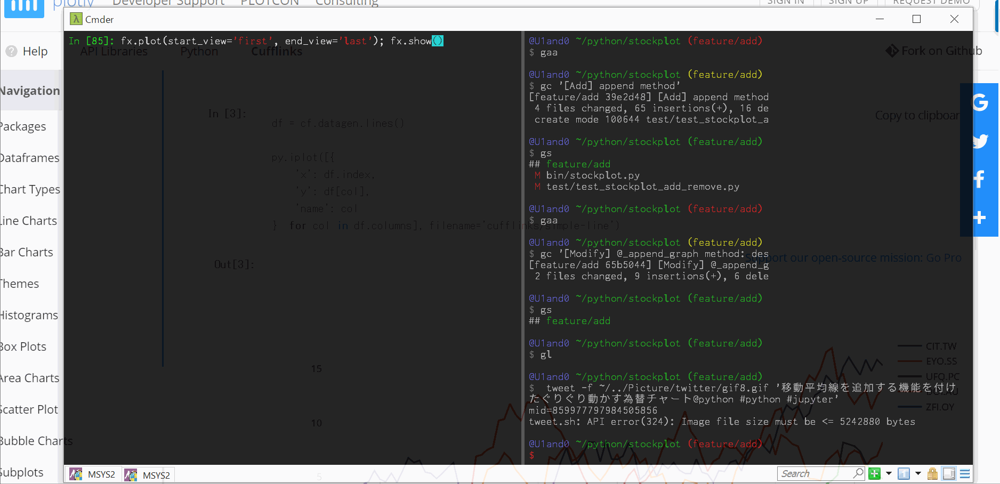
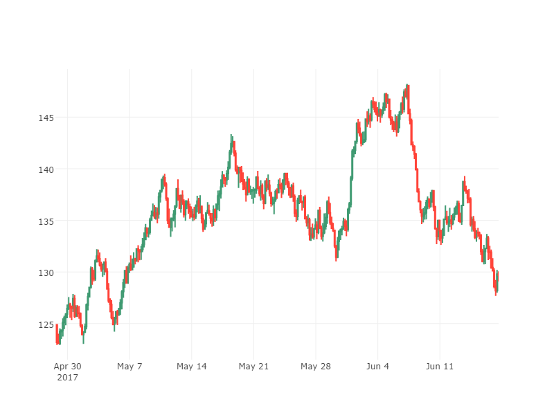
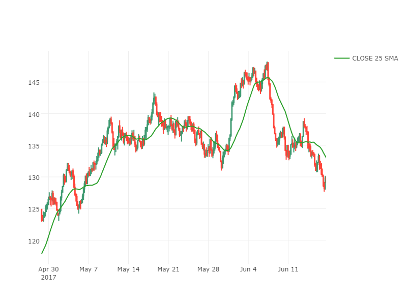
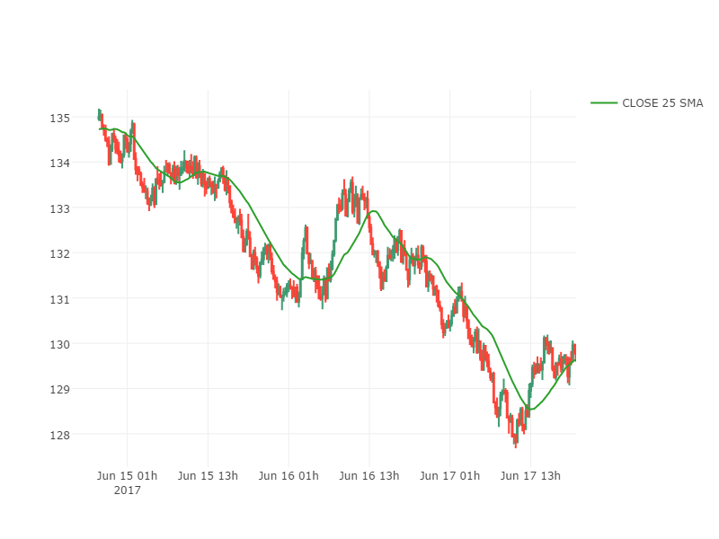
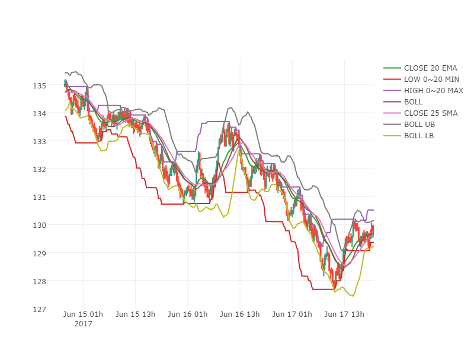
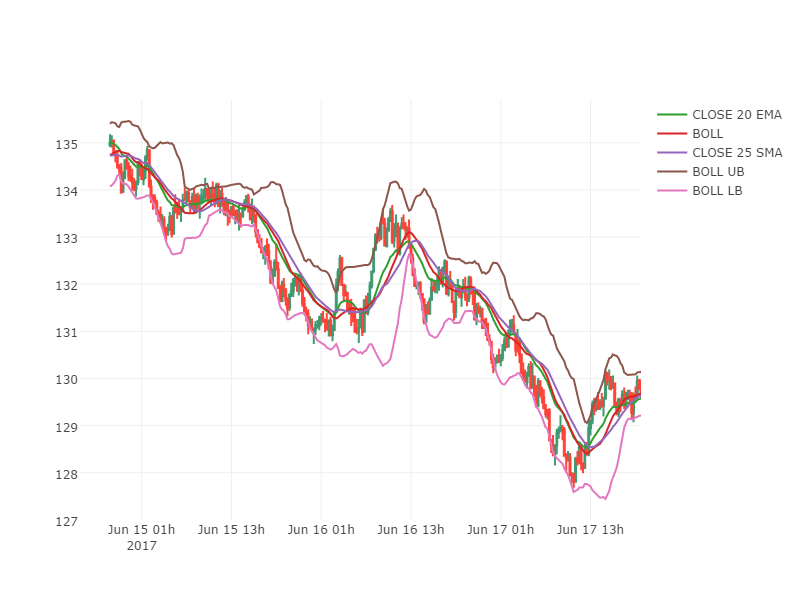
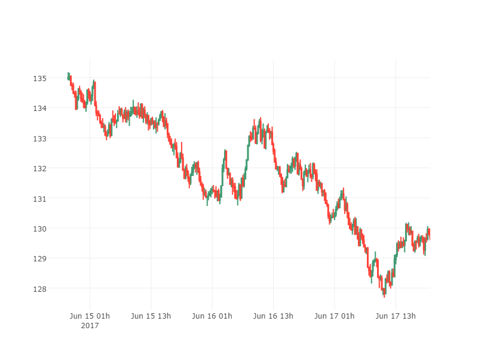
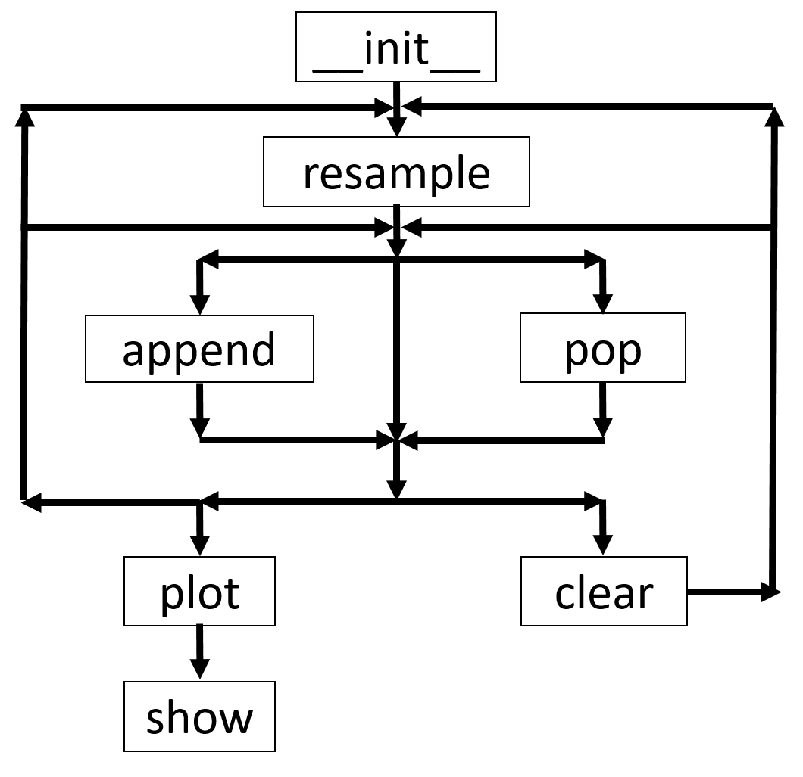
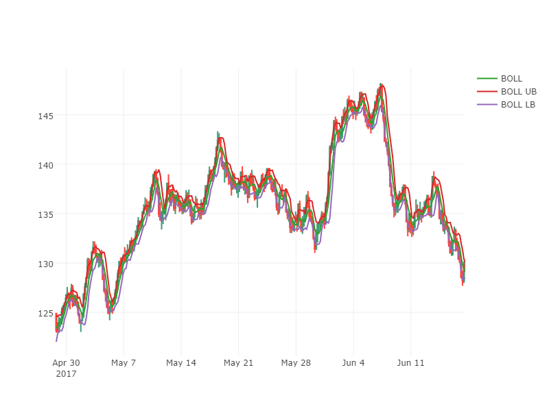

タイトル
Plotlyでぐりぐり動かせる為替チャートを作る(2)


```python
import sys
sys.path.append('../../bin/')
```

[Qiita - u1and0 / Plotlyでぐりぐり動かせる為替チャートを作る(1)](http://qiita.com/u1and0/items/e2273bd8e03c670be45a)の続き
指標の追加・削除・初期化ができるようになりました。



# 下準備

## モジュールインポート
必要なモジュールをインポートします。


```python
# ----------General Module----------
import numpy as np
import pandas as pd
# ----------User Module----------
from randomwalk import randomwalk
import stockplot as sp
```


<script>requirejs.config({paths: { 'plotly': ['https://cdn.plot.ly/plotly-latest.min']},});if(!window.Plotly) {{require(['plotly'],function(plotly) {window.Plotly=plotly;});}}</script>


```python
# ----------Hide General Module----------
import stockstats
import plotly
```

* General Module, Hide General Moduleは一般に配布されているパッケージなので、condaやpipといったパッケージ管理ソフトなどで追加してください。
    * General ModuleはこのJupyter Notebook内で使います。
    * Hide General Moduleは`stockplot`内で使用します。
>```sh
conda install plotly
pip install stockstats
```
* User Moduleのstockplotについては過去記事も併せてご覧ください。今回は**指標の追加・削除ができるようになりました。**
    * [Qiita - u1and0 / Plotlyでぐりぐり動かせる為替チャートを作る(1)](http://qiita.com/u1and0/items/e2273bd8e03c670be45a)
    * [Qiita - u1and0 / plotlyでキャンドルチャートプロット](http://qiita.com/u1and0/items/0ebcf097a1d61c636eb9)
* random_walkについては[Qiita - u1and0 / pythonでローソク足(candle chart)の描画](http://qiita.com/u1and0/items/1d9afdb7216c3d2320ef)

## サンプルデータの作成


```python
# Make sample data
np.random.seed(10)
df = randomwalk(60 * 60 * 24 * 90, freq='S', tick=0.01, start=pd.datetime(2017, 3, 20))\
    .resample('T').ohlc() + 115  # 90日分の1分足, 初期値が115
```

ランダムな為替チャートを作成します。
randomwalk関数で**2017/3/20からの1分足を90日分**作成します。

## インスタンス化


```python
# Convert DataFrame as StockPlot
fx = sp.StockPlot(df)
```

StockPlotクラスでインスタンス化します。

# ローソク足の描画

`fig = sp.StockPlot(sdf)`でインスタンス化されたら時間足を変換します。
変換する際は`resample`メソッドを使います。


```python
fx.resample('4H').head()
```


<div>
<table border="1" class="dataframe">
  <thead>
    <tr style="text-align: right;">
      <th></th>
      <th>close</th>
      <th>open</th>
      <th>high</th>
      <th>low</th>
    </tr>
  </thead>
  <tbody>
    <tr>
      <th>2017-03-20 00:00:00</th>
      <td>115.34</td>
      <td>115.00</td>
      <td>115.98</td>
      <td>114.79</td>
    </tr>
    <tr>
      <th>2017-03-20 04:00:00</th>
      <td>116.03</td>
      <td>115.34</td>
      <td>116.48</td>
      <td>115.16</td>
    </tr>
    <tr>
      <th>2017-03-20 08:00:00</th>
      <td>116.31</td>
      <td>116.03</td>
      <td>116.75</td>
      <td>115.76</td>
    </tr>
    <tr>
      <th>2017-03-20 12:00:00</th>
      <td>115.92</td>
      <td>116.32</td>
      <td>116.87</td>
      <td>115.62</td>
    </tr>
    <tr>
      <th>2017-03-20 16:00:00</th>
      <td>114.36</td>
      <td>115.92</td>
      <td>116.12</td>
      <td>113.85</td>
    </tr>
  </tbody>
</table>
</div>


```python
fx.plot(start_view='first', end_view='last')
fx.show('png', filebasename='png1')
```


    'file://C:\\Users\\U1and0\\Dropbox\\Program\\python\\stockplot\\note\\stockplot_append_pop\\temp-plot.html'




時間足の設定が済んだらプロットしてみます。

ここまでが[前回記事](http://qiita.com/u1and0/items/e2273bd8e03c670be45a)の復習です。

---

# 指標の操作

## 指標の追加

指標をプロットしてみます。
最もポピュラーな単純移動平均(Simple Moving Average)をプロットします。
追加するには`append`メソッドを使います。


```python
fx.append('close_25_sma')
fx.stock_dataframe.head()
```


<div>
<table border="1" class="dataframe">
  <thead>
    <tr style="text-align: right;">
      <th></th>
      <th>close</th>
      <th>open</th>
      <th>high</th>
      <th>low</th>
      <th>close_25_sma</th>
    </tr>
  </thead>
  <tbody>
    <tr>
      <th>2017-03-20 00:00:00</th>
      <td>115.34</td>
      <td>115.00</td>
      <td>115.98</td>
      <td>114.79</td>
      <td>115.340000</td>
    </tr>
    <tr>
      <th>2017-03-20 04:00:00</th>
      <td>116.03</td>
      <td>115.34</td>
      <td>116.48</td>
      <td>115.16</td>
      <td>115.685000</td>
    </tr>
    <tr>
      <th>2017-03-20 08:00:00</th>
      <td>116.31</td>
      <td>116.03</td>
      <td>116.75</td>
      <td>115.76</td>
      <td>115.893333</td>
    </tr>
    <tr>
      <th>2017-03-20 12:00:00</th>
      <td>115.92</td>
      <td>116.32</td>
      <td>116.87</td>
      <td>115.62</td>
      <td>115.900000</td>
    </tr>
    <tr>
      <th>2017-03-20 16:00:00</th>
      <td>114.36</td>
      <td>115.92</td>
      <td>116.12</td>
      <td>113.85</td>
      <td>115.592000</td>
    </tr>
  </tbody>
</table>
</div>


```python
fx.plot(start_view='first', end_view='last')
fx.show('png', filebasename='png2')
```


    'file://C:\\Users\\U1and0\\Dropbox\\Program\\python\\stockplot\\note\\stockplot_append_pop\\temp-plot.html'




close_25_sma(25本足単純移動平均線)が追加されました。
なお、`append`メソッド単体をJupyter NotebookやIpython上で実行するとclose_25_smaの値が戻り値として表示されます。

追加された指標は時間足を変えても、その時間足に合わせて値を変更してくれます。


```python
fx.resample('15T')
fx.plot(start_view='first', end_view='last')
fx.show('png', filebasename='png3')
```


    'file://C:\\Users\\U1and0\\Dropbox\\Program\\python\\stockplot\\note\\stockplot_append_pop\\temp-plot.html'




`resample`メソッドで15分足に変えた後、`append`メソッドを使わなくとも`close_25_sma`が追加されたままです。

これは`append`メソッドを実行した際ではなく、`plot`メソッドを実行した際にグラフに指標を追加するようにしたためです。

`append`メソッドが行うのは`self._indicators`に値を格納するだけです。

```python
# ========self._indicatorに指標を蓄える==========
    def append(self, indicator):
        indicator_value = self.stock_dataframe[indicator]
        self._indicators[indicator] = indicator_value  # self._indicatorsに辞書形式で
        return indicator_value
```

```python
# =======plotメソッド実行時にself._indicatorに蓄えられている指標を_append_graphに渡す==========
    def plot(self, (略)):
        # (中略)
        # ---------Append indicators----------
        for indicator in self._indicators.keys():
            self._append_graph(indicator, start_plot, end_plot)  # Re-append indicator in graph
        # (中略)
        return self._fig

# =======self._indicatorに蓄えられている指標をself._figのデータ部分に追加する==========
    def _append_graph(self, indicator, start, end):
        graph_value = self._indicators[indicator].loc[start:end]
        plotter = go.Scatter(x=graph_value.index, y=graph_value,
                             name=indicator.upper().replace('_', ' '))  # グラフに追加する形式変換
        self._fig['data'].append(plotter)
```

## 指標の削除

指標の削除には`pop`メソッドを使用します。


```python
fx.pop('close_25_sma')
fx.stock_dataframe.head()
```


<div>
<table border="1" class="dataframe">
  <thead>
    <tr style="text-align: right;">
      <th></th>
      <th>open</th>
      <th>high</th>
      <th>low</th>
      <th>close</th>
    </tr>
  </thead>
  <tbody>
    <tr>
      <th>2017-03-20 00:00:00</th>
      <td>115.00</td>
      <td>115.26</td>
      <td>114.87</td>
      <td>115.11</td>
    </tr>
    <tr>
      <th>2017-03-20 00:15:00</th>
      <td>115.11</td>
      <td>115.21</td>
      <td>114.85</td>
      <td>115.01</td>
    </tr>
    <tr>
      <th>2017-03-20 00:30:00</th>
      <td>115.01</td>
      <td>115.49</td>
      <td>114.90</td>
      <td>115.47</td>
    </tr>
    <tr>
      <th>2017-03-20 00:45:00</th>
      <td>115.47</td>
      <td>115.50</td>
      <td>115.24</td>
      <td>115.26</td>
    </tr>
    <tr>
      <th>2017-03-20 01:00:00</th>
      <td>115.25</td>
      <td>115.49</td>
      <td>115.10</td>
      <td>115.27</td>
    </tr>
  </tbody>
</table>
</div>


close_25_smaが削除されました。

単純移動平均以外の指標も描いてみます。


```python
fx.append('close_20_ema')  # 終値の指数移動平均線
fx.append('boll')  # ボリンジャーバンド真ん中(close_20_smaと同じ)
fx.append('boll_ub')  # ボリンジャーバンド上
fx.append('boll_lb')  # ボリンジャーバンド下
fx.append('high_0~20_max')  # 20足前の移動最高値
fx.append('low_0~20_min')  # 20足前の移動最安値
fx.plot(start_view='first', end_view='last')
fx.show('png', filebasename='png4')
```


    'file://C:\\Users\\U1and0\\Dropbox\\Program\\python\\stockplot\\note\\stockplot_append_pop\\temp-plot.html'




 * 20本足ボリンジャーバンド
 * 20本足移動最高値
 * 20本足最安値
 
 がプロットされました。

追加した指標名がわからなくなったらインスタンス変数からアクセスできます。


```python
fx._indicators.keys()
```


    dict_keys(['low_0~20_min', 'boll', 'high_0~20_max', 'boll_ub', 'close_20_ema', 'boll_lb'])


`append`メソッドを使ったときの引数がkey、戻り値がvalueとして、`_indicators`にディクショナリ形式で保存されます。
そのため、`keys`メソッドで追加した指標名を呼び出すことができます。
> `fx.stock_dataframe.columns`でも表示できますが、推奨できません。
> `stockstats.StockDataFrame`は指標の生成時に補助的なカラムも発生させます。
> そのため、補助指標(グラフにプロットされていないデータ)も混在していて、どれがプロットされているのか見分けづらいためです。


```python
fx.stock_dataframe.columns
```


    Index(['open', 'high', 'low', 'close', 'close_20_ema', 'close_20_sma',
           'close_20_mstd', 'boll', 'boll_ub', 'boll_lb', 'high_0_s', 'high_1_s',
           'high_2_s', 'high_3_s', 'high_4_s', 'high_5_s', 'high_6_s', 'high_7_s',
           'high_8_s', 'high_9_s', 'high_10_s', 'high_11_s', 'high_12_s',
           'high_13_s', 'high_14_s', 'high_15_s', 'high_16_s', 'high_17_s',
           'high_18_s', 'high_19_s', 'high_20_s', 'high_0~20_max', 'low_0_s',
           'low_1_s', 'low_2_s', 'low_3_s', 'low_4_s', 'low_5_s', 'low_6_s',
           'low_7_s', 'low_8_s', 'low_9_s', 'low_10_s', 'low_11_s', 'low_12_s',
           'low_13_s', 'low_14_s', 'low_15_s', 'low_16_s', 'low_17_s', 'low_18_s',
           'low_19_s', 'low_20_s', 'low_0~20_min'],
          dtype='object')


`fx.stock_dataframe.columns`による指標の表示は、追加していない指標名も表示されます。

ごちゃごちゃしてきたので`high_20_max`, `low_20_min`を削除します。


```python
fx.pop('high_0~20_max')
fx.pop('low_0~20_min')
fx.plot(start_view='first', end_view='last')
fx.show('png', filebasename='png5')
```


    'file://C:\\Users\\U1and0\\Dropbox\\Program\\python\\stockplot\\note\\stockplot_append_pop\\temp-plot.html'




`high_20_max`, `low_20_min`だけがグラフから削除されました。

`pop`メソッドは以下の手順で進みます。

1. `self._indicator`の中からindicatorで指定された値を削除します。
2. `self.stock_dataframe`から`open, high, low, close`だけ抜き出します。
3. `self._indicators`に残っている指標を再度プロットします。

```python
    def pop(self, indicator):
        popper = self._indicators.pop(indicator)  # (1)
        self.stock_dataframe = reset_dataframe(self.stock_dataframe)  # (2)
        for reindicator in self._indicators.keys():
            self.stock_dataframe.get(reindicator)  # (3)
        return popper
```

`self.stock_dataframe`に入っている指標は、追加した指標によっては補助的に作られたカラムなどが混在します。
そのため、「ある指標によって作られたカラムだけ」を特定し、`self.stock_dataframe`から削除するのが困難です。
よって、一度`self.stock_dataframe`を`resample`がかかった状態まで戻し(2)、再度指標を追加しています(3)。

(3)は`append`メソッドとほとんど同じことですが、`self._indicators`に追加しません。
(1)の段階で`self._indicators`からは余計な指標を取り除いていないため、`self._indicators`に再度追加する必要がありません。

## 指標の初期化

追加した指標をすべて消すときは`clear`メソッドを使います。


```python
fx.clear()
fx.stock_dataframe.head()
```


<div>
<table border="1" class="dataframe">
  <thead>
    <tr style="text-align: right;">
      <th></th>
      <th>open</th>
      <th>high</th>
      <th>low</th>
      <th>close</th>
    </tr>
  </thead>
  <tbody>
    <tr>
      <th>2017-03-20 00:00:00</th>
      <td>115.00</td>
      <td>115.26</td>
      <td>114.87</td>
      <td>115.11</td>
    </tr>
    <tr>
      <th>2017-03-20 00:15:00</th>
      <td>115.11</td>
      <td>115.21</td>
      <td>114.85</td>
      <td>115.01</td>
    </tr>
    <tr>
      <th>2017-03-20 00:30:00</th>
      <td>115.01</td>
      <td>115.49</td>
      <td>114.90</td>
      <td>115.47</td>
    </tr>
    <tr>
      <th>2017-03-20 00:45:00</th>
      <td>115.47</td>
      <td>115.50</td>
      <td>115.24</td>
      <td>115.26</td>
    </tr>
    <tr>
      <th>2017-03-20 01:00:00</th>
      <td>115.25</td>
      <td>115.49</td>
      <td>115.10</td>
      <td>115.27</td>
    </tr>
  </tbody>
</table>
</div>


```python
fx.plot(start_view='first', end_view='last')
fx.show('png', filebasename='png6')
```


    'file://C:\\Users\\U1and0\\Dropbox\\Program\\python\\stockplot\\note\\stockplot_append_pop\\temp-plot.html'




* データフレーム(`self.stock_dataframe`)を初期化します。
* グラフ(`self._fig`)を初期化します。
* 指標(`self._indicators`)を初期化します。
* **時間足は初期化しません。**
> hardオプションをTrueにする(`fx.clear(hard=True)`として実行する)ことで時間足も初期化できます(ハードリセット)。
> `self.stock_dataframe`は`None`に戻ります。
> ハードリセットをかけた後に再度プロットしたいときは`resample`メソッドから実行してください。

```python
    def clear(self, hard=False):
        self._fig = None  # <-- plotly.graph_objs
        self._indicators = {}
        if hard:
            self.stock_dataframe = None
            self.freq = None  # 足の時間幅
        else:
            self.stock_dataframe = reset_dataframe(self.stock_dataframe)
```

`clear`メソッドはほとんど`__init__`メソッドと同じですが、

* データとしての引数が必要ないこと
* デフォルトでは時間足を変更しないこと

> すなわち再度プロットするときに`resample`メソッドを使う必要がないこと

の点が`__init__`と異なります。

# まとめと補足

## フローチャート
各メソッドの使用順序は以下に示すフローチャートの通りです。


左側が追加と表示、右側が削除とリセットを表しています。

## ボリンジャーバンドについて

`stockstats`ではボリンジャーバンドで使う移動区間と$\sigma$がクラス変数として定義されています。

```
BOLL_PERIOD = 20
BOLL_STD_TIMES = 2
```

ここで移動区間を5, $\sigma$を1に変更してみます。


```python
sp.ss.StockDataFrame.BOLL_PERIOD = 5  # ボリンジャーバンド移動区間の設定
sp.ss.StockDataFrame.BOLL_STD_TIMES = 1  # ボリンジャーバンドσの設定
boll = sp.StockPlot(df)
boll.resample('4H')
boll.append('boll')  # ボリンジャーバンド真ん中(close_5_smaと同じ)
boll.append('boll_ub')  # ボリンジャーバンド上
boll.append('boll_lb')  # ボリンジャーバンド下
boll.plot(start_view='first', end_view='last')
boll.show('png', filebasename='png7')
```


    'file://C:\\Users\\U1and0\\Dropbox\\Program\\python\\stockplot\\note\\stockplot_append_pop\\temp-plot.html'




$\sigma_1$と$\sigma_2$は同時に描けないのが残念です。

`BOLL_PERIOD`, `BOLL_STD_TIMES`は`stockstats`のクラス変数なので、
`stockplot.stockstats.BOLL_STD_TIMES = 2`のようにして再定義する必要があります。

しかし、`stockstats`が指標を追加するとき、`_get`メソッドを使うので、一度追加した指標が上書きされてしまいます。

グラフに描くだけであれば何とかすればできそうですが、今後の課題とします。

## サブチャートについて

[`stockstats`](https://github.com/jealous/stockstats)は多くの指標の出力に対応していますが、サブチャートを必要とする指標が多くあります。(MACD, RSI, ADX...)
今回のリリースではサブチャートに手を付けていません。
[Cufflinks](https://github.com/santosjorge/cufflinks)を使ってみたらサブプロットととかも簡単にいきそうな気がします。

## トップのgifファイルについて

最初のgif画像はチャートをipython上からインタラクティブにhtmlとして出力している様子です。

* モジュールのインポートから日足に変更するところまでを実行する`./bin/stockplot_quickset.py`を実行します。
* 'close_25_sma'を追加します。
* 時間足を15分足に変えます。
* 'close_75_sma'を追加します。

```python
# ----------General Module----------
import numpy as np
import pandas as pd
# ----------User Module----------
from randomwalk import randomwalk
import stockplot as sp
# ----------Plotly Module----------
import plotly.offline as pyo
pyo.init_notebook_mode(connected=True)

# Make sample data
np.random.seed(1)
# 90日分の1秒tickを1分足に直す
df = randomwalk(60 * 60 * 24 * 90, freq='S', tick=0.01, start=pd.datetime(2017, 3, 20)).resample('T').ohlc() + 115

# Convert StockDataFrame as StockPlot
fx = sp.StockPlot(df)

# Resample as Day OHLC
fx.resample('H')
```

ソースコードはgithubに上げました。
[github - u1and0/stockplot](https://github.com/u1and0/stockplot)
