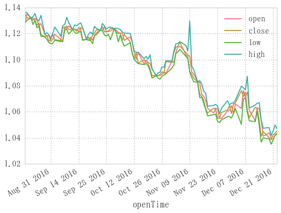

```python
 %run hst_to_df.py  -f EURUSD/EURUSD.hst -ty old 
```

    --- Convert Start ---
    `EURUSD/EURUSD.hst` --> `EURUSD/EURUSD.h5` ---
    Please wait a moment...
    
                            open     high      low    close  volume
    openTime                                                       
    2005-01-10 02:31:00  1.30470  1.30550  1.30470  1.30540    12.0
    2005-01-10 02:32:00  1.30540  1.30580  1.30540  1.30550    10.0
    2005-01-10 02:33:00  1.30550  1.30550  1.30540  1.30540     4.0
    2005-01-10 02:34:00  1.30540  1.30540  1.30540  1.30540     5.0
    2005-01-10 02:35:00  1.30540  1.30540  1.30540  1.30540     3.0
    2005-01-10 02:36:00  1.30540  1.30540  1.30540  1.30540     2.0
    2005-01-10 02:37:00  1.30540  1.30540  1.30530  1.30540     6.0
    2005-01-10 02:38:00  1.30540  1.30540  1.30540  1.30540     2.0
    2005-01-10 02:39:00  1.30540  1.30540  1.30540  1.30540     2.0
    2005-01-10 02:40:00  1.30540  1.30540  1.30540  1.30540     3.0
    2005-01-10 02:41:00  1.30540  1.30540  1.30540  1.30540     2.0
    2005-01-10 02:42:00  1.30540  1.30540  1.30540  1.30540     2.0
    2005-01-10 02:43:00  1.30540  1.30540  1.30540  1.30540     2.0
    2005-01-10 02:44:00  1.30540  1.30540  1.30540  1.30540     3.0
    2005-01-10 02:45:00  1.30540  1.30540  1.30540  1.30540     2.0
    2005-01-10 02:46:00  1.30540  1.30540  1.30540  1.30540     2.0
    2005-01-10 02:47:00  1.30540  1.30540  1.30540  1.30540     3.0
    2005-01-10 02:48:00  1.30540  1.30620  1.30540  1.30580    15.0
    2005-01-10 02:49:00  1.30570  1.30630  1.30570  1.30610    18.0
    2005-01-10 02:50:00  1.30610  1.30630  1.30610  1.30630    23.0
    2005-01-10 02:51:00  1.30650  1.30660  1.30620  1.30650    12.0
    2005-01-10 02:52:00  1.30640  1.30670  1.30640  1.30660    10.0
    2005-01-10 02:53:00  1.30660  1.30670  1.30650  1.30670     8.0
    2005-01-10 02:54:00  1.30660  1.30660  1.30660  1.30660     4.0
    2005-01-10 02:55:00  1.30650  1.30670  1.30650  1.30670    11.0
    2005-01-10 02:56:00  1.30670  1.30680  1.30670  1.30680     5.0
    2005-01-10 02:57:00  1.30690  1.30710  1.30680  1.30710    21.0
    2005-01-10 02:58:00  1.30710  1.30720  1.30710  1.30720     4.0
    2005-01-10 02:59:00  1.30720  1.30720  1.30720  1.30720     3.0
    2005-01-10 03:00:00  1.30720  1.30720  1.30720  1.30720     2.0
    ...                      ...      ...      ...      ...     ...
    2016-12-23 23:16:00  1.04495  1.04497  1.04495  1.04496    15.0
    2016-12-23 23:17:00  1.04496  1.04502  1.04496  1.04498    23.0
    2016-12-23 23:18:00  1.04498  1.04511  1.04497  1.04506    24.0
    2016-12-23 23:19:00  1.04506  1.04506  1.04504  1.04504    12.0
    2016-12-23 23:20:00  1.04504  1.04505  1.04504  1.04505    14.0
    2016-12-23 23:21:00  1.04505  1.04507  1.04505  1.04507     9.0
    2016-12-23 23:22:00  1.04509  1.04509  1.04504  1.04504    18.0
    2016-12-23 23:23:00  1.04504  1.04505  1.04503  1.04503    11.0
    2016-12-23 23:24:00  1.04505  1.04505  1.04505  1.04505    42.0
    2016-12-23 23:25:00  1.04505  1.04505  1.04504  1.04504    23.0
    2016-12-23 23:26:00  1.04504  1.04504  1.04493  1.04494    16.0
    2016-12-23 23:27:00  1.04494  1.04494  1.04494  1.04494     6.0
    2016-12-23 23:28:00  1.04494  1.04496  1.04492  1.04496    27.0
    2016-12-23 23:29:00  1.04496  1.04500  1.04496  1.04498    17.0
    2016-12-23 23:30:00  1.04498  1.04499  1.04498  1.04498    19.0
    2016-12-23 23:31:00  1.04498  1.04498  1.04498  1.04498     5.0
    2016-12-23 23:32:00  1.04499  1.04501  1.04499  1.04501    11.0
    2016-12-23 23:33:00  1.04501  1.04504  1.04498  1.04503    13.0
    2016-12-23 23:34:00  1.04503  1.04503  1.04501  1.04501    12.0
    2016-12-23 23:35:00  1.04501  1.04501  1.04501  1.04501     6.0
    2016-12-23 23:36:00  1.04501  1.04506  1.04501  1.04505    39.0
    2016-12-23 23:37:00  1.04505  1.04505  1.04505  1.04505     4.0
    2016-12-23 23:38:00  1.04506  1.04507  1.04504  1.04507    63.0
    2016-12-23 23:39:00  1.04507  1.04511  1.04507  1.04509    55.0
    2016-12-23 23:40:00  1.04510  1.04511  1.04507  1.04508   104.0
    2016-12-23 23:41:00  1.04508  1.04518  1.04508  1.04518    32.0
    2016-12-23 23:42:00  1.04517  1.04522  1.04517  1.04522    18.0
    2016-12-23 23:43:00  1.04521  1.04525  1.04521  1.04524    22.0
    2016-12-23 23:44:00  1.04525  1.04528  1.04518  1.04524    42.0
    2016-12-23 23:45:00  1.04526  1.04527  1.04522  1.04526    18.0
    
    [4352848 rows x 5 columns]
    
    ---End of Convert---
    Using EURUSD/EURUSD.h5 file, type below...
    `df = pd.read_hdf(EURUSD/EURUSD.h5, key="main")`
    


```python
df = pd.read_hdf('EURUSD/EURUSD.h5', key="main")
df
```


<div>
<table border="1" class="dataframe">
  <thead>
    <tr style="text-align: right;">
      <th></th>
      <th>open</th>
      <th>high</th>
      <th>low</th>
      <th>close</th>
      <th>volume</th>
    </tr>
    <tr>
      <th>openTime</th>
      <th></th>
      <th></th>
      <th></th>
      <th></th>
      <th></th>
    </tr>
  </thead>
  <tbody>
    <tr>
      <th>2005-01-10 02:31:00</th>
      <td>1.30470</td>
      <td>1.30550</td>
      <td>1.30470</td>
      <td>1.30540</td>
      <td>12.0</td>
    </tr>
    <tr>
      <th>2005-01-10 02:32:00</th>
      <td>1.30540</td>
      <td>1.30580</td>
      <td>1.30540</td>
      <td>1.30550</td>
      <td>10.0</td>
    </tr>
    <tr>
      <th>2005-01-10 02:33:00</th>
      <td>1.30550</td>
      <td>1.30550</td>
      <td>1.30540</td>
      <td>1.30540</td>
      <td>4.0</td>
    </tr>
    <tr>
      <th>2005-01-10 02:34:00</th>
      <td>1.30540</td>
      <td>1.30540</td>
      <td>1.30540</td>
      <td>1.30540</td>
      <td>5.0</td>
    </tr>
    <tr>
      <th>2005-01-10 02:35:00</th>
      <td>1.30540</td>
      <td>1.30540</td>
      <td>1.30540</td>
      <td>1.30540</td>
      <td>3.0</td>
    </tr>
    <tr>
      <th>2005-01-10 02:36:00</th>
      <td>1.30540</td>
      <td>1.30540</td>
      <td>1.30540</td>
      <td>1.30540</td>
      <td>2.0</td>
    </tr>
    <tr>
      <th>2005-01-10 02:37:00</th>
      <td>1.30540</td>
      <td>1.30540</td>
      <td>1.30530</td>
      <td>1.30540</td>
      <td>6.0</td>
    </tr>
    <tr>
      <th>2005-01-10 02:38:00</th>
      <td>1.30540</td>
      <td>1.30540</td>
      <td>1.30540</td>
      <td>1.30540</td>
      <td>2.0</td>
    </tr>
    <tr>
      <th>2005-01-10 02:39:00</th>
      <td>1.30540</td>
      <td>1.30540</td>
      <td>1.30540</td>
      <td>1.30540</td>
      <td>2.0</td>
    </tr>
    <tr>
      <th>2005-01-10 02:40:00</th>
      <td>1.30540</td>
      <td>1.30540</td>
      <td>1.30540</td>
      <td>1.30540</td>
      <td>3.0</td>
    </tr>
    <tr>
      <th>2005-01-10 02:41:00</th>
      <td>1.30540</td>
      <td>1.30540</td>
      <td>1.30540</td>
      <td>1.30540</td>
      <td>2.0</td>
    </tr>
    <tr>
      <th>2005-01-10 02:42:00</th>
      <td>1.30540</td>
      <td>1.30540</td>
      <td>1.30540</td>
      <td>1.30540</td>
      <td>2.0</td>
    </tr>
    <tr>
      <th>2005-01-10 02:43:00</th>
      <td>1.30540</td>
      <td>1.30540</td>
      <td>1.30540</td>
      <td>1.30540</td>
      <td>2.0</td>
    </tr>
    <tr>
      <th>2005-01-10 02:44:00</th>
      <td>1.30540</td>
      <td>1.30540</td>
      <td>1.30540</td>
      <td>1.30540</td>
      <td>3.0</td>
    </tr>
    <tr>
      <th>2005-01-10 02:45:00</th>
      <td>1.30540</td>
      <td>1.30540</td>
      <td>1.30540</td>
      <td>1.30540</td>
      <td>2.0</td>
    </tr>
    <tr>
      <th>2005-01-10 02:46:00</th>
      <td>1.30540</td>
      <td>1.30540</td>
      <td>1.30540</td>
      <td>1.30540</td>
      <td>2.0</td>
    </tr>
    <tr>
      <th>2005-01-10 02:47:00</th>
      <td>1.30540</td>
      <td>1.30540</td>
      <td>1.30540</td>
      <td>1.30540</td>
      <td>3.0</td>
    </tr>
    <tr>
      <th>2005-01-10 02:48:00</th>
      <td>1.30540</td>
      <td>1.30620</td>
      <td>1.30540</td>
      <td>1.30580</td>
      <td>15.0</td>
    </tr>
    <tr>
      <th>2005-01-10 02:49:00</th>
      <td>1.30570</td>
      <td>1.30630</td>
      <td>1.30570</td>
      <td>1.30610</td>
      <td>18.0</td>
    </tr>
    <tr>
      <th>2005-01-10 02:50:00</th>
      <td>1.30610</td>
      <td>1.30630</td>
      <td>1.30610</td>
      <td>1.30630</td>
      <td>23.0</td>
    </tr>
    <tr>
      <th>2005-01-10 02:51:00</th>
      <td>1.30650</td>
      <td>1.30660</td>
      <td>1.30620</td>
      <td>1.30650</td>
      <td>12.0</td>
    </tr>
    <tr>
      <th>2005-01-10 02:52:00</th>
      <td>1.30640</td>
      <td>1.30670</td>
      <td>1.30640</td>
      <td>1.30660</td>
      <td>10.0</td>
    </tr>
    <tr>
      <th>2005-01-10 02:53:00</th>
      <td>1.30660</td>
      <td>1.30670</td>
      <td>1.30650</td>
      <td>1.30670</td>
      <td>8.0</td>
    </tr>
    <tr>
      <th>2005-01-10 02:54:00</th>
      <td>1.30660</td>
      <td>1.30660</td>
      <td>1.30660</td>
      <td>1.30660</td>
      <td>4.0</td>
    </tr>
    <tr>
      <th>2005-01-10 02:55:00</th>
      <td>1.30650</td>
      <td>1.30670</td>
      <td>1.30650</td>
      <td>1.30670</td>
      <td>11.0</td>
    </tr>
    <tr>
      <th>2005-01-10 02:56:00</th>
      <td>1.30670</td>
      <td>1.30680</td>
      <td>1.30670</td>
      <td>1.30680</td>
      <td>5.0</td>
    </tr>
    <tr>
      <th>2005-01-10 02:57:00</th>
      <td>1.30690</td>
      <td>1.30710</td>
      <td>1.30680</td>
      <td>1.30710</td>
      <td>21.0</td>
    </tr>
    <tr>
      <th>2005-01-10 02:58:00</th>
      <td>1.30710</td>
      <td>1.30720</td>
      <td>1.30710</td>
      <td>1.30720</td>
      <td>4.0</td>
    </tr>
    <tr>
      <th>2005-01-10 02:59:00</th>
      <td>1.30720</td>
      <td>1.30720</td>
      <td>1.30720</td>
      <td>1.30720</td>
      <td>3.0</td>
    </tr>
    <tr>
      <th>2005-01-10 03:00:00</th>
      <td>1.30720</td>
      <td>1.30720</td>
      <td>1.30720</td>
      <td>1.30720</td>
      <td>2.0</td>
    </tr>
    <tr>
      <th>...</th>
      <td>...</td>
      <td>...</td>
      <td>...</td>
      <td>...</td>
      <td>...</td>
    </tr>
    <tr>
      <th>2016-12-23 23:16:00</th>
      <td>1.04495</td>
      <td>1.04497</td>
      <td>1.04495</td>
      <td>1.04496</td>
      <td>15.0</td>
    </tr>
    <tr>
      <th>2016-12-23 23:17:00</th>
      <td>1.04496</td>
      <td>1.04502</td>
      <td>1.04496</td>
      <td>1.04498</td>
      <td>23.0</td>
    </tr>
    <tr>
      <th>2016-12-23 23:18:00</th>
      <td>1.04498</td>
      <td>1.04511</td>
      <td>1.04497</td>
      <td>1.04506</td>
      <td>24.0</td>
    </tr>
    <tr>
      <th>2016-12-23 23:19:00</th>
      <td>1.04506</td>
      <td>1.04506</td>
      <td>1.04504</td>
      <td>1.04504</td>
      <td>12.0</td>
    </tr>
    <tr>
      <th>2016-12-23 23:20:00</th>
      <td>1.04504</td>
      <td>1.04505</td>
      <td>1.04504</td>
      <td>1.04505</td>
      <td>14.0</td>
    </tr>
    <tr>
      <th>2016-12-23 23:21:00</th>
      <td>1.04505</td>
      <td>1.04507</td>
      <td>1.04505</td>
      <td>1.04507</td>
      <td>9.0</td>
    </tr>
    <tr>
      <th>2016-12-23 23:22:00</th>
      <td>1.04509</td>
      <td>1.04509</td>
      <td>1.04504</td>
      <td>1.04504</td>
      <td>18.0</td>
    </tr>
    <tr>
      <th>2016-12-23 23:23:00</th>
      <td>1.04504</td>
      <td>1.04505</td>
      <td>1.04503</td>
      <td>1.04503</td>
      <td>11.0</td>
    </tr>
    <tr>
      <th>2016-12-23 23:24:00</th>
      <td>1.04505</td>
      <td>1.04505</td>
      <td>1.04505</td>
      <td>1.04505</td>
      <td>42.0</td>
    </tr>
    <tr>
      <th>2016-12-23 23:25:00</th>
      <td>1.04505</td>
      <td>1.04505</td>
      <td>1.04504</td>
      <td>1.04504</td>
      <td>23.0</td>
    </tr>
    <tr>
      <th>2016-12-23 23:26:00</th>
      <td>1.04504</td>
      <td>1.04504</td>
      <td>1.04493</td>
      <td>1.04494</td>
      <td>16.0</td>
    </tr>
    <tr>
      <th>2016-12-23 23:27:00</th>
      <td>1.04494</td>
      <td>1.04494</td>
      <td>1.04494</td>
      <td>1.04494</td>
      <td>6.0</td>
    </tr>
    <tr>
      <th>2016-12-23 23:28:00</th>
      <td>1.04494</td>
      <td>1.04496</td>
      <td>1.04492</td>
      <td>1.04496</td>
      <td>27.0</td>
    </tr>
    <tr>
      <th>2016-12-23 23:29:00</th>
      <td>1.04496</td>
      <td>1.04500</td>
      <td>1.04496</td>
      <td>1.04498</td>
      <td>17.0</td>
    </tr>
    <tr>
      <th>2016-12-23 23:30:00</th>
      <td>1.04498</td>
      <td>1.04499</td>
      <td>1.04498</td>
      <td>1.04498</td>
      <td>19.0</td>
    </tr>
    <tr>
      <th>2016-12-23 23:31:00</th>
      <td>1.04498</td>
      <td>1.04498</td>
      <td>1.04498</td>
      <td>1.04498</td>
      <td>5.0</td>
    </tr>
    <tr>
      <th>2016-12-23 23:32:00</th>
      <td>1.04499</td>
      <td>1.04501</td>
      <td>1.04499</td>
      <td>1.04501</td>
      <td>11.0</td>
    </tr>
    <tr>
      <th>2016-12-23 23:33:00</th>
      <td>1.04501</td>
      <td>1.04504</td>
      <td>1.04498</td>
      <td>1.04503</td>
      <td>13.0</td>
    </tr>
    <tr>
      <th>2016-12-23 23:34:00</th>
      <td>1.04503</td>
      <td>1.04503</td>
      <td>1.04501</td>
      <td>1.04501</td>
      <td>12.0</td>
    </tr>
    <tr>
      <th>2016-12-23 23:35:00</th>
      <td>1.04501</td>
      <td>1.04501</td>
      <td>1.04501</td>
      <td>1.04501</td>
      <td>6.0</td>
    </tr>
    <tr>
      <th>2016-12-23 23:36:00</th>
      <td>1.04501</td>
      <td>1.04506</td>
      <td>1.04501</td>
      <td>1.04505</td>
      <td>39.0</td>
    </tr>
    <tr>
      <th>2016-12-23 23:37:00</th>
      <td>1.04505</td>
      <td>1.04505</td>
      <td>1.04505</td>
      <td>1.04505</td>
      <td>4.0</td>
    </tr>
    <tr>
      <th>2016-12-23 23:38:00</th>
      <td>1.04506</td>
      <td>1.04507</td>
      <td>1.04504</td>
      <td>1.04507</td>
      <td>63.0</td>
    </tr>
    <tr>
      <th>2016-12-23 23:39:00</th>
      <td>1.04507</td>
      <td>1.04511</td>
      <td>1.04507</td>
      <td>1.04509</td>
      <td>55.0</td>
    </tr>
    <tr>
      <th>2016-12-23 23:40:00</th>
      <td>1.04510</td>
      <td>1.04511</td>
      <td>1.04507</td>
      <td>1.04508</td>
      <td>104.0</td>
    </tr>
    <tr>
      <th>2016-12-23 23:41:00</th>
      <td>1.04508</td>
      <td>1.04518</td>
      <td>1.04508</td>
      <td>1.04518</td>
      <td>32.0</td>
    </tr>
    <tr>
      <th>2016-12-23 23:42:00</th>
      <td>1.04517</td>
      <td>1.04522</td>
      <td>1.04517</td>
      <td>1.04522</td>
      <td>18.0</td>
    </tr>
    <tr>
      <th>2016-12-23 23:43:00</th>
      <td>1.04521</td>
      <td>1.04525</td>
      <td>1.04521</td>
      <td>1.04524</td>
      <td>22.0</td>
    </tr>
    <tr>
      <th>2016-12-23 23:44:00</th>
      <td>1.04525</td>
      <td>1.04528</td>
      <td>1.04518</td>
      <td>1.04524</td>
      <td>42.0</td>
    </tr>
    <tr>
      <th>2016-12-23 23:45:00</th>
      <td>1.04526</td>
      <td>1.04527</td>
      <td>1.04522</td>
      <td>1.04526</td>
      <td>18.0</td>
    </tr>
  </tbody>
</table>
<p>4352848 rows × 5 columns</p>
</div>


open, high, low, closeだけにして、
resampleで指定した期間だけデータを丸める

休日はbfill()かdropna()でなくす


```python
dff = df.ix[:, :4].resample('d').agg({'open':'first',
                                      'high':'max',
                                      'low':'min',
                                      'close':'last'}).dropna()
dff
```


<div>
<table border="1" class="dataframe">
  <thead>
    <tr style="text-align: right;">
      <th></th>
      <th>open</th>
      <th>close</th>
      <th>low</th>
      <th>high</th>
    </tr>
    <tr>
      <th>openTime</th>
      <th></th>
      <th></th>
      <th></th>
      <th></th>
    </tr>
  </thead>
  <tbody>
    <tr>
      <th>2005-01-10</th>
      <td>1.30470</td>
      <td>1.30830</td>
      <td>1.30470</td>
      <td>1.31220</td>
    </tr>
    <tr>
      <th>2005-01-11</th>
      <td>1.30830</td>
      <td>1.31110</td>
      <td>1.30650</td>
      <td>1.31700</td>
    </tr>
    <tr>
      <th>2005-01-12</th>
      <td>1.31100</td>
      <td>1.32630</td>
      <td>1.30810</td>
      <td>1.32920</td>
    </tr>
    <tr>
      <th>2005-01-13</th>
      <td>1.32620</td>
      <td>1.32190</td>
      <td>1.31920</td>
      <td>1.32660</td>
    </tr>
    <tr>
      <th>2005-01-14</th>
      <td>1.32210</td>
      <td>1.31070</td>
      <td>1.30550</td>
      <td>1.32260</td>
    </tr>
    <tr>
      <th>2005-01-17</th>
      <td>1.31040</td>
      <td>1.30670</td>
      <td>1.30630</td>
      <td>1.31250</td>
    </tr>
    <tr>
      <th>2005-01-18</th>
      <td>1.30660</td>
      <td>1.30200</td>
      <td>1.29930</td>
      <td>1.30750</td>
    </tr>
    <tr>
      <th>2005-01-19</th>
      <td>1.30210</td>
      <td>1.30050</td>
      <td>1.29640</td>
      <td>1.31180</td>
    </tr>
    <tr>
      <th>2005-01-20</th>
      <td>1.30050</td>
      <td>1.29710</td>
      <td>1.29200</td>
      <td>1.30220</td>
    </tr>
    <tr>
      <th>2005-01-21</th>
      <td>1.29700</td>
      <td>1.30540</td>
      <td>1.29330</td>
      <td>1.30650</td>
    </tr>
    <tr>
      <th>2005-01-24</th>
      <td>1.30460</td>
      <td>1.30580</td>
      <td>1.30270</td>
      <td>1.30990</td>
    </tr>
    <tr>
      <th>2005-01-25</th>
      <td>1.30570</td>
      <td>1.29680</td>
      <td>1.29440</td>
      <td>1.30760</td>
    </tr>
    <tr>
      <th>2005-01-26</th>
      <td>1.29690</td>
      <td>1.30730</td>
      <td>1.29650</td>
      <td>1.31070</td>
    </tr>
    <tr>
      <th>2005-01-27</th>
      <td>1.30730</td>
      <td>1.30340</td>
      <td>1.30120</td>
      <td>1.31230</td>
    </tr>
    <tr>
      <th>2005-01-28</th>
      <td>1.30330</td>
      <td>1.30400</td>
      <td>1.29840</td>
      <td>1.30770</td>
    </tr>
    <tr>
      <th>2005-01-31</th>
      <td>1.30190</td>
      <td>1.30330</td>
      <td>1.29730</td>
      <td>1.30580</td>
    </tr>
    <tr>
      <th>2005-02-01</th>
      <td>1.30340</td>
      <td>1.30430</td>
      <td>1.30010</td>
      <td>1.30630</td>
    </tr>
    <tr>
      <th>2005-02-02</th>
      <td>1.30440</td>
      <td>1.30320</td>
      <td>1.30080</td>
      <td>1.30910</td>
    </tr>
    <tr>
      <th>2005-02-03</th>
      <td>1.30310</td>
      <td>1.29710</td>
      <td>1.29370</td>
      <td>1.30350</td>
    </tr>
    <tr>
      <th>2005-02-04</th>
      <td>1.29700</td>
      <td>1.28730</td>
      <td>1.28660</td>
      <td>1.30410</td>
    </tr>
    <tr>
      <th>2005-02-07</th>
      <td>1.28710</td>
      <td>1.27630</td>
      <td>1.27290</td>
      <td>1.28710</td>
    </tr>
    <tr>
      <th>2005-02-08</th>
      <td>1.27640</td>
      <td>1.27660</td>
      <td>1.27320</td>
      <td>1.27960</td>
    </tr>
    <tr>
      <th>2005-02-09</th>
      <td>1.27670</td>
      <td>1.28040</td>
      <td>1.27380</td>
      <td>1.28120</td>
    </tr>
    <tr>
      <th>2005-02-10</th>
      <td>1.28030</td>
      <td>1.28700</td>
      <td>1.27370</td>
      <td>1.29040</td>
    </tr>
    <tr>
      <th>2005-02-11</th>
      <td>1.28690</td>
      <td>1.28650</td>
      <td>1.28460</td>
      <td>1.28930</td>
    </tr>
    <tr>
      <th>2005-02-14</th>
      <td>1.28750</td>
      <td>1.29600</td>
      <td>1.28750</td>
      <td>1.29890</td>
    </tr>
    <tr>
      <th>2005-02-15</th>
      <td>1.29610</td>
      <td>1.30170</td>
      <td>1.29530</td>
      <td>1.30500</td>
    </tr>
    <tr>
      <th>2005-02-16</th>
      <td>1.30170</td>
      <td>1.30240</td>
      <td>1.29590</td>
      <td>1.30640</td>
    </tr>
    <tr>
      <th>2005-02-17</th>
      <td>1.30240</td>
      <td>1.30750</td>
      <td>1.30130</td>
      <td>1.30870</td>
    </tr>
    <tr>
      <th>2005-02-18</th>
      <td>1.30740</td>
      <td>1.30630</td>
      <td>1.30130</td>
      <td>1.30800</td>
    </tr>
    <tr>
      <th>...</th>
      <td>...</td>
      <td>...</td>
      <td>...</td>
      <td>...</td>
    </tr>
    <tr>
      <th>2016-11-14</th>
      <td>1.08269</td>
      <td>1.07359</td>
      <td>1.07081</td>
      <td>1.08394</td>
    </tr>
    <tr>
      <th>2016-11-15</th>
      <td>1.07357</td>
      <td>1.07186</td>
      <td>1.07132</td>
      <td>1.08155</td>
    </tr>
    <tr>
      <th>2016-11-16</th>
      <td>1.07190</td>
      <td>1.06893</td>
      <td>1.06652</td>
      <td>1.07586</td>
    </tr>
    <tr>
      <th>2016-11-17</th>
      <td>1.06892</td>
      <td>1.06258</td>
      <td>1.06191</td>
      <td>1.07447</td>
    </tr>
    <tr>
      <th>2016-11-18</th>
      <td>1.06261</td>
      <td>1.05905</td>
      <td>1.05683</td>
      <td>1.06419</td>
    </tr>
    <tr>
      <th>2016-11-21</th>
      <td>1.05908</td>
      <td>1.06263</td>
      <td>1.05775</td>
      <td>1.06483</td>
    </tr>
    <tr>
      <th>2016-11-22</th>
      <td>1.06255</td>
      <td>1.06256</td>
      <td>1.05828</td>
      <td>1.06569</td>
    </tr>
    <tr>
      <th>2016-11-23</th>
      <td>1.06228</td>
      <td>1.05518</td>
      <td>1.05252</td>
      <td>1.06427</td>
    </tr>
    <tr>
      <th>2016-11-24</th>
      <td>1.05494</td>
      <td>1.05501</td>
      <td>1.05171</td>
      <td>1.05844</td>
    </tr>
    <tr>
      <th>2016-11-25</th>
      <td>1.05482</td>
      <td>1.05947</td>
      <td>1.05376</td>
      <td>1.06265</td>
    </tr>
    <tr>
      <th>2016-11-28</th>
      <td>1.06049</td>
      <td>1.06125</td>
      <td>1.05627</td>
      <td>1.06847</td>
    </tr>
    <tr>
      <th>2016-11-29</th>
      <td>1.06117</td>
      <td>1.06484</td>
      <td>1.05641</td>
      <td>1.06534</td>
    </tr>
    <tr>
      <th>2016-11-30</th>
      <td>1.06473</td>
      <td>1.05871</td>
      <td>1.05518</td>
      <td>1.06657</td>
    </tr>
    <tr>
      <th>2016-12-01</th>
      <td>1.05872</td>
      <td>1.06583</td>
      <td>1.05837</td>
      <td>1.06678</td>
    </tr>
    <tr>
      <th>2016-12-02</th>
      <td>1.06588</td>
      <td>1.06676</td>
      <td>1.06243</td>
      <td>1.06889</td>
    </tr>
    <tr>
      <th>2016-12-05</th>
      <td>1.06263</td>
      <td>1.07618</td>
      <td>1.05040</td>
      <td>1.07956</td>
    </tr>
    <tr>
      <th>2016-12-06</th>
      <td>1.07618</td>
      <td>1.07176</td>
      <td>1.06976</td>
      <td>1.07844</td>
    </tr>
    <tr>
      <th>2016-12-07</th>
      <td>1.07154</td>
      <td>1.07514</td>
      <td>1.07090</td>
      <td>1.07673</td>
    </tr>
    <tr>
      <th>2016-12-08</th>
      <td>1.07513</td>
      <td>1.06116</td>
      <td>1.05963</td>
      <td>1.08728</td>
    </tr>
    <tr>
      <th>2016-12-09</th>
      <td>1.06113</td>
      <td>1.05554</td>
      <td>1.05301</td>
      <td>1.06289</td>
    </tr>
    <tr>
      <th>2016-12-12</th>
      <td>1.05287</td>
      <td>1.06336</td>
      <td>1.05244</td>
      <td>1.06508</td>
    </tr>
    <tr>
      <th>2016-12-13</th>
      <td>1.06323</td>
      <td>1.06238</td>
      <td>1.06030</td>
      <td>1.06664</td>
    </tr>
    <tr>
      <th>2016-12-14</th>
      <td>1.06238</td>
      <td>1.05328</td>
      <td>1.04954</td>
      <td>1.06693</td>
    </tr>
    <tr>
      <th>2016-12-15</th>
      <td>1.05324</td>
      <td>1.04118</td>
      <td>1.03657</td>
      <td>1.05386</td>
    </tr>
    <tr>
      <th>2016-12-16</th>
      <td>1.04118</td>
      <td>1.04483</td>
      <td>1.03999</td>
      <td>1.04734</td>
    </tr>
    <tr>
      <th>2016-12-19</th>
      <td>1.04369</td>
      <td>1.04005</td>
      <td>1.03916</td>
      <td>1.04786</td>
    </tr>
    <tr>
      <th>2016-12-20</th>
      <td>1.04003</td>
      <td>1.03869</td>
      <td>1.03514</td>
      <td>1.04173</td>
    </tr>
    <tr>
      <th>2016-12-21</th>
      <td>1.03869</td>
      <td>1.04228</td>
      <td>1.03816</td>
      <td>1.04502</td>
    </tr>
    <tr>
      <th>2016-12-22</th>
      <td>1.04214</td>
      <td>1.04355</td>
      <td>1.04213</td>
      <td>1.04986</td>
    </tr>
    <tr>
      <th>2016-12-23</th>
      <td>1.04340</td>
      <td>1.04526</td>
      <td>1.04256</td>
      <td>1.04682</td>
    </tr>
  </tbody>
</table>
<p>3191 rows × 4 columns</p>
</div>


最新100日、約3か月分のプロット


```python
dfl = dff[-100:]
dfl.plot()
```


    <matplotlib.axes._subplots.AxesSubplot at 0x29d80046e80>





```python
import matplotlib.finance as fi
```


```python
plt.grid()
ax = plt.subplot()
fi.candlestick2_ohlc(ax, df.index, df.values[:,0], df.values[:,1], df.values[:,2], df.values[:,3])
```


```python

```
